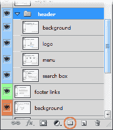
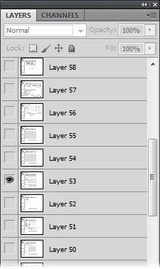
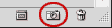
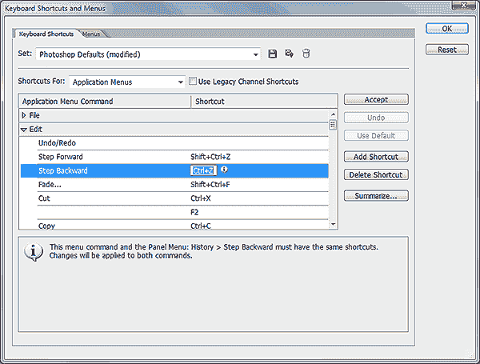
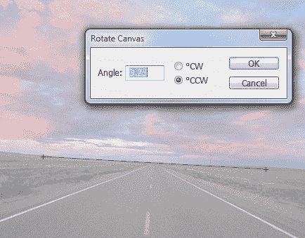

# 给开发者的 10 个 Photoshop 技巧

> 原文：<https://www.sitepoint.com/10-photoshop-tips-for-developers/>

如果你是一个顽固的程序员，除了咖啡和 Vim 什么都不需要，也许 web 开发不适合你。多种多样。虽然你肯定需要顶尖的编码技能，但你无法避免处理媒体和图形。是的，图形。大概在 Photoshop 里。

Photoshop 第一次用的时候好像有点怪。这个界面在任何操作系统平台上都不是很标准，有些特性会让你一开始就感到困惑。但是，坚持使用它，你就再也不想使用另一个图形包了。幸运的是，有几种方法可以让你的生活变得轻松一点…

## 1.快速选择一个层

如果你收到一个设计师的 PSD，你会发现他们已经把它弄平了*(是的，谢谢)*或者它包含了数千层。要找到您需要的层，切换到移动工具(V)，按住 Ctrl 并单击您想要的元素。或者，右键单击它以查看光标下所有层的菜单。

## 2.更简单的层管理

浏览多个图层可能会很痛苦。Photoshop 提供了几个选项来帮助您管理长列表:

1.  指定名称:双击层的名称进行更改。
2.  指定颜色:右键单击眼睛图标并选择一种颜色。
3.  图层组:单击文件夹图标(圆圈)并将图层拖入其中。文件夹可以有子文件夹，可以重新排列、重命名、着色、折叠或隐藏。

## 3.查看单个层

通常需要隔离一个层。你可以通过关闭所有不必要的“眼睛”图标来做到这一点，但是如果你有很多层，这可能需要一段时间。一个更快的解决方法是按住 Alt 键并点击你想要的图层上的“眼睛”图标。重复该操作以重新启用其他层。

## 4.将相同的样式应用到另一个图层

您可以通过拖动图层块右边的*“FX”*图标将样式从一个图层移动到另一个图层。同时按住 Alt，它会复制样式。

## 5.创建快照

我经常发现自己撤销了几个动作，以返回到以前的状态，例如，当创建多种尺寸的图形时。单击撤销或找到正确的历史状态并不总是可行的。快照是一个很好的选择；单击“历史记录”调板中的快照图标，Photoshop 将创建当前状态的副本，您可以随时返回到该状态。

## 6.准确的指南

对齐元素和分割图像时，参考线非常有用。要快速添加水平或垂直参考线，请查看标尺(**查看** > **标尺**或 Ctrl+R)，单击标尺并将参考线拖到您的图像上。

你应该知道 Photoshop 允许任何地方的参考线，甚至是像素的一半。这可能会导致不准确的切片或不想要的抗锯齿效果。为防止出现此问题，请先创建一个矩形选区，然后将参考线拖到选区的边缘，参考线将在那里准确地对齐。

## 7.多次撤消

Ctrl+Z 执行标准的撤消操作。但是，再次按下它会撤销撤销操作——它变成了重做！如果这让你感到悲伤，选择**编辑** > **键盘快捷键**，然后在应用菜单中展开**编辑**。在撤销/重做中移除“Ctrl+Z”并将其添加到“后退”设置中。

## 8.从屏幕上的任何地方挑选颜色

多年来，我用一个颜色挑选工具来抓取一个十六进制代码，打开调色板并复制进去。没必要。使用 Photoshop 的任何拾色器工具时，单击图像上的任何位置，然后将光标从 Photoshop 窗口拖到屏幕的任何部分。

这种方法的唯一缺点是您不能切换到隐藏的应用程序，您可能需要将 Photoshop 窗口变小，以便更多的屏幕可见。

## 9.轻松旋转标尺

你经常会收到摄影师在他们喝了几杯后拍摄的照片。幸运的是，使用标尺工具很容易将图片旋转到它们的自然方向(与滴管在同一个工具栏图标下)。

沿着您想要旋转的方向在地平线上画一条线，即，如果需要顺时针旋转，从左向右画。现在从菜单中选择**图像** > **图像旋转** > **任意**——对话框会显示标尺角度，所以你只需点击确定。

## 10.个性化您的工作空间

开发人员是一群迂腐的人。我们花了几个小时整理我们的桌面和 ide，这样我们可以在重复的任务上节省几秒钟！Photoshop 是一个复杂的野兽，它可以花时间来打开和定位你想要的调色板和窗口。为了确保它不会被弄乱，单击右上角的 v 形图标并保存一个新的工作区。

你有什么好的 Photoshop 技巧吗？

## 分享这篇文章