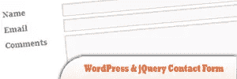
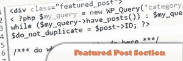
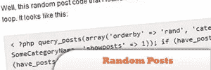
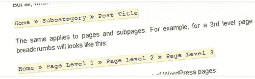
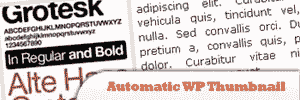
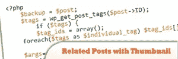

# 10 插件替换 WordPress 教程

> 原文：<https://www.sitepoint.com/10-plugin-replacing-tutorials-wordpress/>

Let face it, the main reason why WordPress is so popular is because of the endless supply of plugins that make it highly extensible. With wisely chosen plugins we can easily transform a basic WordPress into a powerful application.

有时候我们会问自己，**我们真的需要使用插件来完成最常见和最基本的任务吗**，比如安装分析软件或者将我们的订阅重定向到 Feedbuner？对于分页，联系形式，甚至内容滑块？嗯，只有你能回答这个问题，但是有更好的，在某些情况下更简单的解决方案，正如我们将在本文中向你展示的一些技巧和片段。

这里是一些使用 PHP & jQuery 的 WordPress 插件等价物！

## 1.没有插件的 WordPress & jQuery 联系人表单

有许多联系人表格插件，大多数都过于臃肿，有着无穷无尽的功能和插件列表。如果只有一个基本的联系表单，并被赋予对标记的控制权，这不是很好吗？在本教程中，您将创建一个带有联系人表单的定制页面模板，最后，添加一点 jQuery 来改进表单。

[来源](http://trevordavis.net/blog/wordpress-jquery-contact-form-without-a-plugin/)

## 2.没有插件的文章分页

使用插件进行 post pagination 可能有点大材小用，因为你真的只需要在你的主题中添加几行 PHP 和 CSS 代码，这篇简单易懂的教程将带你完成这个过程。

[来源](http://www.kriesi.at/archives/how-to-build-a-wordpress-post-pagination-without-plugin)

## 3.WP 中的特色文章部分(并让分页工作)

WordPress 主题的一个普遍趋势是在主页上有特色帖子框，有点像一个帖子会一直留在那里，直到你用另一个特色帖子替换它。本教程将向您展示如何构建您自己的特色文章部分，您也可以下载示例 php 文件。

[来源](http://spyrestudios.com/featured-post-section-in-wordpress-and-pagination/)

## 4.没有插件的热门帖子页面

有很多不同的方法可以做到这一点，也有很多插件可以帮助你。本教程将向您展示如何根据每个帖子的评论数量来构建一个受欢迎的帖子页面。除了向您展示如何创建一个受欢迎的帖子页面，本教程还将向您展示如何为侧边栏创建一个受欢迎的帖子小部件。

[来源](http://www.problogdesign.com/wordpress/create-your-own-popular-posts-page/)

## 5.向你的 WordPress 主题添加社交书签

在这个简短的教程中，你将学习如何在我们的 WordPress 主题中添加按钮，让访问者可以轻松地将当前文章提交到社交书签网站，如 Delicious、Reddit、Digg、StumbleUpon、Twitter 和脸书，而无需插件。

[来源](http://blog.themeforest.net/wordpress/add-social-bookmarks-to-your-wordpress-theme/)

## 6.没有插件的随机帖子

如果你的 WordPress 博客使用了主页或某种登陆页面，那么随机发布一篇帖子会非常有用，有望吸引访问者的注意力。这个简短的教程将告诉你如何去做。

[来源](http://www.astro-geek.com/2009/01/wordpress-random-posts-without-a-plugin/)

## 7.没有插件的面包屑

当然，有很多现成的插件可以用来创建 WordPress 面包屑导航，但是如果你更喜欢使用简短的代码片段，这篇教程会给你指出正确的方向。

[来源](http://dimox.net/wordpress-breadcrumbs-without-a-plugin/)

## 8.没有自定义字段或插件的自动缩略图

许多博客在首页或档案上有效地展示缩略图，伴随着标题和摘录，它们确实倾向于给内容带来更多活力。
唯一的问题是使用自定义字段可能会很复杂且浪费时间。这篇文章将向你展示如何让你的主题根据你文章的第一张图片自动生成缩略图。

[来源](http://www.problogdesign.com/wordpress/automatic-wordpress-thumbnail-without-custom-field/)

## 9.没有插件的相关帖子(基本方法)

展示相关的文章是让访问者在你的博客上停留更久的一个非常好的方法。你可以使用一个插件，但是为了让事情变得更简单，你可以使用这个代码片段。

[来源](http://www.bin-co.com/blog/2009/04/show-related-post-in-wordpress-without-a-plugin/)

## 10.带缩略图的相关帖子，不带插件(高级)

这个代码片段并不简单地显示一个链接列表，而是构建一个图像(缩略图)列表。

[来源](http://www.wearepixel8.com/blog/add-related-posts-with-images-to-wordpress-without-a-plugin/)

## 分享这篇文章