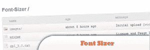
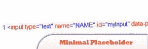

# 2011 年 8 月的 10 个新 jQuery 插件

> 原文：<https://www.sitepoint.com/10-plugins-august-2011/>

又是一个月，2011 年 8 月又有 10 个全新的 jQuery 插件。这个月人们都在忙些什么？查看列表，了解 jQuery 插件世界的新特性。尽情享受吧！

## 1\. Font Sizer

Font sizer 是一个高度可配置的、不引人注目的 jQuery 插件，它允许用户调整网站上特定文本区域的字体大小。它是轻量级的，易于配置，并为你的博客、论坛或新闻网站增加了一些功能。

## 2.提示 2–jQuery 工具提示

允许你使用 jQuery JavaScript 库轻松创建漂亮的工具提示。Tipped 从流行的 Prototip 库发展而来，通过使用 HTML5 让你完全控制工具提示的外观和感觉，将工具提示提升到了一个新的层次。

[来源](http://projects.nickstakenburg.com/tipped)

## 3.自动截断器

这个类使用 jQuery 库通过 JavaScript 实现多行 html 截断、展开-折叠链接和自动换行/断字。它沿着 DOM textnodes & html 节点遵循二叉树分裂算法。在页面加载时，截断器将自动用 truncate 类包装和截断容器。

## 4.jOVI——一个基于诺基亚地图 API 的 jQuery 插件

下面所有这些原因让我产生了将诺基亚的 API 封装在一个 jQuery 插件中的想法，任何人都可以轻松地将它添加到自己的网站上。
–诺基亚地图的用户界面和用户体验非常棒。
–API 看起来非常完整，尽管我似乎知道他们在不断改进它。
–该 API 有很多特性，其中大部分绝不会被一般的 web 开发人员使用。
–文档有点差，而且不太用户友好。

[来源](http://marcon.me/jovi/)

## 5.最小占位符

这个简单的 jQuery 插件允许你在任何“input”或“textarea”元素中创建跨浏览器的占位符文本。只需设置任何输入或文本区域的“值”(或文本)和“标题”，并通过 ID、类或标记名调用该元素的插件。

[来源](http://matthewbjordan.me/mph/)

## 6.copyCSS

一个小小的更新，另一个扩展简化了将样式复制到另一个元素。

[来源](http://upshots.org/?p=192)

## 7.jQuery 字符限制

这个插件允许表单输入域和文本区域元素有字符限制。字母数字是默认设置，但是可以选择仅字母、仅数字和正则表达式。其他允许的字符可以添加到字母数字、字母和数字选项中。

[来源](http://plugins.jquery.com/project/charRestriction)

## 8.自动保存表单脚本

这个 jQuery 脚本将 GMail 风格的自动保存功能引入到你网站上的任何表单中。一个漂亮的即插即用脚本，它定期保存任何表单的内容，并在需要时调用它们，直到表单被实际提交。

[来源](http://www.dynamicdrive.com/dynamicindex16/autosaveform.htm)

## 9.ht5ivf–html 5 内嵌表单验证

jQuery ht5ifv 插件是一个可扩展和高度可配置的 jQuery 插件，它允许在用户输入时验证 HTML5 的表单。它是可扩展的，因为它允许程序员在 HTML5 已经定义的限制之外定义新的限制。

[来源](https://github.com/jvverde/ht5ifv)

## 10.智能社交计数器

一个插件将帮助你显示你的网站社交网络计数器。您可以使用浮动栏或在您的页面内。

特点:
>易于配置。
>两种漂亮的布局:box 和 float
>全动态控制
>全通过插件变量扩展。
>自定义 CSS 为效果
> jQuery 漂亮的悬停效果。
>轻重量

[来源](http://plugins.jquery.com/project/smartSocialCount)

## 分享这篇文章