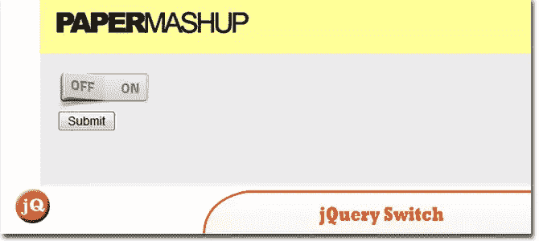
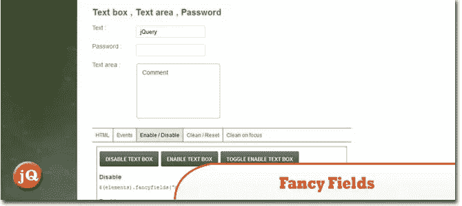
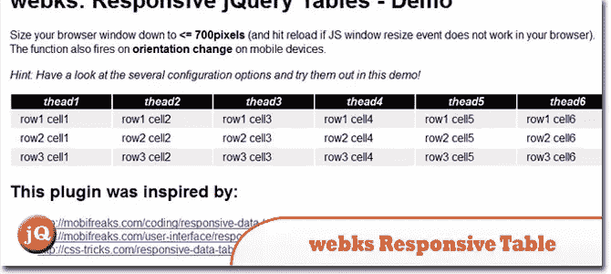
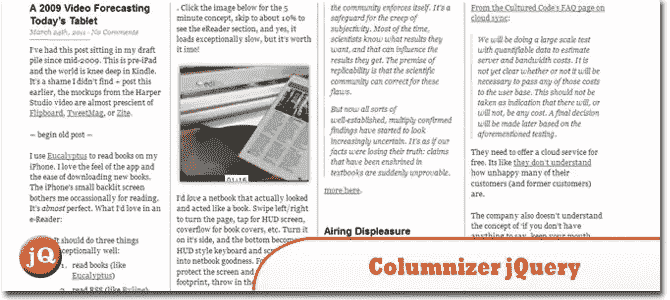
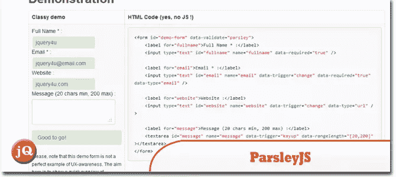
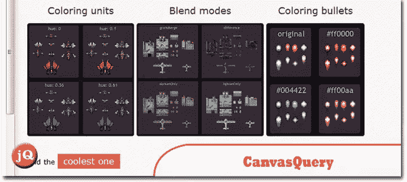
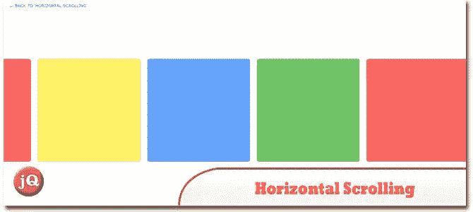
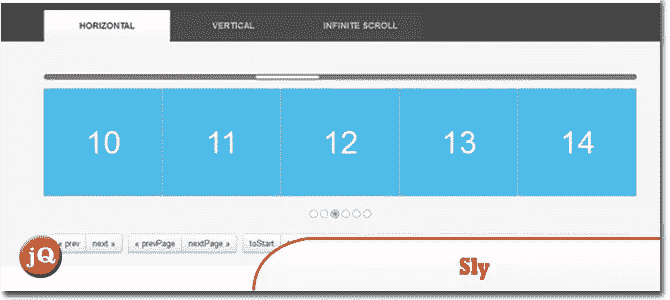
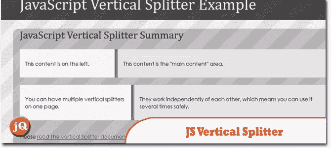

# 10 随机 jQuery 插件星期五好

> 原文：<https://www.sitepoint.com/10-random-jquery-plugin-friday-goodness/>

享受吧。

## 1.jquery.snipe

狙击镜头风格的图像放大。
 
[来源](https://github.com/RayFranco/jquery.snipe#readme) [演示](http://rayfranco.github.com/jquery.snipe/demos.html)

## 2.jQuery 花式开关

本教程的目标用户是刚刚踏上 jQuery 阶梯的用户，希望这将展示一些技术是多么简单。开关的设计是由谢伊完成的。
 
[来源](http://papermashup.com/jquery-fancy-switch/) [演示](http://papermashup.com/demos/jquery-switch/)

## 3.jQFancyFields

帮助您快速轻松地设计自定义表单。
 
[来源](http://www.jqfancyfields.com/) [演示](http://www.jqfancyfields.com/examples-docs/)

## 4.jQuery“webks 响应表”插件

将移动性较差的默认 HTML 表格转换为灵活的响应(列表)格式。
 
[来源](http://julian.pustkuchen.com/en/projekte/jquery-webks-responsive-table-plugin) [演示](http://www.webks.de/demos/jquery.webks-responsive-table/demo/webks_responsive_tables.html)

## 5.Columnizer jQuery 插件

它会自动以报纸专栏的格式编排你的内容。您可以指定列宽或静态列数。
 
[来源](http://welcome.totheinter.net/columnizer-jquery-plugin/) [演示](http://welcome.totheinter.net/notes/)

## 6.欧芹. js

Javascript 表单验证，无需实际编写一行 javascript 代码！
 
[源+演示](http://parsleyjs.org/documentation.html)

## 7.CanvasQuery

它是 HTML5 Canvas 元素的包装器库，允许它与 jQuery like 语法一起使用。
 
[来源](http://canvasquery.com/) [演示](http://canvasquery.com/#examples)

## 8.使用 jQuery 进行水平滚动

只是有时候，与众不同，围绕横轴建一个网站也不错。然而，这造成了限制，因为计算机鼠标和它的鼠标滚轮不会侧向滚动——但是这可以用 good-ol' jQuery 纠正。
 
[来源](http://www.designedbyaturtle.co.uk/2012/horizontal-scrolling-with-jquery/) [演示](http://www.designedbyaturtle.co.uk/demos/horizontal-scrolling/)

## 9.狡猾的

jQuery 插件，支持基于项目的单向滚动导航。
 
[源+演示](http://darsa.in/sly/#!horizontal)

## 10.JavaScript 垂直分割器

一个独立的脚本，允许通过向左或向右拖动手柄来调整两个并排容器的大小。
 
[来源](http://www.stevefenton.co.uk/Content/JavaScript-Vertical-Splitter/) [演示](http://www.stevefenton.co.uk/cmsfiles/assets/File/VerticalSplitter.html)

## 分享这篇文章