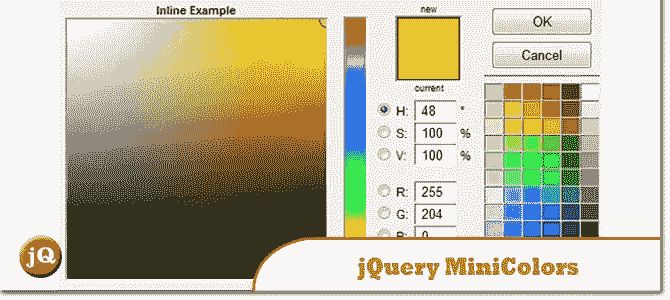
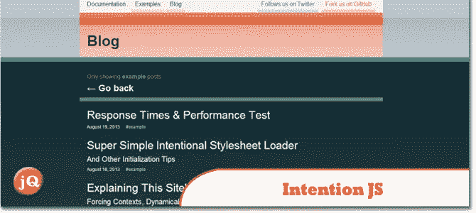
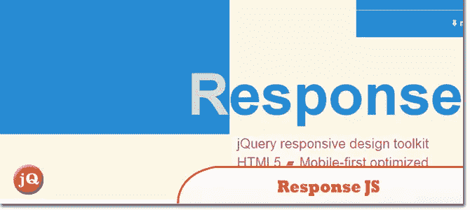
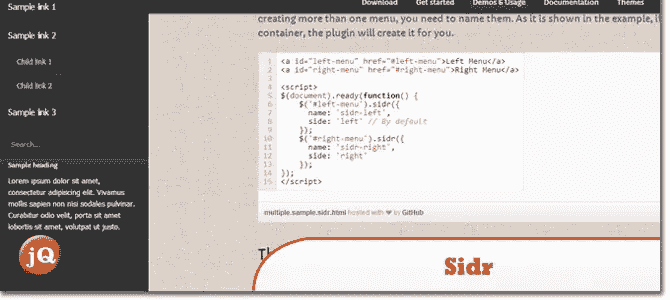
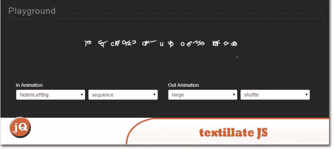
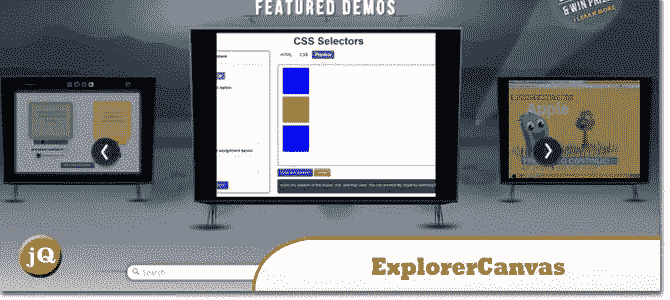

# 10 个随机 jQuery 插件

> 原文：<https://www.sitepoint.com/10-random-jquery-plugins-4/>

在今天的帖子中，你会发现另外一组 **10 个随机 jQuery 插件**非常有用。尤其是第五点。jQuery。指向#7。CropZoom 和#10。iView 插件！享受=)

## 1.jQuery 迷你颜色

基于 jQuery 的小型颜色选择器

 
[源+演示](http://labs.abeautifulsite.net/jquery-minicolors/)

## 2.Intention.js

提供了一种轻量级的、清晰的方法，以响应性的方式动态地重构 HTML。

 
[来源](http://intentionjs.com/) [演示](http://intentionjs.com/blog/tagged/example.html)

## 3.回复 JS

一个 jQuery 插件，为构建性能优化、移动优先的响应网站提供工具。它的断点集使用 HTML5 数据属性根据断点动态交换标记，以便可以渐进地提供丰富的内容。

 
[源+演示](http://responsejs.com/)

## 4.Sidr

创建侧菜单的最好的 jQuery 插件，也是让你的菜单响应的最简单的方法

 
[来源](http://www.berriart.com/sidr/) [演示](http://www.berriart.com/sidr/#usage)

## 5.jQuery(即时查询)。瞄准点

一个简单的 jQuery 插件。

 
[源+演示](http://pointat.idenations.com/demo)

## 6.重击

使字符串 url 安全。

 
[源+演示](https://github.com/bengourley/slugg)

## 7.CropZoom

一个插件，让你选择一个图像区域，然后裁剪它。有了这个工具，你还可以放大或缩小，拖动和旋转图像。

 
[来源](http://www.cropzoom.com.ar/) [演示](http://www.cropzoom.com.ar/demo/)

## 8.textillate.js

结合了一些很棒的库，提供了一个易于使用的插件，可以将 CSS3 动画应用于任何文本。

 
[源+演示](http://jschr.github.io/textillate/)

## 9.探险队

Firefox、Safari、Chrome 和 Opera 等现代浏览器支持 HTML5 canvas 标签，允许 2D 基于命令的绘制。ExplorerCanvas 为 Internet Explorer 带来了同样的功能。要使用，web 开发人员只需在他们现有的网页中包含一个脚本标记。

 
[来源](http://excanvas.sourceforge.net/) [演示](https://developer.mozilla.org/en-US/demos/#demo-next)

## 10.iView

世界上最棒的 jQuery 图片和内容滑块

 
[源+演示](http://iprodev.com/iview/)

## 分享这篇文章