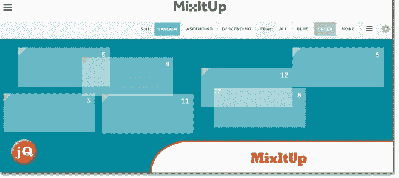
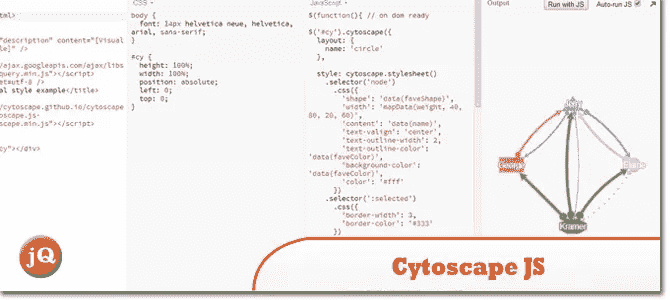
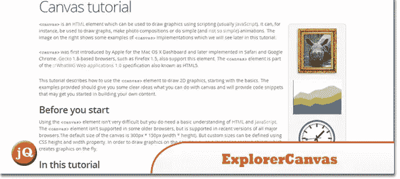
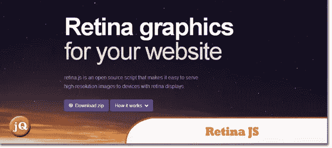
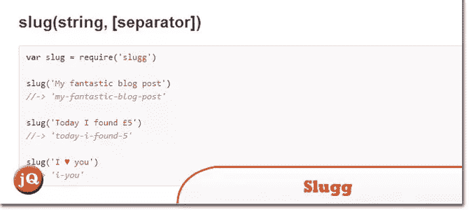
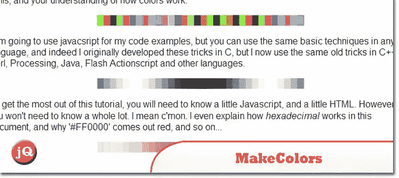
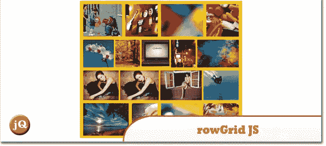
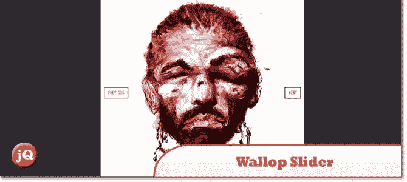
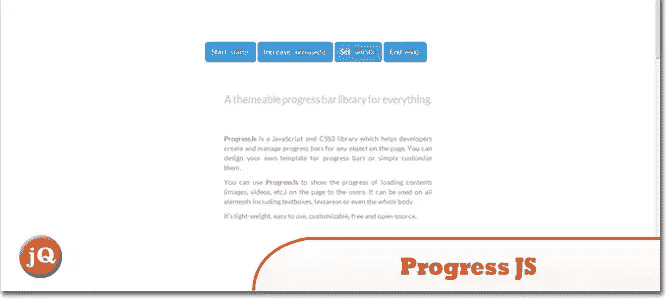

# 10 个随机 jQuery 插件

> 原文：<https://www.sitepoint.com/10-random-jquery-plugins-6/>

另一套 **10 个随机 jQuery 插件**满足你的 web 开发需求！值得一试。MitItUp 真的很酷；)

## 1.MixItUp

一个 jQuery 过滤和排序插件，用于你的布局。

 
[源+演示](http://www.mixitup.io/)

## 2.深色工具提示

一个简单可定制的工具提示，带有确认选项和效果。

 
[来源](http://rubentd.com/darktooltip/) [演示](http://rubentd.com/darktooltip/examples.html)

## 3.Cytoscape.js

用于分析和可视化的 JavaScript 图形库(兼容 CommonJS/Node.js、AMD/Require.js、jQuery 1.4+、Bower 和普通 JavaScript)

 
[来源](http://cytoscape.github.io/cytoscape.js/) [演示](http://jsbin.com/aqupun/7/edit)

## 4.探险队

Firefox、Safari、Chrome 和 Opera 等现代浏览器支持 HTML5 canvas 标签，允许 2D 基于命令的绘制。ExplorerCanvas 为 Internet Explorer 带来了同样的功能。要使用，web 开发人员只需在他们现有的网页中包含一个脚本标记。

 
[源+演示](http://excanvas.sourceforge.net/)

## 5.视网膜. js

一个开源脚本，可以轻松地将高分辨率图像提供给配有 retina 显示屏的设备

 
[源+演示](http://retinajs.com/)

## 6.重击

使字符串 url 安全

 
[源+演示](https://github.com/bengourley/slugg)

## 7.制造颜色

用 javascript 制作烦人的彩虹

 
[源+演示](http://krazydad.com/tutorials/makecolors.php)

## 8.rowGrid.js

一个小的轻量级 jQuery 插件，用于将项目放置在直线行中。

 
[来源](https://github.com/brunjo/rowGrid.js) [演示](http://brunjo.github.io/rowGrid.js/)

## 9.冲击滑块

又一个该死的滑球。

 
[源+演示](http://www.pedroduarte.me/wallop-slider/)

## 10.Progress.js

ProgressJs 是一个 JavaScript 和 CSS3 库，帮助开发者创建和管理页面上每个对象的进度条。

 
[来源](https://github.com/usablica/progress.js) [演示](http://usablica.github.io/progress.js/)

## 分享这篇文章