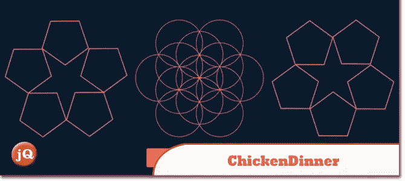
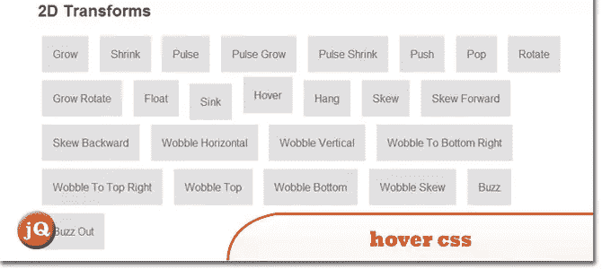
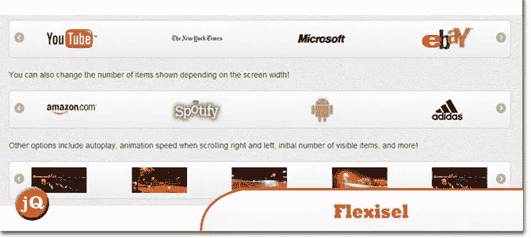
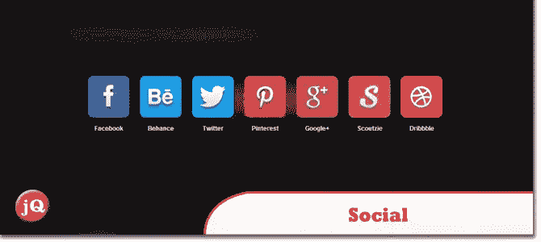
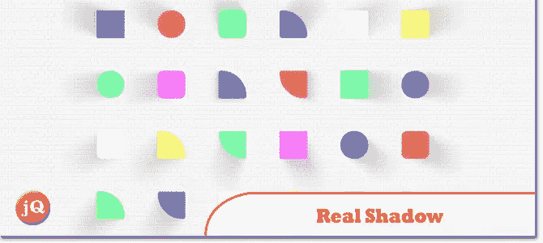
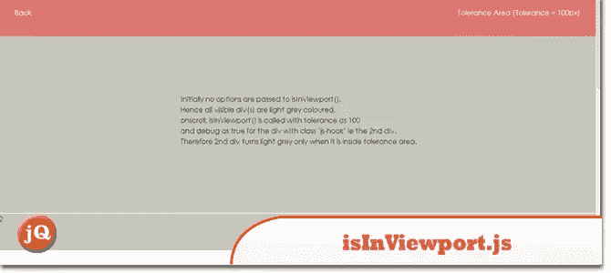
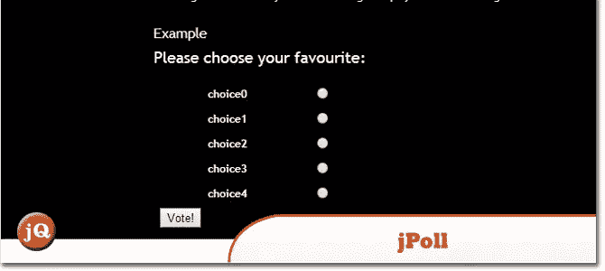
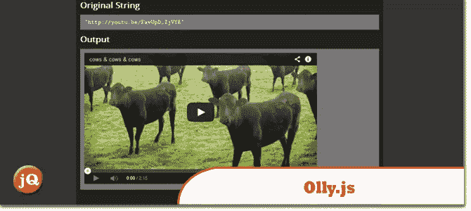

# 10 个随机 jQuery 插件

> 原文：<https://www.sitepoint.com/10-random-jquery-plugins-8/>

今天我们给你另外一套 **10 个随机 jQuery 插件**，因为我们知道你会想要更多！因此，请检查它们，并享受=)也可以随意留下评论，或者如果你认为我们遗漏了一些好的，一如既往地欢迎你这样说。；)

## 1.鸡肉晚餐

一个愚蠢的 Jquery 插件，通过 img 标签或背景图片从客户端随机加载图片。

 
[来源](https://github.com/sosweetcreative/ChickenDinner) [演示](http://chickendinner.sosweetcreative.com/)

## 2.hover.css 教程和介绍

CSS3 悬停效果的集合，可以很容易地应用到您自己的网站元素，如按钮，徽标和特色图像。

 
[来源](http://ianlunn.co.uk/articles/hover-css-tutorial-introduction/) [演示](http://ianlunn.github.io/Hover/)

## 3.Flexisel

响应式图像轮播，具有专门用于调整轮播以适应移动和平板设备的选项。

 
[源+演示](http://9bitstudios.github.io/flexisel/)

## 4.社会的

用于列出配置文件和共享的 jQuery 插件

 
[来源](https://github.com/tolgaergin/social) [演示](http://tolgaergin.com/files/social/index.html)

## 5.真实阴影

投射任何形状的真实感阴影的模块

 
[来源](https://github.com/Indamix/real-shadow) [演示](http://indamix.github.io/real-shadow/#/box/)

## 6.jQuery 社交时间表插件

DP 社交时间表插件可以让你从不同的社交网络中检索状态/帖子/视频/图片，按照时间表的格式，从最新的到最早的。

 
[源+演示](http://www.dpereyra.com/scripts/dpSocialTimeline/)

## 7.迂回的

一个 jQuery 插件，可以轻松地将无序列表和其他嵌套的 HTML 结构转换成有趣的、交互式的、类似转盘的区域。

 
[来源](http://fredhq.com/projects/roundabout/) [演示](http://fredhq.com/projects/roundabout/#/demos)

## 8\. isInViewport.js

一个超轻的 jQuery 插件，告诉你一个元素是否在视窗中，但是有一个扭曲。

## 9.jPoll

jPoll 附带了 nettuts+ screencast，提供了一个“投票”小工具，可以用来问你的访问者一个简短的问题。该小部件将在指定的容器内创建并呈现一个表单，然后监视表单的提交。

 
[源+演示](http://www.danwellman.co.uk/jquery-plugin-jpoll/)

## 10.奥利. js

一个 JavaScript 库，用于将 URL 转换成可嵌入的 HTML。

 
[来源](https://github.com/abeisgreat/Olly.js) [演示](http://abeisgreat.github.io/Olly.js/markup/example.html)

## 分享这篇文章