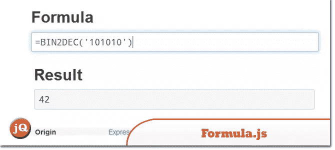
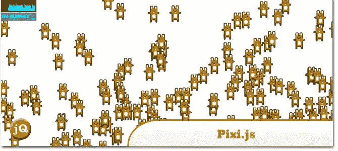
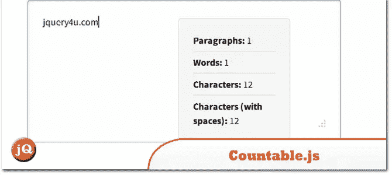
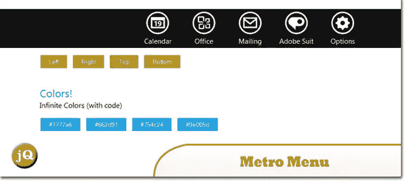
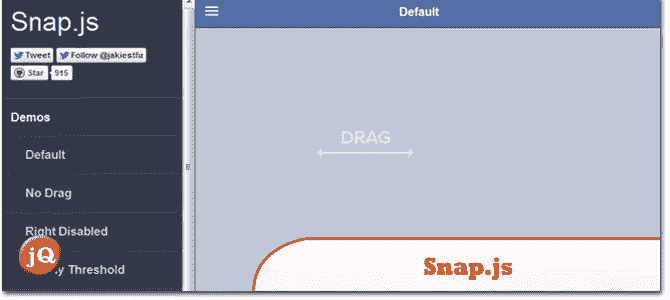
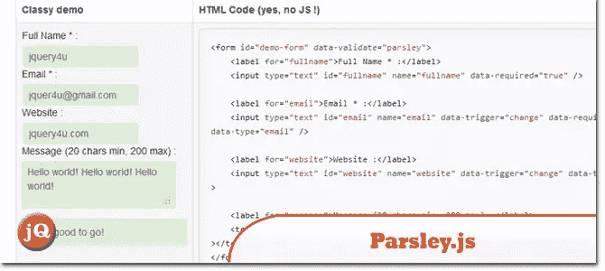

# 10 个新的随机 jQuery 插件:2013 年 4 月版

> 原文：<https://www.sitepoint.com/10-random-jquery-plugins-april-2013/>

今天我们分享 10 个完全随机但很酷的 jQuery 插件！。有些可能会帮助你改善网站的用户体验。如果你想在这些随机的文章中展示你的插件，请发表评论，下次我们可能会收录它们！7.地铁菜单病了。玩得开心:)

## 1.公式. js

Microsoft Excel 2013 和 Google 电子表格支持的大多数公式函数的 JavaScript 实现

 
[源+演示](http://stoic.com/formula/)

## 2.TabLooper–响应循环选项卡 Metro UI

响应式标签 jQuery 插件，用于为您的站点创建具有响应式布局的标签，支持无限标签，结合内联和 AJAX 内容以获得最佳性能，通过触摸滑动事件(在移动设备上)或左/右键(在台式机/笔记本电脑上)或简单的点击按钮(在所有设备上)来移动标签内容。

 
[来源](http://codecanyon.net/item/tablooper-responsive-loop-tab-metro-ui/4343388?ref=sdeering) [演示](http://demo.siterepo.com/tablooper/demo2.php)

## 3.Epoxy.js

一个优雅且可扩展的 Backbone.js 数据绑定库；它为 Backbone 的模型和视图组件提供了功能丰富的扩展，旨在将视图元素直接挂钩到数据模型。

 
[来源](http://epoxyjs.org/)

## 4.pixi.js

这个项目的目的是提供一个快速轻量级的 2D 库，可以在所有设备上运行。Pixi 渲染器允许每个人享受硬件加速的力量，而无需事先了解 webGL。

 
[来源](https://github.com/GoodBoyDigital/pixi.js#readme) [演示](http://www.goodboydigital.com/pixijs/bunnymark/)

## 5.Countable.js

Countable 是一个 JavaScript 函数，用于向 HTML 元素添加实时段落计数、单词计数和字符计数。Countable 不依赖于任何库，并且非常小。

 
[源+演示](http://radlikewhoa.github.io/Countable/)

## 6.简易多媒体艺廊

或者(EMG)是一个 wordpress (wordpress self hosted)插件，旨在轻松优雅地显示作品集和各种媒体支持，包括图库集、单个图像、视频、谷歌地图、音频和链接。

 
[源+演示](http://ghozylab.com/)

## 7.地铁菜单

这个插件是响应性和可定制的。您可以更改颜色、动画、位置、关闭方法等。

 
[来源](http://codecanyon.net/item/metro-menu/4476162?sso?WT.ac=search_item&WT.seg_1=search_item&WT.z_author=klerith) [演示](http://codecanyon.net/item/metro-menu/full_screen_preview/4476162?ref=sdeering)

## 8.Snap.js

一个用 Javascript 创建漂亮的移动货架的库

 
[来源](https://github.com/jakiestfu/Snap.js#readme) [演示](http://jakiestfu.github.io/Snap.js/demo/apps/default.html)

## 9.欧芹. js

Javascript 表单验证，无需实际编写一行 javascript 代码！

 
[源+演示](http://parsleyjs.org/documentation.html)

## 10.Wookmark-jQuery

这是一个 jQuery 插件，用于布局元素的动态网格。

 
[来源](https://github.com/GBKS/Wookmark-jQuery#readme) [演示](http://www.wookmark.com/jquery-plugin)

## 分享这篇文章