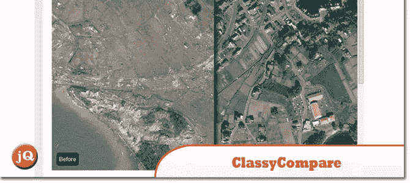
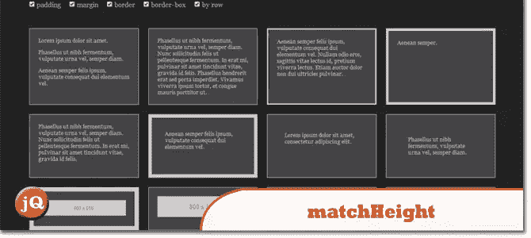
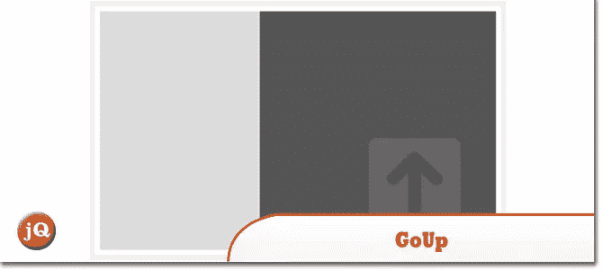
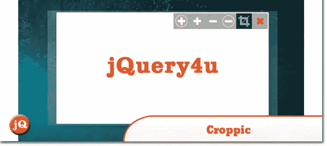
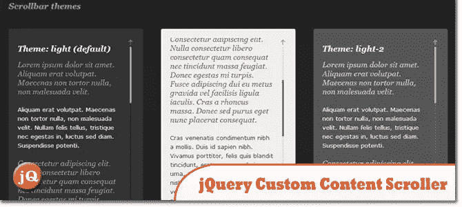
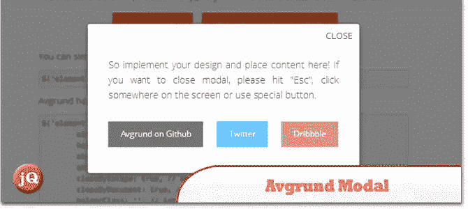
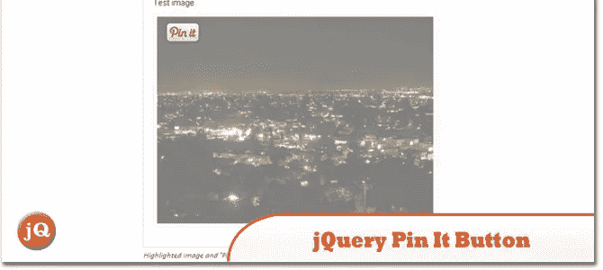
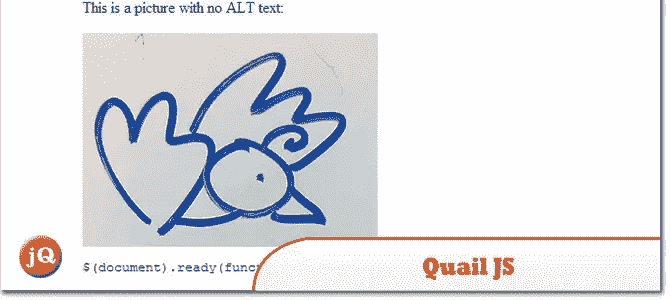
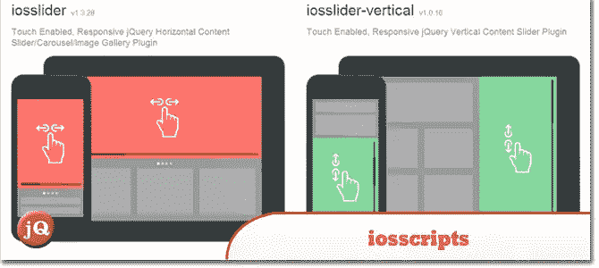

# 10 个新的随机 jQuery 插件:2014 年 2 月版

> 原文：<https://www.sitepoint.com/10-random-jquery-plugins-february-2014/>

这些插件是新的，或者已经在 2014 年 2 月更新。有一些非常好的，ClassyCompare 非常有趣！:)

## 1.分类比较

一个由马里乌斯·斯坦丘写的 jQuery 插件——Sergiu，这个插件可以让你通过一个漂亮的界面比较两张图片(之前和之后，等等)。

 
[源+演示](http://www.class.pm/projects/jquery/classycompare/)

## 2.用于 Grails 的 jQuery

提供 jQuery 库与 Grails JavascriptProvider 的集成

 
[源+演示](http://grails.org/plugins/jquery)

## 3.火柴高度

使所有选定元素的高度完全相等。

 
[来源](http://brm.io/jquery-match-height/) [演示](http://brm.io/jquery-match-height-demo/)

## 4.古普

一个 jQuery 滚动到顶部插件。

 
[源+演示](http://www.jquerygoup.tk/)

## 5.克罗皮奇

是一个图像裁剪 jquery 插件，将满足您的需求和更多。

 
[源+演示](http://www.croppic.net/)

## 6.jQuery 自定义内容滚动器

自定义滚动条插件，完全可定制的 CSS。具有垂直/水平滚动，鼠标滚轮支持(通过 jQuery mousewheel 插件)，滚动按钮，滚动惯性，自动调整滚动条长度，嵌套滚动条，滚动到功能，用户定义的回调等等。

 
[源+演示](http://manos.malihu.gr/jquery-custom-content-scroller/)

## 7.深渊模式

是一个用于模式框和弹出窗口的 jQuery 插件。它使用有趣的概念来显示弹出窗口和页面之间的深度。它可以在所有现代浏览器中工作，并且在那些不支持 CSS 过渡和转换的浏览器中优雅地降级(例如，在 IE 6-9 中有标准行为)。

 
[源+演示](http://labs.voronianski.com/jquery.avgrund.js/)

## 8.图像的 jQuery 锁定按钮

突出显示悬停时的图像，并在图像上添加 Pinterest“锁定”按钮，以便于锁定。

 
[源+演示](http://wordpress.org/plugins/jquery-pin-it-button-for-images/screenshots/)

## 9.奎尔斯

在浏览器和服务器上进行可访问性测试。

 
[来源](http://quailjs.org/) [演示](http://quailjs.org/examples/)

## 10.IOs 脚本

高级桌面+移动 jQuery 插件

 
[源+演示](https://iosscripts.com/)

## 分享这篇文章