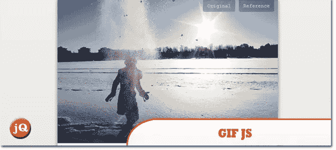
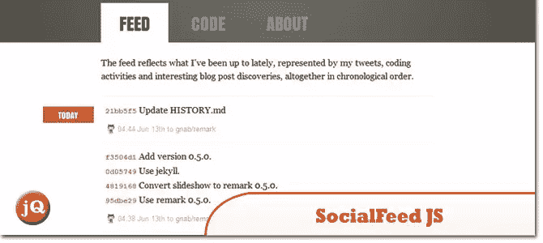
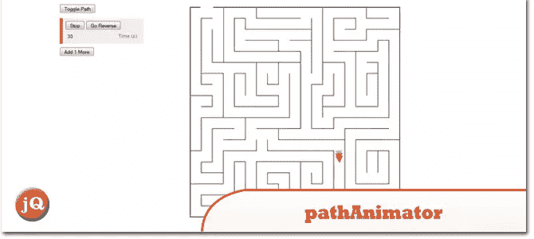
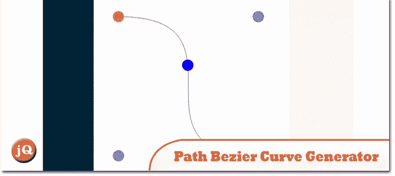
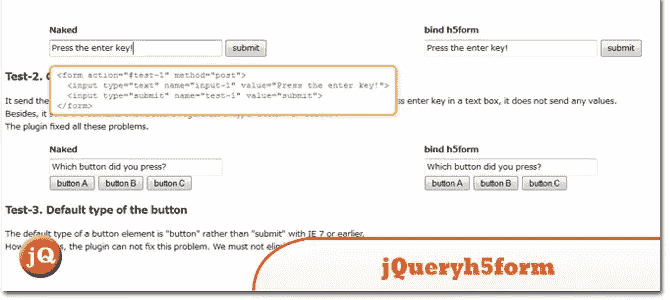
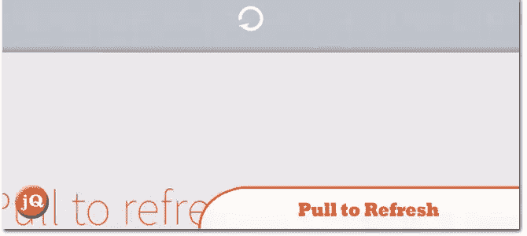
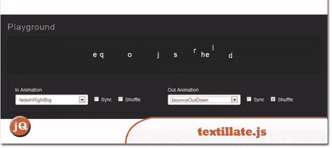
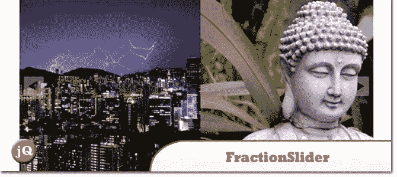

# 10 个随机 jQuery 插件，2013 年 6 月

> 原文：<https://www.sitepoint.com/10-random-jquery-plugins-june-2013/>

今天的帖子是我们收集的 2013 年 6 月的另外一组 **10 个随机 jQuery 插件**。看一看，玩得开心！值得一查；)

**相关帖子: [10 个随机 jQuery 插件 2013 年 4 月](http://www.jquery4u.com/plugins/10-random-jquery-plugins-april-2013/)**

## 1.Moment.js

一个 5.5kb 的 javascript 日期库，用于解析、验证、操作和格式化日期。

 
[源+演示](http://momentjs.com/)

## 2.gif.js

在浏览器中运行的全功能 JavaScript GIF 编码器。

 
[源+演示](http://jnordberg.github.io/gif.js/)

## 3.Countable.js

Countable 是一个 JavaScript 函数，用于向 HTML 元素添加实时段落计数、单词计数和字符计数。Countable 是一个零依赖的库，当被缩小和压缩时，它的大小是 1KB。

 
[源+演示](http://radlikewhoa.github.io/Countable/)

## 4.社会福利. js

用 javascript 生成一个社交提要。

[试玩](http://gnab.org/#/feed)

## 5.pathAnimator

沿着 SVG 路径移动

 
[来源](http://dropthebit.com/592/pathanimator-moving-along-an-svg-path/) [演示](http://dropthebit.com/demos/pathAnimator/index.html)

## 6.jQuery 路径贝塞尔曲线生成器

优秀的 jQuery。Path 允许您在使用 jQuery animate 函数时创建自定义路径。贝塞尔曲线特别有趣，因为它们允许你沿着几乎任何可以想到的路径移动对象(尤其是当链接动画时)。

 
[源+演示](http://jqbezier.ericlesch.com/)

## 7.jquery . H5 form–html 5 表单插件

这个插件为所有浏览器提供了像 Opera 一样的 HTML5 表单。

 
[来源](http://www.rapidexp.com/h5form/) [演示](http://www.rapidexp.com/h5form/testing.php)

## 8.拉至刷新

我们喜欢我们设备上的这个简洁的“刷新”功能，但是如果它是用于网络的，那不是很棒吗？找出方法！

 
[源+演示](http://usehook.com/)

## 9.textillate.js

asimplepluginfocss 3 texanimations

 
[源+演示](http://jschr.github.io/textillate/)

## 10.分数计算器 0.9.8

它允许你在每张幻灯片上制作多个元素的动画。您可以设置不同的动画方法，如从某个方向淡入淡出或过渡。

 
[来源](http://jacksbox.de/stuff/jquery-fractionslider/) [演示](http://jacksbox.de/fractiondemos/example_slides.html)

## 分享这篇文章