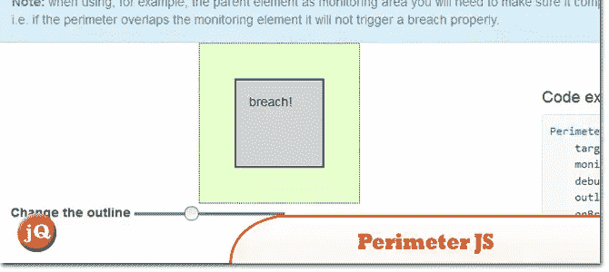
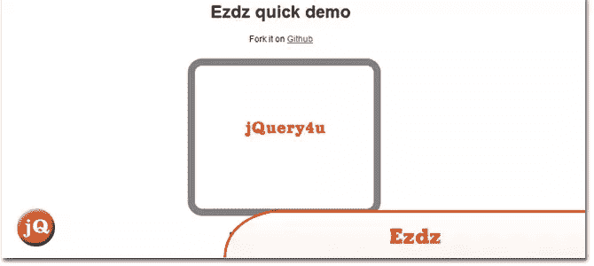
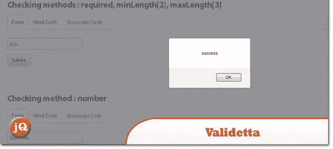
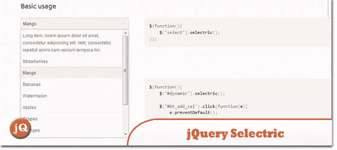
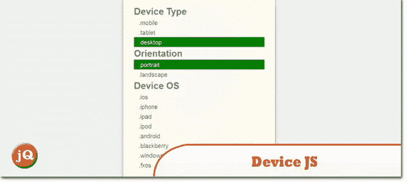
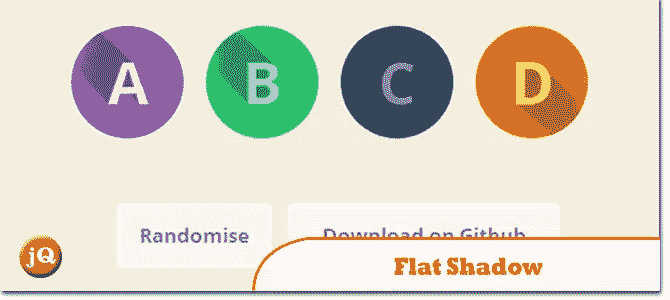
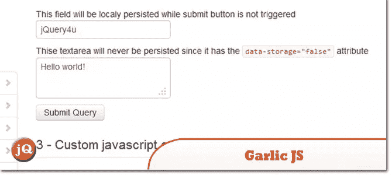
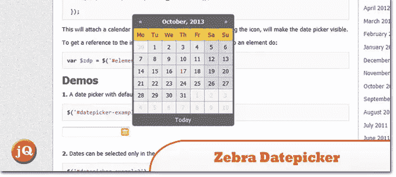
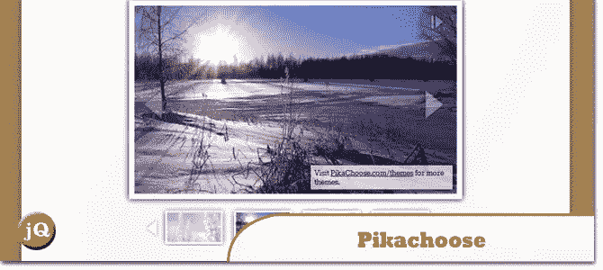
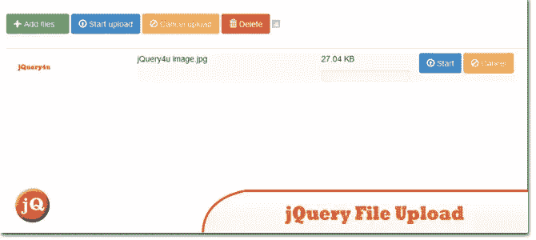

# 10 个新的随机 jQuery 插件:2013 年 10 月版

> 原文：<https://www.sitepoint.com/10-random-jquery-plugins-october-2013/>

我们希望你们还能跟上！；)下面是另一组精彩内容—**2013 年 10 月的 10 个新随机 jQuery 插件**。尽情享受吧！

**相关帖子:**

*   [**10 个新随机 jQuery 插件 2013 年 9 月**](http://www.jquery4u.com/plugins/10-random-jquery-plugins-september-2013/)

## 1.Perimeter.js

在目标元素周围创建一个不可见的边界，并监视鼠标突破。

 
[来源](http://github.e-sites.nl/perimeter.js/) [演示](http://github.e-sites.nl/perimeter.js/#examples)

## 2.开始[z 轴阵列]

一个 jQuery 插件，可以将任何标准的输入类型文件转换成一个漂亮的带有验证器和预览的拖放区。

 
[来源](https://github.com/jaysalvat/ezdz) [演示](http://codepen.io/jaysalvat/full/wjFcn)

## 3.瓦利埃塔

一个 jQuery 插件，你可以在客户端验证你的表单。它旨在减轻您的负担，使用方便，结构灵活。

 
[来源](http://lab.hasanaydogdu.com/validetta/)

## 4.jQuery 选择器

一个 jQuery 插件，旨在帮助设计和操作 HTML 选择。

 
[来源](http://lcdsantos.github.io/jQuery-Selectric/) [演示](http://lcdsantos.github.io/jQuery-Selectric/demo.html)

## 5.Device.js

基于设备操作系统(iOS、Android、Blackberry、Windows、Firefox OS)、方向(纵向与横向)和类型(平板电脑与移动设备)，轻松编写条件 CSS 和/或 JavaScript。

 
[来源](https://github.com/matthewhudson/device.js)

## 6.皮特·r 的《平影》。

一个小的 jQuery 插件，可以自动为你的平面 UI 元素投下深度阴影。

 
[来源](https://github.com/peachananr/flat-shadow) [演示](http://www.thepetedesign.com/demos/jquery_flat_shadow_demo.html)

## 7.大蒜. js

允许您自动在本地保存表单的文本字段值，直到表单被提交。

 
[源+演示](http://garlicjs.org/)

## 8.斑马 _Datepicker

这个 jQuery 插件将自动在指定的输入字段中添加一个日历图标，单击该图标将打开附加的日期选择器。

 
[源+演示](http://stefangabos.ro/jquery/zebra-datepicker/)

## 9.皮卡丘

一个轻量级的 jQuery 幻灯片插件，有很多很棒的特性。

 
[源+演示](http://www.pikachoose.com/)

## 10.jQuery 文件上传

文件上传小部件，支持多文件选择、拖放、进度条、验证和预览图像、音频和视频。

 
[源+演示](http://blueimp.github.io/jQuery-File-Upload/)

## 分享这篇文章