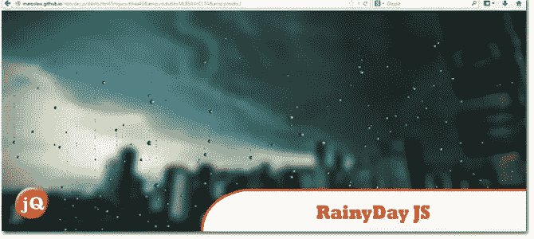
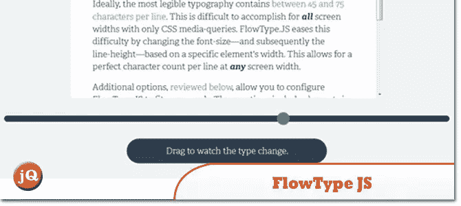
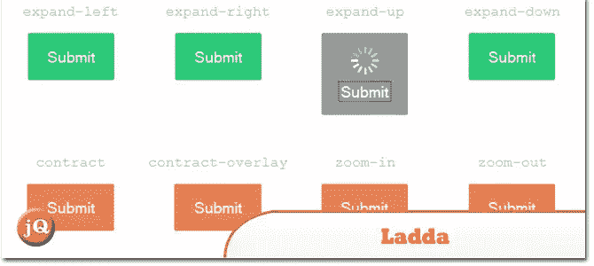
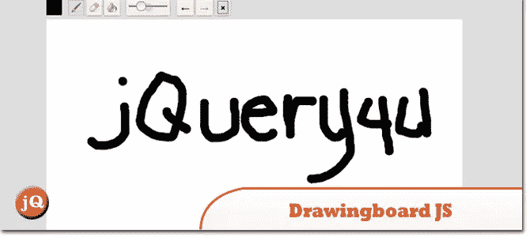

# 10 个新的随机 jQuery 插件:2013 年 9 月版

> 原文：<https://www.sitepoint.com/10-random-jquery-plugins-september-2013/>

我们收集了另外一组 **10 个新的随机 jQuery 插件**，我们认为我们会在 2013 年 9 月份分享。这里有一些不错的注意 1。雨天和 3。流量类型。看看吧！；)

**相关帖子:**

*   [**10 个随机 jQuery 插件 2013 年 6 月**](http://www.jquery4u.com/plugins/10-random-jquery-plugins-june-2013/)
*   [**随机网页开发 2013 年 8 月**](http://www.jquery4u.com/random/interesting-web-dev-finds-august-2013-part-1-of-2/)

## 1.雷尼戴. js

一个简单的脚本，用于模拟落在玻璃表面的雨滴。

 
[来源](http://maroslaw.github.io/rainyday.js/) [演示](http://maroslaw.github.io/rainyday.js/demo.html?imgur=rhnaa4G&youtube=MLBSAVcC1TA&preset=2)

## 2.佩斯网

自动页面加载进度条。

 
[源+演示](http://github.hubspot.com/pace/docs/welcome/)

## 3.流型。射流研究…

网页排版的最佳状态:基于元素宽度的字体大小和行高。

 
[源+演示](http://simplefocus.com/flowtype/)

## 4.装弹

内置加载指示器的按钮，有效地弥合了动作和反馈之间的差距。

 
[来源](https://github.com/hakimel/Ladda) [演示](http://lab.hakim.se/ladda/)

## 5.重击

使字符串 url 安全。

 
[来源](https://github.com/bengourley/slugg)

## 6.SmoothDivScroll

一个水平左右滚动内容的 jQuery 插件。

 
[来源](http://www.smoothdivscroll.com/) [演示](http://www.smoothdivscroll.com/mixedContentTouch.html)

## 7.键击器

它是一个输入捕获库，具有一些非常特殊的特性，易于获取和使用，占用空间合理(约 9kb)，并且没有依赖性。

 
[源+演示](http://dmauro.github.io/Keypress/)

## 8.在一起

由 Mozilla 提供的免费开源 JavaScript 库，为您的网站增加了协作功能和工具。

 
[源+演示](https://togetherjs.com/)

## 9.Looper。射流研究…

一个直观、轻量级的转盘解决方案。不需要编码。

 
[来源](http://rygine.com/projects/looper.js/docs/)

## 10.画板。射流研究…

一个基于画布的绘图应用程序，您可以轻松地将其集成到您的网站上。

 
[源+演示](http://leimi.github.io/drawingboard.js/)

## 分享这篇文章