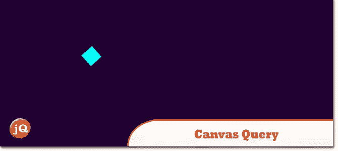
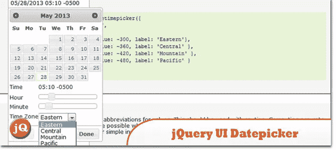
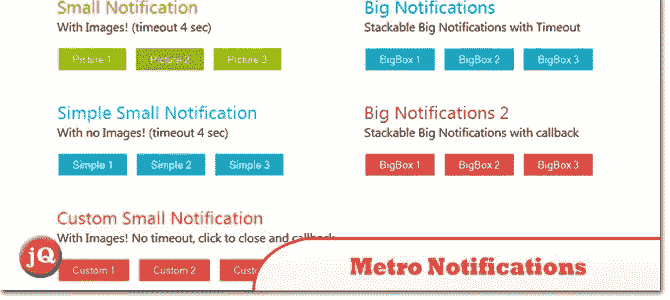
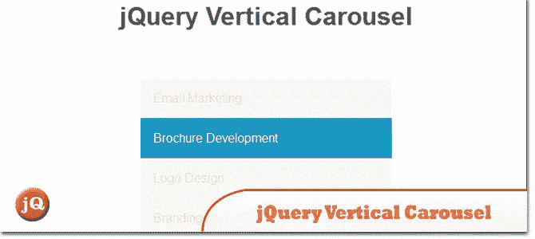
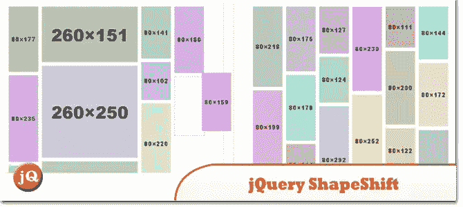
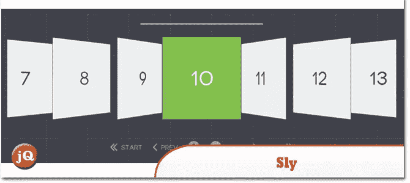
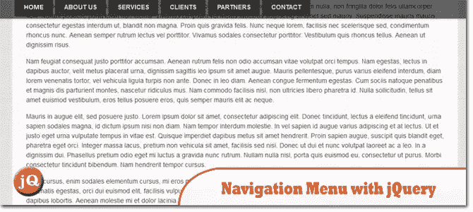
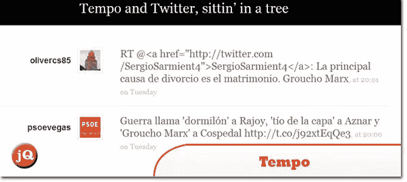
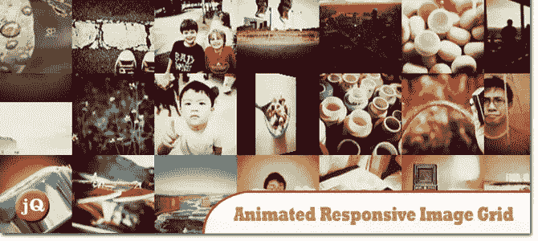
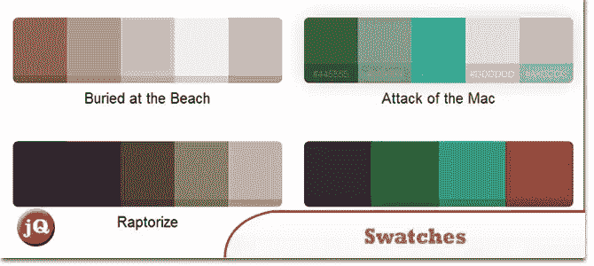

# 10 个随机 JS 插件

> 原文：<https://www.sitepoint.com/10-random-js-plugins/>

在这个由 **10 个随机 JS 插件**组成的集合中，你会发现广泛的功能，从导航增强、通知布局等等..每一个都可以为网站添加独特的元素，帮助它变得生动，对用户来说更有吸引力。玩得开心！

**相关帖子:**

*   [**10 个新随机 JQUERY 插件 2013 年 4 月**](http://www.jquery4u.com/plugins/10-random-jquery-plugins-april-2013/)
*   [**使用 JAVASCRIPT 生成随机颜色值**](http://www.jquery4u.com/snippets/generating-random-color-values/)

## 1.画布查询

像 jQuery 一样使用 HTML5 Canvas。游戏开发者的扩展画布，游戏循环、渲染循环、鼠标、触摸和键盘的简单设置

 
[来源](http://canvasquery.com/)

## 2.向 jQuery UI 日期选择器添加时间选择器

timepicker 插件向 jQuery UI Datepicker 添加了一个 timepicker，因此使用任何这些组件都需要 Datepicker 和 slider 组件(jQuery UI)。此外，所有日期选择器选项仍然可以通过时间选择器插件获得。

 
[源+演示](http://trentrichardson.com/examples/timepicker/)

## 3.地铁通知

一个 jQuery 插件，将通知提升到一个新的水平。

 
[来源](http://codecanyon.net/item/metro-notifications/3903495?ref=sdeering) [演示](http://codecanyon.net/item/metro-notifications/full_screen_preview/3903495?ref=sdeering)

## 4.jQuery 垂直转盘

jQuery 垂直转盘

 
[源+演示](http://codepen.io/gidmakus/pen/AhFgb)

## 5.jQuery。变形

jQuery 插件创建了一个基于列的网格系统，允许在多个容器之间拖放。

 
[源+演示](http://mcpants.github.io/jquery.shapeshift/)

## 6.狡猾的

JavaScript 库，支持基于项目的单向滚动导航

 
[源+演示](http://darsa.in/sly/)

## 7.jQuery 的顶层导航菜单

这是一个简单的方法来制作一个导航菜单，当向下滚动页面时，它会一直显示在窗口的顶部。

 
[来源](http://www.backslash.gr/content/blog/webdevelopment/6-navigation-menu-that-stays-on-top-with-jquery) [演示](http://www.backslash.gr/demos/jquery-sticky-navigation/)

## 8.拍子

它是一个简单、直观的 JavaScript 呈现引擎，使您能够用纯 HTML 制作数据模板。

 
[来源](http://tempojs.com/) [演示](http://tempojs.com/examples/twitter/)

## 9.动画响应图像网格

一个 jQuery 插件，用于创建一个响应式图像网格，使用不同的动画和计时来切换图像。

 
[来源](http://tympanus.net/codrops/2012/08/02/animated-responsive-image-grid/) [演示](http://tympanus.net/Development/AnimatedResponsiveImageGrid/)

## 10.jquery.swatches

一个 jQuery 插件，可以将一行 div 转换成甜美的颜色样本

 
[来源](https://github.com/maxmackie/jquery.swatches#readme) [演示](http://maxmackie.com/jquery.swatches/)

## 分享这篇文章