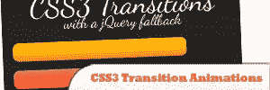
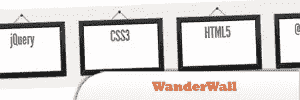
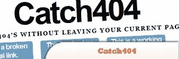
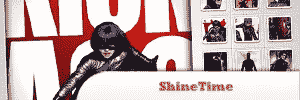
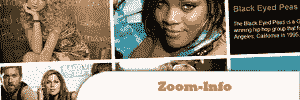
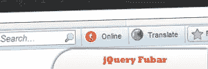
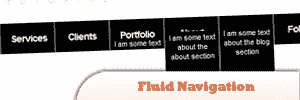

# 10 个随机的好 jQuery 插件

> 原文：<https://www.sitepoint.com/10-randomly-good-jquery-plugins/>

jQuery has been continuously giving its share in developing sites. Check out this list of random jQuery plugins that we’ve collected from awesome jQuery developer [Addy Osmani](http://addyosmani.com). Very nice plugins and I’m sure you haven’t seen most of these. Have fun!

## 1.与 jQuery 最好的朋友一起构建单页面应用程序

在本教程中，你将学习如何使用 jQuery 的一些好友构建一个支持优雅降级的单页应用程序(SPA );DocumentCloud 的 Backbone.js、Underscore.js、LAB.js 和 jQuery 模板等等。

[来源](http://addyosmani.com/blog/building-spas-jquerys-best-friends/#more-2590)

## 2.带有 jQuery 回退的 CSS3 过渡动画

了解如何使用 CSS3 过渡来增强 jQuery 应用程序的动画效果。animate()方法作为不支持过渡时的备用方法。

[来源](http://addyosmani.com/blog/css3transitions-jquery/#more-3044)

## 3.wander wall——一个基于 jQuery、CSS3 和 HTML5 的悬停界面

了解如何使用 jQuery、CSS3、HTML5 和@font-face 创建一个有用的基于悬停的用户界面。

[来源](http://addyosmani.com/blog/wanderwall/#more-1018)

## 4.rocket bar——一个 jQuery 和 CSS3 持久导航菜单

RocketBar 是一个简单的解决方案，它向你展示了如何轻松地为你的用户提供一个持久的网站导航，而不需要他们再向上滚动。

[来源](http://addyosmani.com/blog/rocketbar/#more-957)

## 5.catch 404——一个 jQuery 和 CSS3 模态插件，用于优雅地处理断开的链接

通过 jQuery 的魔力，我们将在用户不离开页面的情况下捕捉 404 个错误，然后使用内联 jQuery 模态窗口建议一些其他选项。

[来源](http://addyosmani.com/blog/catch404/#more-887)

## 6.Shine time——一个很棒的新 jQuery & CSS3 图库，带有动画效果

这种效果有助于让你的用户界面元素看起来像一张真实的宝丽来照片(或由玻璃制成),最棒的是，这并不难实现。

[来源](http://addyosmani.com/blog/shinetime/#more-702)

## 7.如何用 jQuery 和 CSS 创建一个信息丰富的图库

了解如何创建一个有用的信息丰富的 jQuery 图像库来解决这个问题。最好的一点是，编写起来非常简单，你所需要的只是 jQuery 的优秀。悬停()和。animate()函数来启动并运行它。

[来源](http://addyosmani.com/blog/zoom-info-how-to-create-an-informative-image-gallery-with-jquery-css/#more-659)

## 8.jQuery Fubar——如何从头开始创建一个网站工具栏，并向其中添加小部件

了解如何创建你自己的 jQuery 网站工具栏，然后我们将在其中加入很多有用的小部件特性，比如在 Wibiya-toolbar 中找到的那些。

[来源](http://addyosmani.com/blog/jquery-fubar-how-to-create-a-website-toolbar-from-scratch-and-add-widgets-to-it/#more-411)

## 9.流畅导航——如何用 jQuery 和 CSS 创建信息丰富的菜单栏

现在有些导航选项不能为你提供足够的关于你可以访问的网站部分的信息，所以今天我们将学习如何创建一个菜单来解决这个问题。

[来源](http://addyosmani.com/blog/fluid-navigation-how-to-create-an-informative-menu-bar-with-jquery-in-just-a-few-minutes/#more-394)

## 10.如何使用 Webkit CSS 和 JavaScript 创建令人印象深刻的动画

了解如何使用 WebKit CSS 和一些 JavaScript 创建一些简单却令人印象深刻的动画效果。

[来源](http://addyosmani.com/blog/how-to-create-impressive-animations-using-webkit-css-and-javascript/#more-281)

[文章来源](http://addyosmani.com)

## 分享这篇文章