# 10 个卓越的网站排版设计

> 原文：<https://www.sitepoint.com/10-remarkable-website-typography-designs-2/>

[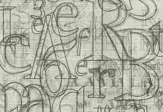](https://www.flickr.com/photos/typoatelier/4086333942/)

图片:阿诺诺克

就在几年前，如果你在网站上使用 Proxima Nova 字体，其他设计师会惊叹你的“字体设计”有多棒。

你如何在你的网站上使用这种字体并不重要——仅仅是你的网站没有使用 Arial 字体这一事实就足以让它脱颖而出。

最近，似乎每个新网站都利用了 Proxima Nova、Avenir 或 Open Sans 等漂亮的网络字体。这已经不足以让你的网站与众不同了。网站需要基于坚实的排版原则，以新颖有趣的方式使用字体，才能真正引人注目。

我见过很多使用漂亮字体的网站，但是仍然有糟糕的排版。在这篇文章中，我将展示 10 个具有非凡排版的网站的例子——不仅仅是漂亮的字体，还有漂亮的*排版*。

* * *

## 1) [面向创业者的谷歌](https://www.googleforentrepreneurs.com)

[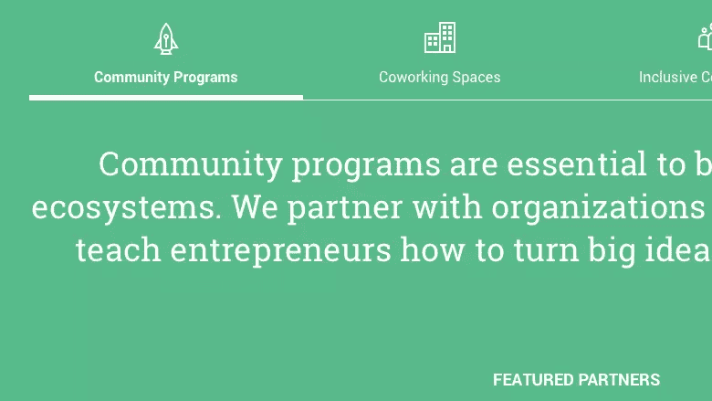](https://www.googleforentrepreneurs.com/)

没有比使用超家族更简单的方法来组合字体了。 [Roboto](http://www.typewolf.com/site-of-the-day/fonts/roboto) 和它的 slab serif 家族成员 [Roboto Slab](http://www.typewolf.com/site-of-the-day/fonts/roboto-slab) ，组成了一个完美的字体组合。他们的字体协调完美，同时仍然保持无衬线和平板衬线风格之间的坚实对比。

谷歌选择在他们的 [Google for Entrepreneurs](https://www.googleforentrepreneurs.com) 网站上使用 Roboto 家族并不奇怪，因为谷歌最初委托 Roboto 家族在他们的 Android 操作系统上使用。

* * *

## 2) [伯努瓦·查兰德](http://www.benoitchalland.com)

[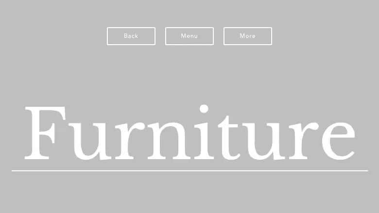](http://www.benoitchalland.com/)

顾名思义， [Libre Baskerville](http://www.typewolf.com/site-of-the-day/fonts/libre-baskerville) 是一种自由字体。对于免费字体来说，它看起来很棒。 [Benoit Challand 的网站](http://www.benoitchalland.com)通过将字体设置为非常大的尺寸，展示了 Libre Baskerville 的精细平衡的曲线。曾经流行的 [Avenir](http://www.typewolf.com/site-of-the-day/fonts/avenir) ，被评为领先设计师最喜欢的字体，以其安静庄严的外观平衡了设计。

* * *

## 3) [AKQA](http://www.akqa.com)

[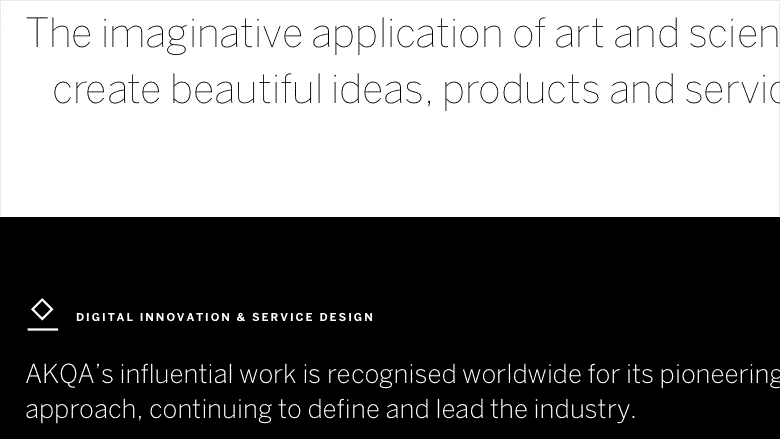](http://www.akqa.com/)

AKQA 一直以大胆和引人入胜的设计作品而闻名。然而，他们的个人品牌一直有一个鲜明和谦逊的外观。他们的新网站保持这一传统，坚持黑白配色方案，使用单一字体[本顿桑斯](http://www.typewolf.com/site-of-the-day/fonts/benton-sans)。

Benton Sans 的细而细的字体用于大字号标题，而粗而粗的字体用于小字号，使用少量的字母间距来创建平衡的字体层次。

* * *

## 4) [b14](http://www.b14.dk)

[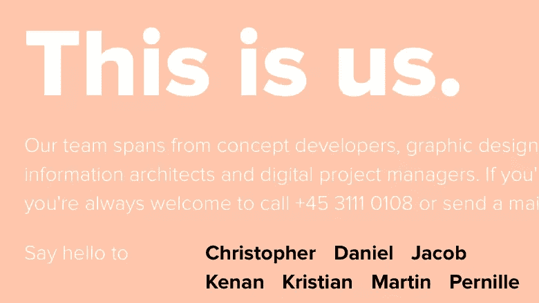](http://www.b14.dk/)

比邻星新星开始获得在网络上被滥用的名声。但是不要告诉丹麦代理 [b14](http://www.b14.dk) 。他们设法用一种常用的网络字体做了一些新的令人兴奋的事情。

字体大小从巨大到微小不等，比邻星 Nova 的众多重量被充分利用。这个网站证明了无论你使用什么字体，你都可以用你的字体做一些大胆和独特的事情。

* * *

## 5) [3FE 咖啡](http://www.3fe.com)

[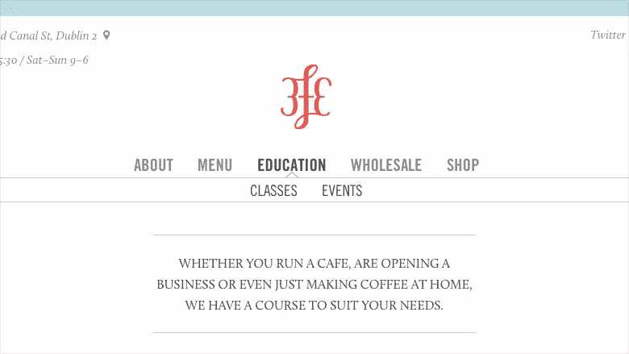](http://www.3fe.com/)

使用完全大写的 [Trade Gothic](http://www.typewolf.com/site-of-the-day/fonts/trade-gothic) 作为他们的导航和标题。Trade Gothic 是一种相当简洁的字体，很适合这种用途。由荷兰设计师 Jos Buivenga 创作的 [Calluna](http://www.typewolf.com/site-of-the-day/fonts/calluna) ，是一种美丽的衬线字体，与强烈而沉默的贸易哥特式形成鲜明对比。

我唯一的抱怨是，照片上面的一些文字在某些地方可能有点难以阅读，这证明易读性仍然应该是排版最重要的目标。

* * *

## 6) [CHGO DSGN](http://chgodsgn.com)

[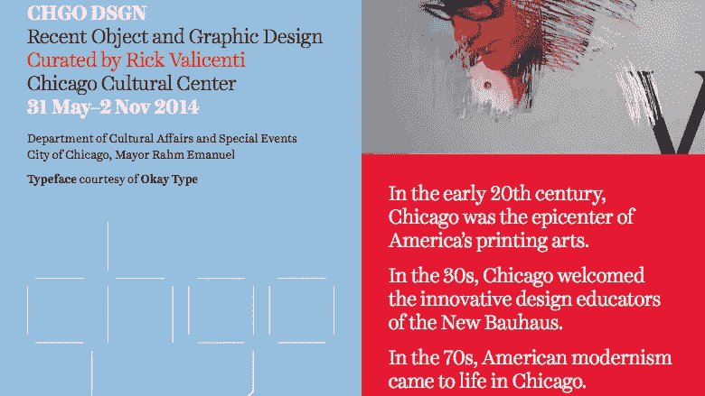](http://chgodsgn.com)

[Harriet](http://www.typewolf.com/site-of-the-day/fonts/harriet) ，由 [Okay Type](http://okaytype.com) 的 Jackson Cavanaugh 设计，是我个人最喜欢的衬线字体之一。Okay Type 总部位于芝加哥，所以 [CHGO DSGN](http://chgodsgn.com) 使用在芝加哥设计的字体是合适的。哈丽雅特文本用于阅读，用于正文的段落，显示版哈丽雅特显示用于大尺寸的标题。

* * *

## 7) [欧内斯特·海明威作品集](http://www.ernesthemingwaycollection.com)

[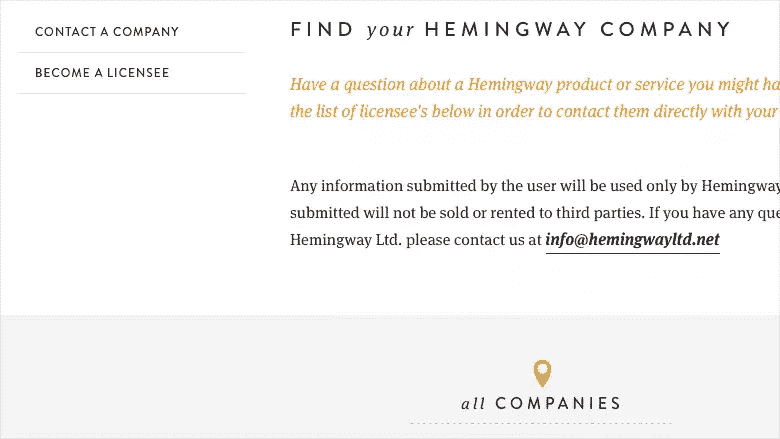](http://www.ernesthemingwaycollection.com)

由纳什维尔的机构[品牌援助](http://www.brandaiddesignco.com)设计的欧内斯特·海明威收藏网站，完美地抓住了美国偶像欧内斯特·海明威的精神。 [Brandon Grotesque](http://www.typewolf.com/site-of-the-day/fonts/brandon-grotesque) 具有高贵、优雅的感觉，是 body font [FF Meta Serif](http://www.typewolf.com/site-of-the-day/fonts/ff-meta-serif) 的绝佳搭配。贴面是一种仿旧的无衬线字体，很少使用，几乎更多的是为了纹理。

* * *

## 8) [巨大的不满](http://thegreatdiscontent.com)

[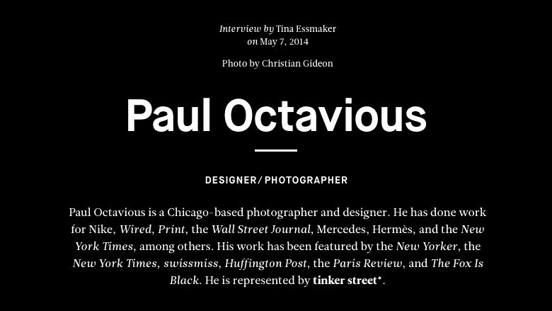](http://thegreatdiscontent.com)

*[极大的不满](http://thegreatdiscontent.com)* ，一本注重创意的杂志，在设计和排版方面自然有很高的标准。幸运的是，他们的新网站在各个方面都提供了帮助。

字体设置在 [Leitura News](http://www.typewolf.com/site-of-the-day/fonts/leitura-news) 中，这是一种专门为编辑使用而设计的字体。[新房屋](http://www.typewolf.com/site-of-the-day/fonts/maison-neue)，一个来自[环境怪诞](http://www.milieugrotesque.com)的当代怪诞，做了一个美丽的组合。从网格中突出的引用是一种很好的印刷风格。

* * *

## 我们是视觉动物

[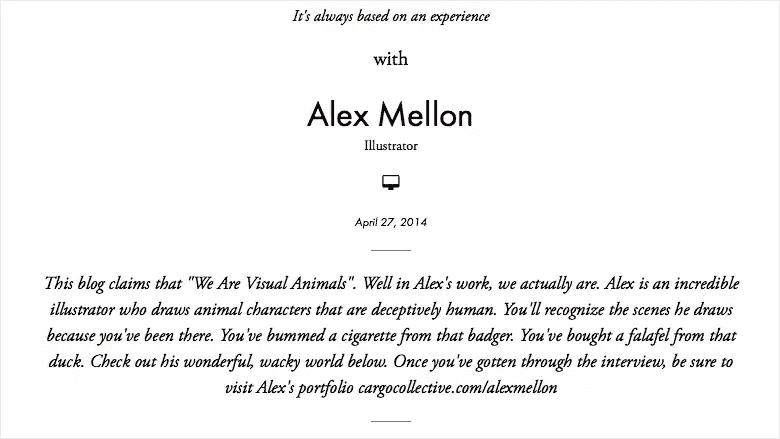](http://wearevisualanimals.com)

Futura 和 [Garamond](http://www.typewolf.com/site-of-the-day/fonts/garamond) 组成了一个经典而永恒的字体组合。[我们是视觉动物](http://wearevisualanimals.com)是一个充满醒目视觉效果的网站，所以经典的字体组合提供了一个受欢迎的喘息机会。

* * *

## 10) [独奏](http://www.thrivesolo.com)

[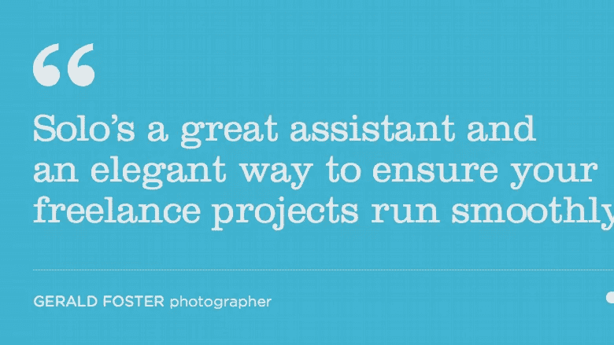](http://www.thrivesolo.com)

Clarendon 是一个很好的展示面，但是，因为它没有斜体，所以不是正文的最佳选择。 [Solo](http://www.thrivesolo.com) 突出使用克拉伦登作为标题，这给他们的网站一个大胆和独特的身份。克拉伦登的球形端子与用于正文复制的[哥谭圆形](http://www.typewolf.com/site-of-the-day/fonts/gotham-rounded)的光滑角配合良好。

* * *

以上 10 个网站展示了惊人的各种排版布局。希望这些例子能激发你在下一个网页设计项目中用排版做一些真正了不起的事情。

## 分享这篇文章