# 你可能不知道的 10 件事情

> 原文：<https://www.sitepoint.com/10-things-you-may-not-know-woocommerce-can-do/>

*本帖于 2017 年 7 月更新，增加了新选项，并更新了现有选项的相关信息。*

就像 WordPress 本身能够[转变成多种形式](https://www.sitepoint.com/15-things-you-may-not-know-wordpress-can-do/)一样，WooCommerce 也是如此。

WooCommerce 是一个在 WordPress 上运行网络商店的优秀插件，然而，它不仅仅是一个网络商店，它是一个非常通用的插件，可以用于各种其他目的。

WooCommerce 可以做这么多事情的原因是它有一个优秀的内置支付引擎，其他插件可以利用它。因此，即使你实际上没有销售产品，你仍然可以使用这个引擎及其许多不同的支付方式。

将你的 WooCommerce 网站改造成不同的东西是通过使用额外的插件或扩展来完成的，它们通常被称为。

在这篇文章中，我将介绍 10 种不同的 WooCommerce 扩展，让你知道如何使用 WooCommerce，每种扩展都有一个推荐插件。请随意搜索，看看是否有更适合您特定需求的替代插件。随着 2017 年 7 月的更新，我还会添加五个额外的项目，您可以看看！

## 1)预订

演示:[WC 度假村& Spa](http://demo2.woothemes.com/bookings/)
插件: [WooCommerce 预订](http://www.woothemes.com/products/woocommerce-bookings/)

无论你是像演示中那样出售酒店房间，还是出售你自己的单口喜剧表演的门票，使用一个预订插件就可以搞定。它使用日期和时间日历，允许访问者选择他们想要预订的时间。

这个插件非常巧妙，给了你足够多的方法来控制你的日历，防止超额预定或没有演出。你甚至可以让顾客先和你确认是否有货。该插件还负责使用 WooCommerce 支付选项开具发票。

## 2)订阅

插件: [WooCommerce 订阅量](http://www.woothemes.com/products/woocommerce-subscriptions/)

订阅用于允许定期支付。这个插件简单而强大，可以销售报纸订阅、在线访问、产品等。它甚至与许多流行的支付网关同步。因此，当客户取消与提供商的订阅时，您的商店也会取消订阅。

不管你是销售实体产品还是在线产品，只要按月或按年订阅都没关系。只要是经常性的，这个插件就符合要求。

## 3)会员资格

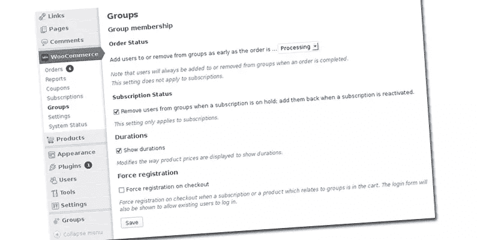

插件:【WooCommerce 的群组

WordPress 已经有了一个优秀的 [Groups 插件](http://wordpress.org/plugins/groups/)，可以用来定义成员级别。结合 WooCommerce 插件，你可以开始销售付费会员。添加上述订阅插件，你甚至可以出售经常性会员资格。

付费会员资格很受智囊团或研究小组的欢迎。这样，新会员需要付费成为会员，之后他们就可以访问作者提供的优质内容。加上订阅，作者保证从他们的团体中获得经常性收入。

## 4)脸书商店

试玩:[脸书店试玩](https://www.facebook.com/pg/LetsMakeSomeCoffee/shop/)
外挂:[脸书店](https://woocommerce.com/products/facebook/)

WooCommerce 提供了一个免费插件，可以将你的网络商店连接到脸书。这个插件允许你在你的脸书网页上建立一个商店，并且在你的网络商店和你的脸书网页之间同步你的产品。还包括一个脸书广告扩展，你可以使用它通过一个像素在脸书上(重新)锁定你的访问者。

设置非常方便。安装插件后，系统会引导您选择相关页面。脸书像素是现场制作的，产品会立即导入到您的脸书页面。然后你只需要等待脸书处理图像、文本和链接，之后你就大功告成了。

## 5)拍卖

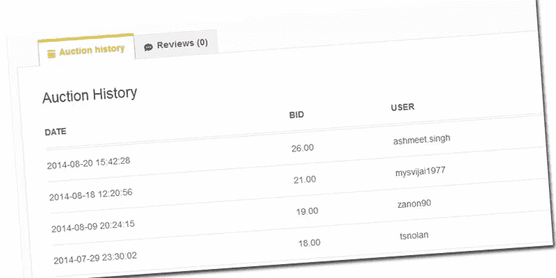

演示: [wpgenie 的 WooCommerce 简单拍卖&插件演示](http://wpgenie.org/woocommerce-simple-auctions/)
插件: [WooCommerce 简单拍卖](http://codecanyon.net/item/woocommerce-simple-auctions/6811382?WT.ac=search_thumb&WT.oss_phrase=woocommerce&WT.oss_rank=22&WT.z_author=wpgenie)

说到原创性，这是我个人的最爱之一。通过给 WooCommerce 增加一些额外的功能，你会突然变成“新易贝”。这个插件允许你为你的产品运行一个或多个拍卖，包括投标历史和倒计时定时器。

中标决定后，投标人可以立即支付他们的商品，当然这一切都由 WooCommerce 管理。甚至还有一个“我的拍卖”部分，这样竞拍者就可以随时跟踪。

对于一个拍卖网站来说，所有这些听起来都很明显，但是别忘了我们谈论的仍然是 WooCommerce。如果你问我，我会觉得印象深刻。

## 6)直运

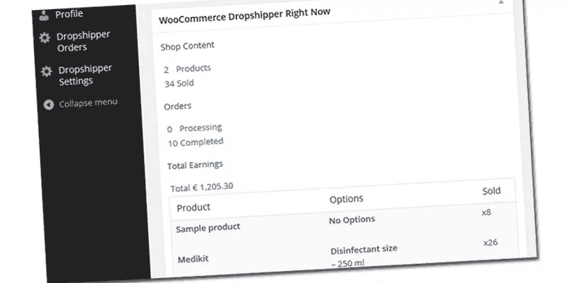

截图:[woo commerce drop shippers](https://codecanyon.net/item/woocommerce-dropshippers/screenshots/7615263)
插件: [WooCommerce Dropshippers](https://codecanyon.net/item/woocommerce-dropshippers/7615263)

起初，这个插件看起来像是一个非常简单的通知你合作的直运公司新订单的方式。这样你就可以在你的网上商店里把他们的产品当作你自己的产品来卖，当接到订单时，就会有一封电子邮件发送给供货公司。

但是这个插件将这个过程推进了一点，它还支持状态更新。这确实取决于供应商的合作意愿，但如果他们合作，你只需要在管理订单上花费有限的时间。该插件甚至可以记录你欠供应商的金额。

## 7)亚马逊商店

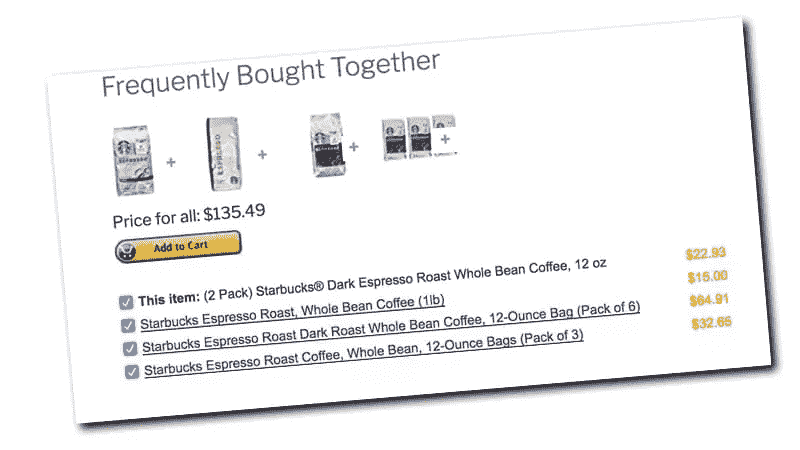

演示:[让我们做些咖啡](https://www.letsmakesomecoffee.com/)
插件: [WooCommerce 亚马逊分支机构](https://codecanyon.net/item/woocommerce-amazon-affiliates-wordpress-plugin/3057503)

我在之前提到过这个[，但是它是一个非常棒的插件，值得再次提及。它使用亚马逊的 API 将其产品完全整合到你的网络商店中，这样一来，访问者甚至不会知道它是亚马逊。](https://www.sitepoint.com/15-things-you-may-not-know-wordpress-can-do/)

你甚至可以使用亚马逊网站上的评论和“经常一起购买”的推荐。只有当顾客决定结账时，他们才会被带到亚马逊的结账页面。

因为它只是一个 WordPress 插件，你仍然可以使用原生功能。这样你可以在你的网站上运行一个独立的博客，或者将这个插件与其他 WooCommerce/ WordPress 插件和功能结合起来。如果你想获得经营网络商店的经验，而不用担心库存或付款，这个插件是完美的。

## 8)加盟店

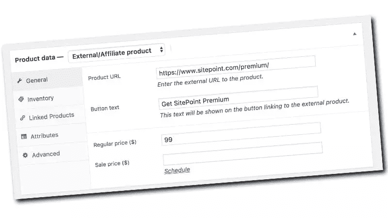

演示: [WooCommerce 演示产品](https://www.letsmakesomecoffee.com/product/sitepoint-premium/)
插件:WooCommerce(内置)

这一特点是 WooCommerce 如此受欢迎的原因之一，因为它是另一种(免费的)销售产品的方式，无需保留库存。

当然，你实际上并没有卖出任何东西，因为你是在把客户介绍给另一家公司来进行销售。然而，你可以给你的访客一个购物体验，使用交叉销售和/或追加销售，如果你愿意，可以很容易地将代销商的产品与你自己的产品结合起来。

这是一个完美的试水方式，你甚至可以把它和上面提到的亚马逊商店结合起来。它是内置的，所以你不需要额外的插件。

正如你在演示和截图中看到的例子，它的设置非常简单。

## 9)报价

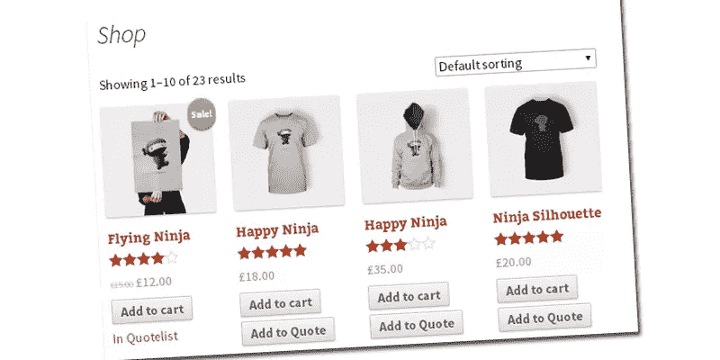

演示: [WooCommerce 询价演示](http://qlistdev.zippydev.com/wp/shop)
插件: [WooCommerce 询价](http://codecanyon.net/item/woocommerce-request-a-quote/6460218?WT.ac=category_thumb&WT.z_author=DVin)

有些情况下，您不想马上销售产品，但希望客户先向您询问报价。例如，当客户想要批量订购时。你可以使用这个插件，而不是使用电子邮件或电话来洽谈销售，它为 WooCommerce 产品列表页面增加了一个额外的选项。

你仍然需要在你的网上商店之外跟进，但是它确实节省了你通过电话讨论不同产品的大订单的麻烦。你只需要确认价格，完成交易。

## 10)有偿工作列表

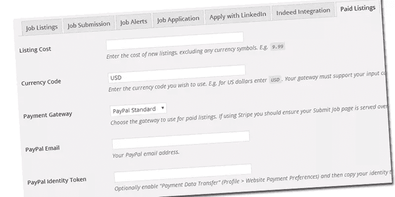

演示: [WP 作业管理器演示](http://demo.wpjobmanager.com/)
插件: [WC 付费列表](https://wpjobmanager.com/add-ons/wc-paid-listings/)

这个插件需要免费的 [WP 作业管理器](https://wpjobmanager.com/)插件才能工作，并且有一个付费的扩展。它允许你为寻找候选人的招聘人员出售工作列表。不幸的是，演示没有包括这个实际的扩展。

如果你想以最低的成本运营自己的招聘平台，这是一个很好的方式，同时还能利用 WooCommerce 的所有功能。

## 2017 年更新的奖金建议

### 11)说出你的价格

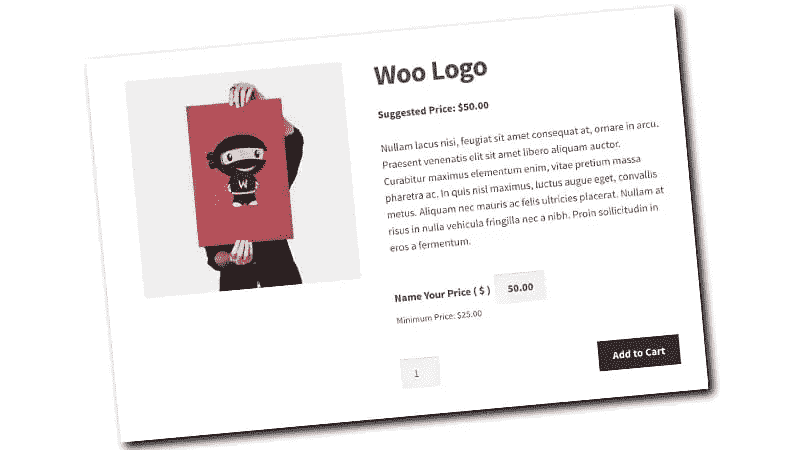

截图:[https://docs.woocommerce.com/document/name-your-price/](https://docs.woocommerce.com/document/name-your-price/)
插件:[https://woocommerce.com/products/name-your-price/](https://woocommerce.com/products/name-your-price/)

如果你想采取一种更自由的方式来销售你的产品，可以使用这个插件，让买家决定他们想付多少钱。如果你想为你的产品赚取最低价格，你也可以指定一个固定价格，并在价格的基础上增加一个可变部分。

如果你想接受捐赠，并希望你的访问者指定要支付的费用，也可以使用这个插件。

### 12)市场

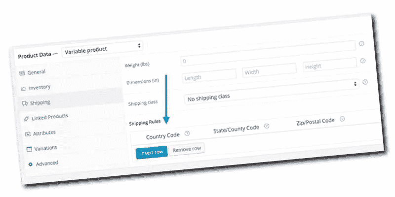

截图:[https://docs.woocommerce.com/document/product-vendors/](https://docs.woocommerce.com/document/product-vendors/)
插件:[https://woocommerce.com/products/product-vendors/](https://woocommerce.com/products/product-vendors/)

如果你想创建你自己的市场，在那里你充当中间人，“产品供应商”插件是一个很好的解决方案。你可以让你的供应商管理他们自己的库存和列表，你可以从每笔销售中获得佣金。

虽然这可能看起来类似于直运，但实际上更好。但是让你的供应商做管理库存的繁琐工作，你可以专注于建立和推广你的网上商店。你也可以选择在你的市场上和供应商一起展示你自己的产品，以获得更大的份额。

如果你能找到适合这种模式的供应商，这个插件可以让你以相对较低的风险经营一个成熟的网络商店。你接受付款，扣除你的佣金，付给供应商他们的份额。

### 13)设计自己的产品

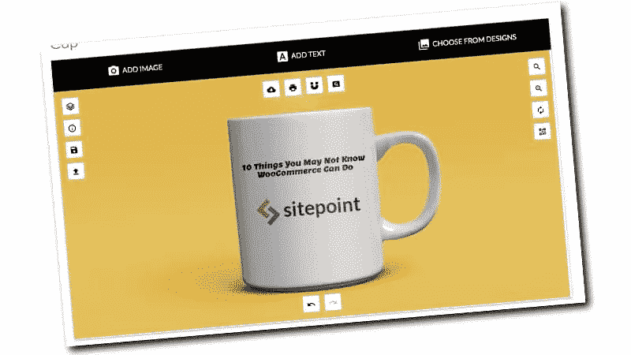

演示:[http://fancyproductdesigner.com/product/cup/](http://fancyproductdesigner.com/product/cup/)
插件:[https://code canyon . net/item/fancy-product-designer-wocommercewordpress/6318393](https://codecanyon.net/item/fancy-product-designer-woocommercewordpress/6318393)

让你的顾客设计他们自己的杯子、t 恤、名片；基本上任何可以定制的产品。这个插件为你的客户提供了一个简单易用的工具来上传他们自己的图片，并添加他们喜欢的各种颜色的文本。

该插件允许根据使用的元素和材料以及层数进行动态定价。您可以根据自己的生产流程，指定希望客户拥有的灵活性。

### 14) CRM

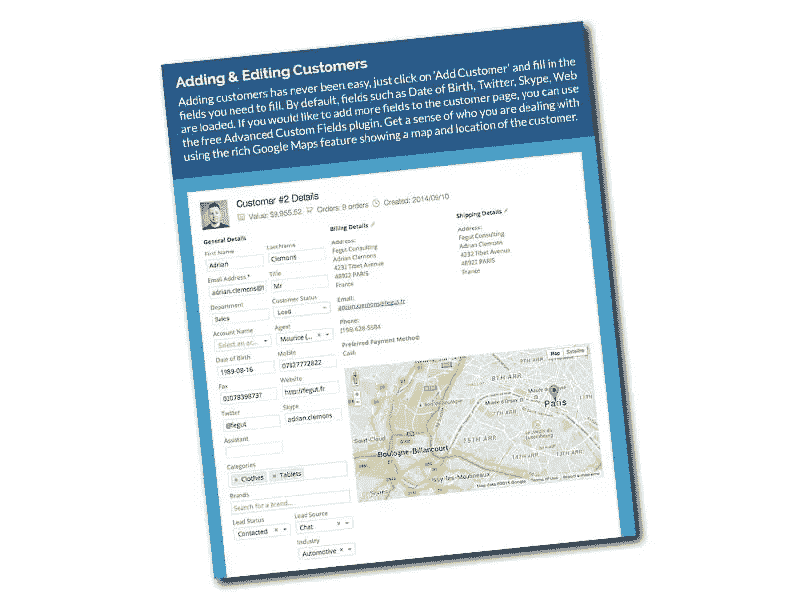

演示:[http://demo.actualityextensions.com/demo-login.html](http://demo.actualityextensions.com/demo-login.html)

如果你想和你的客户建立关系，有一个 CRM 来跟踪沟通和订单是最完美的。尤其是对于大件商品，保持联系是获得订单和维护未来订单关系的关键。

这个 WordPress CRM 可以很好地与你的网络商店整合，跟踪客户的订单、电子邮件和聊天记录以及状态。它也可以作为独立的 CRM 使用，不需要从你的网络商店出售任何东西。

### 15)销售点

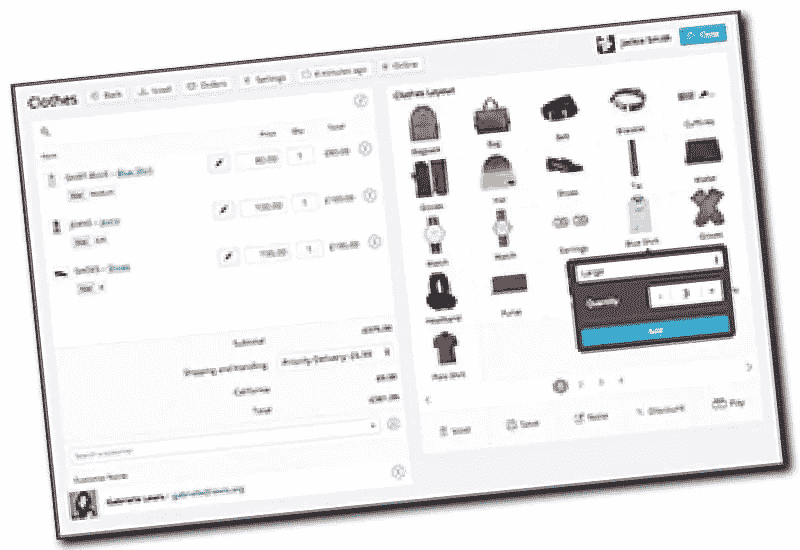

演示:[http://demo.actualityextensions.com/wp-admin/](http://demo.actualityextensions.com/wp-admin/)

这个销售点(POS)插件展示了 WooCommerce 的巨大灵活性，以及它在任何与销售相关的事情上的转变能力。通过使用这个插件，你可以在你的实体店和网上商店出售相同的股票。这样你就永远不会在不知道的情况下耗尽库存，还有库存通知。你甚至可以运行多个网点，并在所有场馆保持同步。

该插件兼容多种类型的硬件，如条形码扫描仪和支付网关。它还拥有出色的客户管理，因此您可以跟踪回头客。

## 结论

正如你所看到的，WooCommerce 能够做的不仅仅是销售产品！

WooCommerce 的开放架构允许功能上的许多变化，所有这些插件都很好地利用了这一点。

如果你有技能，你甚至可以自己构建一些东西，因为它附带了大量的文档。

请在评论中让我知道你对这样使用 WooCommerce 的看法，甚至给这个列表添加新的建议。

## 分享这篇文章