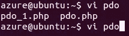
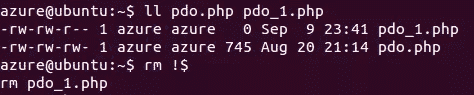

# UNIX 初学者的 10 个节省时间的终端技巧

> 原文：<https://www.sitepoint.com/10-time-saving-terminal-tips-unix-beginners/>

如今，终端是许多 web 开发人员工作空间的首选。为什么不呢？有了正确的命令集，终端肯定可以更快地完成任务。然而，初学者会犯一些耗时的错误。时间就是金钱，在这篇文章中，我们将关注几个可以帮助你快速有效地完成行动的领域。

## 1.使用制表符结束

这可能是我见过的初学者最常犯的错误。假设您需要在文本编辑器中打开一个名为“`my_long_file_name.py`”的文件。您键入文件的完整名称并按回车键，却发现自己拼错了。所以你又开始打字了。不应该是这样的。

一旦你输入了 2-3 个字符，点击 tab，剩下的名字就会自动完成。如果您有相似的文件名(如“`my_long_file_name.py`”和“`my_long_file_name.py.bkp`”)，公共部分将为您完成，您将看到两个选项，如下所示。



这同样适用于命令。键入命令的一部分，然后按 tab 键完成命令。如果有类似的命令，您将看到选项，就像文件的情况一样。

过度跳转没有坏处，所以如果你还没有开始经常使用它，那就开始吧。

## 2.用！！以最后一个命令为前缀

在[以前的一篇文章](https://www.sitepoint.com/15-little-known-unix-commands)中，我提到过`sudo !!`用管理员权限运行前面的命令。我没有提到的是`!!`所做的只是用之前的命令替换自己。

要执行相同的任务，按“向上”箭头，然后按`home`键(或`Fn` + `<-`)到达命令的开头。这真的取决于你个人的选择。

此外，`!:n`选择最后一个命令的第 n 个参数(但不是命令的其余部分)，而`!$`选择最后一个命令的最后一个参数。



## 3.剪切和粘贴线条

如果你正在打一个很长的东西，并且意识到它需要被放在别的地方，你可以通过按`Ctrl` / `Cmd` + `U`来剪切当前行中的任何内容。然后你可以通过按`Ctrl` / `Cmd` + `Y`把它粘贴到其他地方。如果您不想因为选择文本来执行这些操作而变得混乱，它们是有用的快捷方式。

## 4.清除屏幕

如果您想从终端视图中清除前面命令的输出，您可以运行—

```
clear 
```

然而，这有一个捷径。只需点击`Ctrl` / `Cmd` + `L`，当前行以上的所有文本将被清除。与`clear`命令不同，当你写了一半的命令时，可以使用这个快捷键，而不会丢失。

## 5.`cd`到主目录

无论您的工作目录是什么(运行`pwd`获得您的绝对工作目录)，您都可以通过运行以下命令随时切换回您的主目录(`/home/username/`)

```
cd 
```

或者，您也可以运行以下命令:

```
cd ~ 
```

这就引出了您的下一个技巧…

## 6.您的主目录的相对路径

您可能知道您的主目录是`/home/username/`，但是在终端中工作时，您可以使用`~`作为您的主目录的相对路径。例如:

```
cd ~ 
```

指向:

```
cd /home/username/ 
```

这里有一些其他的例子。

```
vi ~/.bash_history
cd ~/git.slides/
scp -r ./ donny@192.168.121.147:~/ 
```

上面列出的命令等效于以下命令:

```
vi /home/username/.bash_history
cd /home/username/git.slides/
scp -r ./ donny@192.168.121.147:/home/donny/ 
```

## 7.使用化名

我相信您一定运行过对您的工作至关重要的长命令。类似如下的命令:

```
python manage.py runserver --settings=project.development 
```

为了避免每次需要时都键入如此长的命令，可以使用别名。

```
alias start-dj="python manage.py runserver --settings=project.development" 
```

下次运行`start-dj`，实际执行的是这个— `python manage.py runserver --settings=project.development`。

## 8.使用`.bashrc`

使用别名很好，但令人难过的是，一旦你关闭终端，它们就会从记忆中消失。要保存它们，您需要将它们存储在您的`.bashrc`文件中。默认情况下，它存储在您的主目录中(`/home/username/.bashrc`或`~/.bashrc`)。只需将别名命令粘贴到`.bashrc`文件中，重启终端即可生效。

如果您不想重启终端，保存`.bashrc`文件并运行以下命令使新别名生效。

```
. ~/.bashrc 
```

开发人员在使用别名定制命令时可以变得非常有创意。有各种各样的自定义命令可以使您的工作更容易，但我不会提及其中任何一个，因为它们因人而异。或许，你会在适当的时候发展出自己的捷径。

## 9.在旅途中创建文件

你可以很容易地动态创建一个文件，并将内容作为函数的输出。

```
[command] > sample_file 
```

文件`sample_file`被创建，如果已经存在则被替换(无需任何确认)。因此，您在执行此操作时必须小心。

这个命令对于获取数据库转储非常有用。例如:

```
mysqldump -u [username] -p -D [database] > db_dump 
```

这样做的结果是，您可以通过给出一个空命令(当然，它有一个空输出)轻松地创建空文件。

```
> sample_file 
```

上面的命令将创建一个名为`sample_file`的空文件。

## 10.使用文件内容作为命令的参数

就像我们可以将命令的输出存储到文件中一样，我们可以使用文件的内容作为命令的输入。例如，下面将使用输入的`sample_file`作为参数来运行命令。

```
[command] < file 
```

这方面的一个用例是恢复 SQL 转储。

```
mysql -u [username] -p -D [database_name] < db_dump 
```

这将首先登录到 MySQL，然后在 MySQL shell 中运行`db_dump`中的每一行。

## 奖金

现在你已经在终端上完成了你的工作，你可以键入`exit`并按下回车键，或者你可以按下`Ctrl` / `Cmd` + `D`来做同样的事情——这是你的选择。

这样，我们就到了省时清单的末尾。你有什么有趣的 UNIX 技巧或别名想分享吗？欢迎在下面评论。

## 分享这篇文章