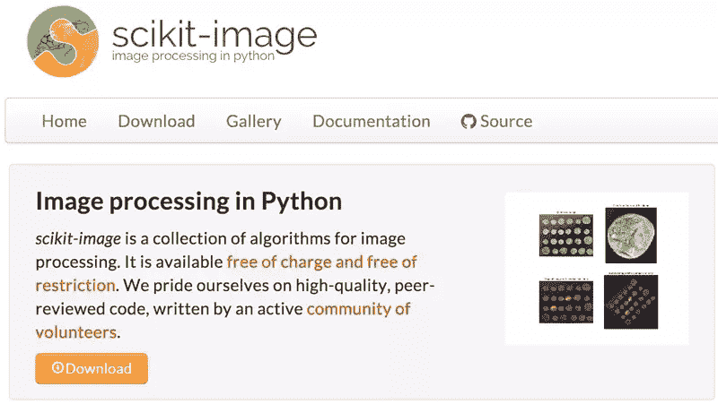
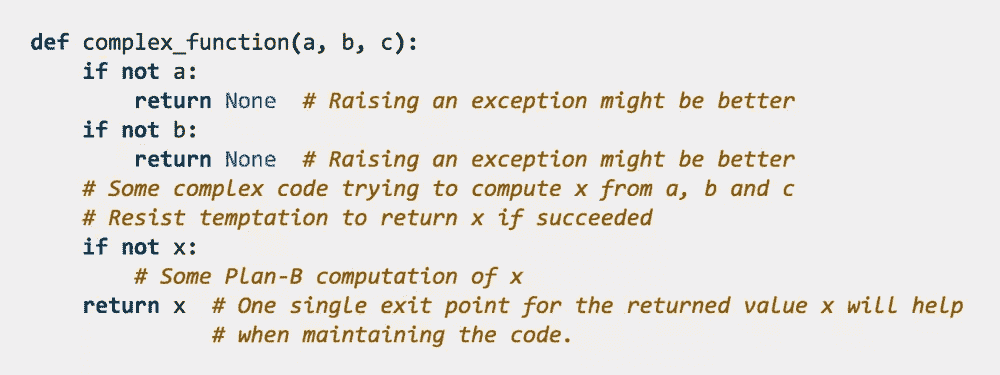

# 给蟒蛇的 10 个省时建议

> 原文：<https://www.sitepoint.com/10-time-saving-tips-pythonists/>

Python 是一种美丽的语言，能够激发用户的爱。因此，如果你想进入编程领域，或者如果你对 C++、Perl、Java 等有些厌倦，我建议你试试 Python。

Python 有许多吸引程序员的特性。它易于学习，面向对象，字节编译，免费和开源。它还具有运行时类型检查、完全和快速支持，以及用于执行各种任务的大量库。

## Python 的效率

在这篇文章中，我想强调一些在 Python 中节省时间从而最大化生产力的方法。

在准备过程中，我询问了几个蟒蛇学家他们最好的省时技巧。以下是结果…

### 1.不要用分号

因为在 Python 中使用分号被认为是可选的——与其他面向对象的编程语言相反——所以您不需要用分号结束代码的每个语句。

这看起来很简单，并不浪费时间；但是一旦你的代码扩展到成千上万行，所有这些分号会让你有点分心，而且会有很多不必要的输入。

### 2.获得一个好的代码编辑器

选择正确的 Python 编辑器可以节省大量时间。许多新的 Python 程序员对于选择哪一个代码编辑器感到困惑——尤其是有这么多可用的代码编辑器。

习惯了一个编辑器，然后又不得不换另一个编辑器，这是非常具有破坏性的，所以最好从一个好的编辑器开始。确保无论你选择哪一个，都是实时切片 8 和 [PEP8](https://www.python.org/dev/peps/pep-0008/) 。

关于选择哪个编辑器的指导，请参见我以前的文章[python 们使用哪些代码编辑器？](https://www.sitepoint.com/which-code-editors-do-pythonists-use/)

### 3.遵循 Python 代码风格

遵循 Python [代码风格](http://docs.python-guide.org/en/latest/writing/style/)可以增强代码的可读性，从而节省浏览代码的时间。(Python 的[设计理念](https://en.wikipedia.org/wiki/Python_%28programming_language%29#Features_and_philosophy)强调代码可读性的问题。)

### 4.使用`help()`功能

Python 的`help()`是一个非常方便的内置函数，可以节省很多时间——例如，在搜索其他函数的描述时。你可以直接从你的解释器控制台运行这个函数。

Python 文档描述了很好地使用这个函数的方法。

### 5.使用库

有很多 Python 库可以让你每次都不用重新发明轮子。

例如，您可以从 Python 软件库[PyPI](https://pypi.python.org/pypi)(Python 包索引)提供的一系列包中进行选择。

Python 库的一个很好的例子是 [scikit-image](http://scikit-image.org/) 。只需调用函数，它就可以执行模糊、增强对比度和缩放等图像处理任务。

### 6.使用 Cookiecutter

 [Cookiecutter](https://github.com/audreyr/cookiecutter) 是一个命令行工具，可以让你从项目模板中创建所有的 Python 项目样板文件，这可以节省大量时间。

### 7.严谨地评论

养成注释代码的习惯将会为你和他人节省大量时间，尤其是以后。(是的，我们经常听到这样的话，但是还是需要提醒很多程序员，好像！)

当在团队中工作时，评论尤其重要——尤其是那些变化很大的团队。

### 8.经常测试

尝试测试程序中的每个组件。虽然这听起来很耗时，但从长远来看，边编码边测试可以节省大量时间，并确保没有隐藏的错误。它还强化了你对每段代码实际上在做什么的理解。

一个[REPL](https://en.wikipedia.org/wiki/Read%E2%80%93eval%E2%80%93print_loop)——一个读取-评估-打印循环——是一种测试代码的常用方法，经常被 python 们所采用。

### 9.专注和专业化

有成就的蟒蛇学家的一个普遍建议是有一个专门的焦点或专业领域。你可以用 Python 做很多事情——从为网络摄像头编码到处理计算和数学。

有很棒的库可以帮助完成这些任务，比如处理计算机视觉的[simple cv](http://simplecv.org/)； [Biopython](http://biopython.org/wiki/Main_Page) ，生物计算的库；还有 [SymPy](http://www.sympy.org/en/index.html) ，一个处理符号数学的库。

深入这些领域，并掌握一个特定的框架，有助于您在更深的层次上学习 Python，掌握一种特定的编码风格(在第 3 点中提到)，并处理特殊类型的问题。

### 10.每天写代码

当你养成了每天编写 Python 代码的习惯，使用 Python 解决问题将开始成为你的第二天性。可以说，你将开始用 Python 思考，这最终将帮助你更快地导航和解决问题。

## 包扎

在这篇简短的文章中，我列出了我在和 python 们讨论节省时间的技巧时收集到的主要技巧。这里有几个我可以添加到列表中的其他人。

### 参加 Python 活动和聚会

尽可能确保参加活动和聚会。它们非常适合分享经验、最佳实践、工具和其他有趣的话题。

这可能并不明显是一种节省时间的策略，但通过建议、技巧和黑客从他人的经验中学习是避免重复发明轮子的另一种方式。

一年一度的 [PyConf](https://us.pycon.org/2015/) 是一项值得一试的盛事。

### 在纸上思考

在直接进入代码之前，在纸上思考会给你改变的灵活性。直接写代码迫使你从一开始就参与到实现细节中，这并不总是在开始一个项目时最好地利用你的时间。Paper 的无分心模式非常适合头脑风暴和解决问题！

### 掌握基础知识

最后，这似乎是显而易见的，但是一定要花时间学习 Python 的基础知识。这最终会节省你很多时间，因为你会更好地准备处理更复杂的话题。

一些有助于此的好书包括

*   [学习 Python](http://www.amazon.com/Learning-Python-5th-Mark-Lutz/dp/1449355730/ref=sr_1_5?s=books&ie=UTF8&qid=1434899928&sr=1-5&keywords=python+for+beginners)
*   [Python 编程初学者:Python 计算机语言和计算机编程入门](http://www.amazon.com/Python-Programming-Beginners-Introduction-Computer/dp/1501000861/ref=sr_1_1?s=books&ie=UTF8&qid=1434900007&sr=1-1&keywords=python+for+beginners)。

通过阅读博客和文章，及时了解新闻也很重要。一个值得关注的博客是[鼠标 vs . Python](http://www.blog.pythonlibrary.org/)。

* * *

嗯，我相信还有更多的事情可以添加到清单上。编程 Python 时，你有哪些最省时的小技巧？请在评论中告诉我！

## 分享这篇文章