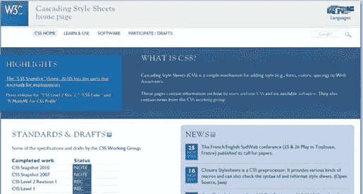
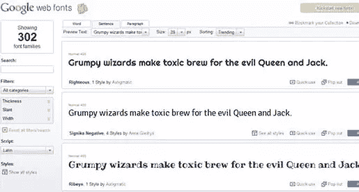
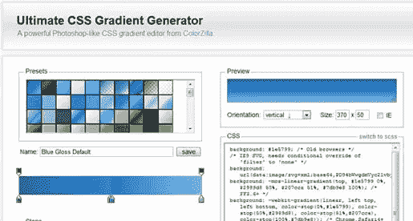
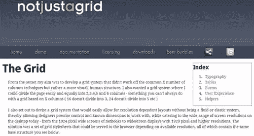
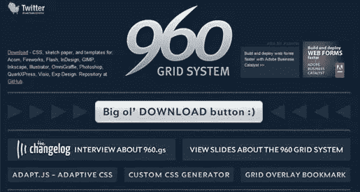
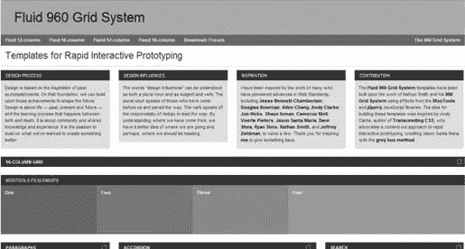
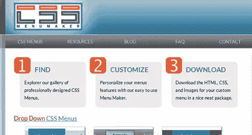
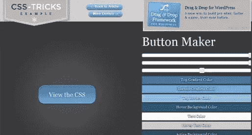
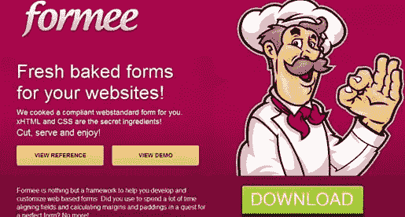

# 10 大 CSS 设计资源

> 原文：<https://www.sitepoint.com/10-top-css-design-resources/>

级联样式表(CSS)为您提供了对任何 web 文档的布局和设计的前所未有的控制。随着浏览器支持的改进，我们将会看到 CSS 成为主要的样式系统。这部分是因为与大多数 JavaScript、AJAX 或基于图像的设计系统相比，CSS 是如此之轻。随着对滑块和渐变等更多过渡特性的支持进入 CSS，在不久的将来可能除了 CSS 之外不再需要任何东西。

以下集合是 CSS 的一站式商店。从 W3C 的官方主页到渐变和按钮生成器——所有这些资源都经过了仔细的审查和测试。有了这些工具，你可以使用 CSS 作为实现外观和感觉的主要(如果不是唯一的)系统来完成任何你想要的 CSS 设计任务。

请让我们知道您的想法，以及是否有应该在此列表中的可用资源！

* * *

### 万维网联盟(W3C)

这是 CSS 的大本营。官方 CSS 总部，万维网联盟 W3C 建立 Web 标准，CSS 是他们管理的标准之一。虽然有些浏览器支持 W3 标准之外的 CSS，但这个网站是您获取 CSS 权威信息的地方。他们有优秀的 CSS 培训和大量的资源。

* * *

### 谷歌网络字体

网络字体是未来向你的网站添加排版元素的方式。谷歌允许字体设计师上传他们的字体，他们完全可以免费用于商业或个人用途。只需在 CSS 文档中添加一个@import 字符串，就可以实现这些高质量的字体。

* * *

### 终极 CSS 梯度生成器

最后，基于 CSS 的渐变，适用于所有主流浏览器。Colorzilla 整合了这一精华，它使用 CSS3 和 HTML5 的组合来获得跨浏览器的一致结果。它甚至支持 IE9，信不信由你。只需点击“IE”按钮，看看在 IE 中渐变会是什么样子，以确保它是你想要的。渐变编辑器非常棒，代码也很容易实现。

* * *

### CSS3Gen

为圆角、投影和文本阴影快速生成 CSS 代码片段的优秀资源。这对于你想把信息从其他内容中分离出来的对话框、表单和侧栏来说是很好的选择。页面工具非常简单，可以很容易地集成到其他功能中。更好的是，每个工具都有 CSS 函数在每个浏览器中如何工作的详细解释。因此，这既是一个易于使用的工具，也是一个优秀的工具，用于解决浏览器可能无法按预期响应的问题。

* * *

### 不仅仅是网格

并非所有的网格都以相同的方式运行。有些是流动的，而有些是固定的。不仅仅是 grid 想出了一个基于屏幕可用分辨率为 Grid 提供服务的系统，使它成为一个混合体。系统是流动的，因为它以屏幕分辨率工作，但是一旦页面加载，网格是固定的。结果每次都是干净的布局。

* * *

### 960 网格系统

960 网格系统是一种固定宽度的方法，有一个简单的前提:不要浪费时间，只管设计。它们只有几个网格，但是很容易实现。他们的客户名单——包括索尼音乐、Drupal、Fedora 和许多其他公司——不言自明。免费下载包括 Photoshop、Fireworks、Gimp 和其他动作/模板文件，以创建符合要求的设计。然后拼接就行了！

* * *

### 流体 960 网格系统

寻找一个能在各种显示宽度上流畅运行的网格系统？Fluid 960 Grid System by Design Influences 是一个灵活的系统，用于确保您的内容始终在视图中。如果你想要一个有很多图形的网格，这并不理想，因为这个系统的流动性会以一种笨拙的方式推动图像。该网站提供了许多强大的工具，如图像预览、手风琴和 12 列和 16 列设计的多种网格尺寸。固定宽度系统也是可用的。

* * *

### CSS 菜单生成器

跨浏览器兼容，基于 CSS 的下拉菜单现在是可能的。不需要 JavaScript。该网站提供完全可定制的各种类型的菜单:下拉菜单、水平菜单和垂直菜单。拥有大量的资源，这也是许多其他 CSS 开发工具的一站式商店。

* * *

### CSS 按钮生成器

寻找一个无图像的按钮解决方案？CSS 按钮制造商的 CSS-Tricks 让您快速生成 CSS 按钮，只有跨浏览器兼容。您可以稍后调整代码或使用他们提供的股票代码。它不会变得更容易，渐变工具很容易使用。支持悬停，因此您可以向用户提供视觉反馈。WordPress 也有拖放功能。

* * *

### 形成一个

对表单进行编码并获得正确的结果是一件非常痛苦的事情。如果您曾经遇到过字段浮动或文本元素对齐有问题，您会理解。Formee 有一套简单的模板表单，与上面的 960 网格系统兼容，所以它会很快就位。代码有很好的文档记录，并且很容易进行修改。

* * *

### 我们错过了什么？

还有其他基于 CSS 的工具我们应该放在这里吗？你用什么来完成工作？

## 分享这篇文章