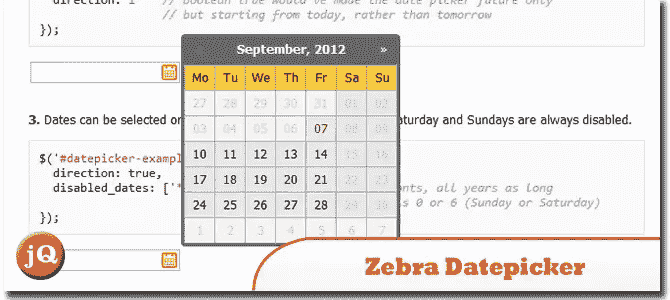
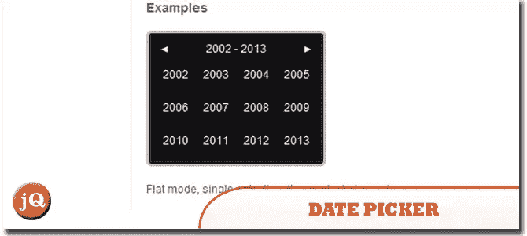
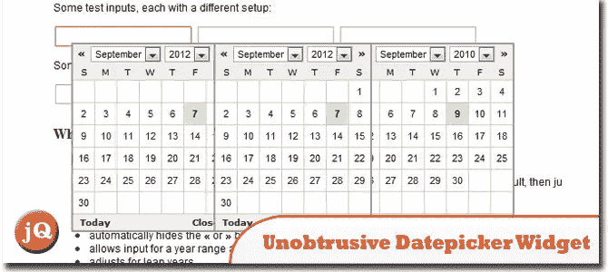
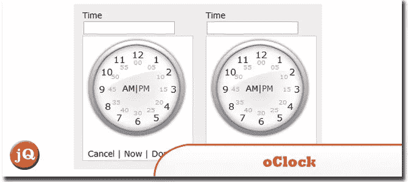
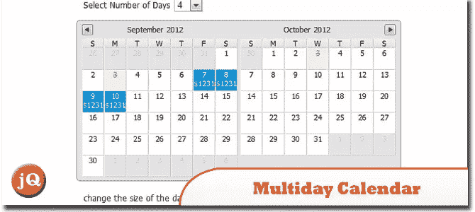
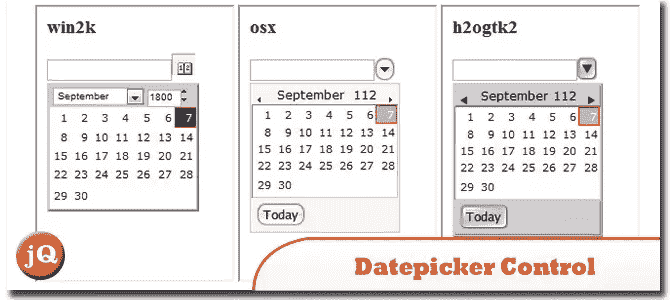
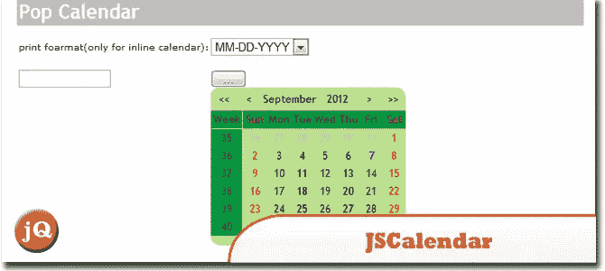
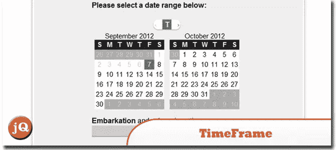
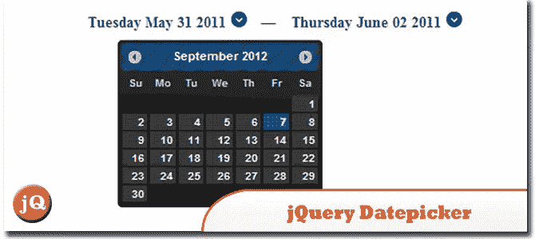

# 10 个顶级 jQuery 日期弹出插件

> 原文：<https://www.sitepoint.com/10-top-line-jquery-date-popup-plugins/>

有了这些 **10 个顶级的 jQuery 日期弹出(日期选择器)插件**，你通常可以在几分钟内丰富你的表单，你的用户肯定会喜欢它！它们中的大多数被设计成一旦用户激活一个日期表单域，就打开一个可点击的日历弹出窗口。玩得开心！

## 1.斑马 _Datepicker

一个小巧、紧凑且高度可配置的 datepicker jQuery 插件，旨在通过添加 datepicker 功能来丰富表单。
 
[源+演示](http://stefangabos.ro/jquery/zebra-datepicker/)

## 2.日期选择器 JQUERY 插件

它有很多选项，很容易适应你的网络应用。
 
[源+演示](http://www.eyecon.ro/datepicker/)

## 3.不引人注目的日期选择器小部件更新

一个可以使用键盘访问的日期选择器(jquery Calendar ),不需要嵌入 JavaScript 块，不使用弹出窗口，适合在作为 application/xhtml+xml 的文档中使用。
 
[源+演示](http://teddevito.com/demos/calendar.php)

## 4.o clock–模拟时间选择器

一个闪亮的模拟时间选择器，方便用户选择时间。它像日期选择器一样把你的输入转换成模拟时钟。
 
[来源](http://codecanyon.net/item/oclock-analog-time-picker/238377?ref=themespotters) [演示](http://codecanyon.net/item/oclock-analog-time-picker/full_screen_preview/238377?ref=themespotters)

## 5.jQuery.calendar/datepicker

一个轻量级 jquery 日历/日期选择器。一些值得一提的特性可能是:支持国际化(支持不一定意味着它被实现)，支持改变当前日期，支持鼠标滚轮滚动，支持日期选择的(延迟)回调，支持可变的年数、月数和天数，支持下一个/上一个箭头。
 
[源+演示](http://bugsvoice.com/applications/bugsVoice/site/test/calendarPickerDemo.jsp)

## 6.多日日历日期选择器 JQuery 插件

多日、多月的动画 datepicker jquery 日历插件，未压缩开发版重 14KB。
 
[源+演示](http://www.overset.com/2008/05/12/multiday-calendar-datepicker-jquery-plugin/)

## 7.Datepicker 控件(JavaScript Datepicker)

允许用户从下拉日历中轻松选择有效日期。不必担心日期格式，通过选择日期，它总是正确的。
 
[来源](http://www.blueshoes.org/en/javascript/datepicker/) [演示](http://www.blueshoes.org/_bsJavascript/components/datepicker/examples/example4.html)

## 8.JSCalendar (JavaScript)

一个 JavaScript 类，向表单元素添加可访问的、不引人注目的日期选择器。通过使用它，您可以在最短的时间内设置最酷的日历。
 
[来源](http://codecanyon.net/item/jscalendar/67528?ref=themespotters) [演示](http://www.egrappler.com/responsive-image-content-slider/index.htm)

## 9.时间范围，(JavaScript 日期选择器)

一个开源的 JavaScript 日期选择器。
 
[来源](http://stephencelis.github.com/timeframe/) [演示](http://stephencelis.github.com/timeframe/#example_information)

## 10.jQuery 日期选择器

允许用户选择日期范围的简单 jQuery UI 日期选择器扩展。当用户选择一个日期，一个隐藏的表单被提交。
 
[来源](http://codecanyon.net/item/jquery-date-range-picker/261519?ref=themespotters) [演示](http://www.egrappler.com/responsive-image-content-slider/index.htm)

## 分享这篇文章