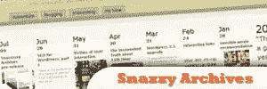
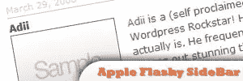
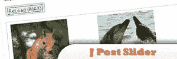
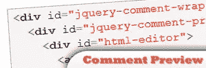

# 10 个终极 jQuery WordPress 插件

> 原文：<https://www.sitepoint.com/10-ultimate-jquery-wordpress-plugins/>

We all know that WordPress is mostly considered as the best blog CMS (Content Management System) script today. And I believe that’s true, it’s easy to use and easy to get along with. Well, what could be more of it if we integrate it with the all beauty and mighty jQuery? If combined, these two would be impossible to beat in terms of graphical related areas. **jQuery is well known for it’s cool and eye catchy effects and WordPress is considered the best blog CMS**. Recently, I’ve come across to different websites and scraped some of the best jQuery plugin tailored for WordPress. So here they are!

相关帖子:

*   [**如何给单个 WordPress 帖子添加 JavaScript**](http://www.jquery4u.com/tutorials/add-javascript-single-wordpress-posts/)
*   
***   [**【第二部分】**](http://www.jquery4u.com/snippets/9-snippets-hacks-wordpress-user-friendly-clients/)**

 **## [1。WP 墙](http://www.prelovac.com/vladimir/WordPress-plugins/wp-wall)

这个插件将允许你的读者对他们正在阅读的博客快速添加评论。因此，评论会出现在侧边栏上，而不会刷新页面。所有的评论都由 WordPress 内部处理，就像普通的评论一样。

来源:
【http://www.prelovac.com/vladimir/WordPress-plugins/wp-wall】T4

## [2。jQuery 灯箱](http://www.pedrolamas.com/projectos/jquery-lightbox-en/)

这是一个非常酷的 jQuery 插件，当用户点击相关图片时，背景会变暗，图片会在中间放大。

来源:
【http://www.pedrolamas.com/projectos/jquery-lightbox-en/】

## [3。洞察力](http://www.prelovac.com/vladimir/WordPress-plugins/insights)

用强有力的方式写你的博客文章。借助 AJAX 界面，它将提高你的文章质量。

来源:
【http://www.prelovac.com/vladimir/WordPress-plugins/insights】T4

## [4 .WP-图像拟合〔t1〕](http://factoryjoe.com/projects/wp-imagefit/)

它不再依赖 CSS 或 HTML 来调整大图片的大小，而是依赖 JavaScript 来成比例地调整图片的大小。

来源:
【http://factoryjoe.com/projects/wp-imagefit/】T4

## [5。时髦的档案](http://www.prelovac.com/vladimir/WordPress-plugins/snazzy-archives)

以一种奇特的方式显示你所有的帖子！这个插件为你的 WordPress 文章提供了很好的可视化效果。

来源:
[http://www . prelovac . com/Vladimir/WordPress-plugins/snazzy-archives](http://www.prelovac.com/vladimir/WordPress-plugins/snazzy-archives)

## [6。苹果华而不实的侧边栏](http://net.tutsplus.com/tutorials/WordPress/WordPress-sidebar-turned-apple-flashy-using-jquery-ui/)

在 jQuery UI 中创建一个 accordion 插件，以获得类似 Apple Startpage 的侧边栏。

来源:
[http://net . tuts plus . com/tutorials/WordPress-sidebar-turned-apple-flash-using-jquery-ui/](http://net.tutsplus.com/tutorials/WordPress/WordPress-sidebar-turned-apple-flashy-using-jquery-ui/)

## 7 .[。直播博客](http://www.prelovac.com/vladimir/WordPress-plugins/live-blogroll)

用这个插件让你的旧博客充满活力。在 AJAX 的帮助下，这将显示 Blogroll 中每个链接的最新帖子。当用户将鼠标放在链接上方时，会自动发现 RSS 源。

来源:
[http://www . prelovac . com/Vladimir/WordPress-plugins/live-blogroll](http://www.prelovac.com/vladimir/WordPress-plugins/live-blogroll)

## [8。GD 星级插件](http://www.gdstarrating.com/)

这是一个众所周知的 WordPress jQuery 评级插件。这也将允许您将评级整合到评论、帖子和页面中。

来源:
【http://www.gdstarrating.com/】T4

## [9。j 柱滑块](http://www.prodeveloper.org/j-post-slider-WordPress-plugin-jquery-post-animation-show.html)

用这个插件旋转博客中最新的文章，用选中的图片，文章标题和摘录展示。

来源:
[http://www . prodeveloper . org/j-post-slider-WordPress-plugin-jquery-post-animation-show . html](http://www.prodeveloper.org/j-post-slider-WordPress-plugin-jquery-post-animation-show.html)

## 10。jQuery 注释预览

这是为了让用户预览他们的评论，而不用用 html 编辑器刷新页面作为他们的评论字段。

来源:
[http://articlesss . com/jquery-comment-preview-WordPress-plugin/](http://articlesss.com/jquery-comment-preview-WordPress-plugin/)

## 分享这篇文章**