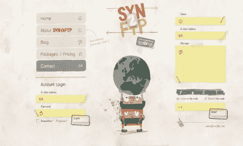
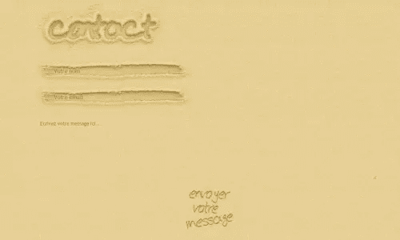
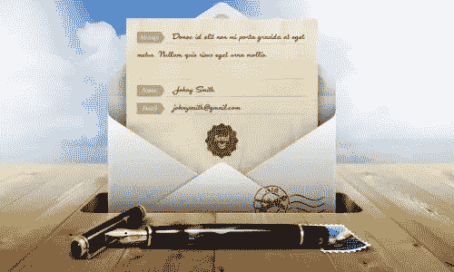
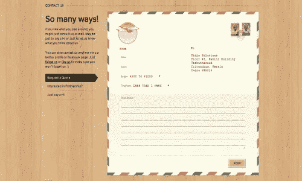
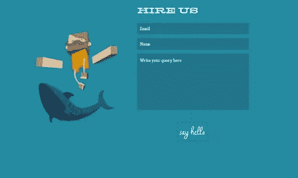
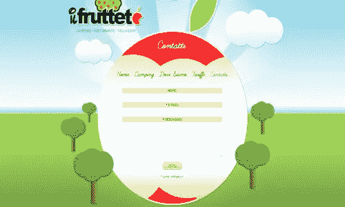
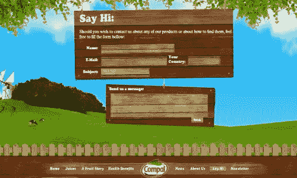
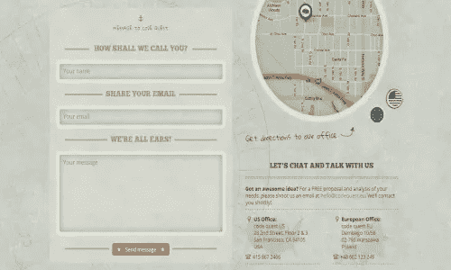
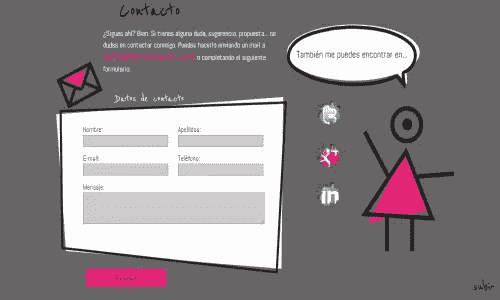
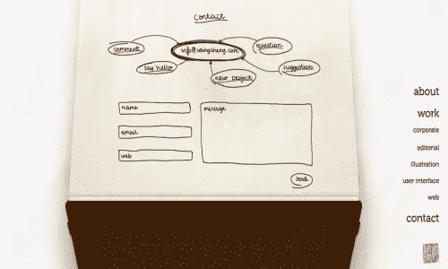

# 10 种独特而有启发性的联系方式

> 原文：<https://www.sitepoint.com/10-unique-and-inspirational-contact-forms/>

最近，我分享了一些真正有创意的联系页面的综述，以激励你看看你自己的，或者至少让你思考一下你是否正在创建自己的网站。从会说话的猫到手绘的动画插图，这些网页都给人一种真正原创的感觉。但是，嵌入到联系页面中的实际表单本身呢？那里有区别和创造性的空间吗？

并非所有联系人页面都使用表单；一些人通过提供电话号码、电子邮件地址和地址(视业务而定)来保持简单。你想在网站上实现联系表单有很多原因，主要是为了给人们提供一个快捷方便的方式与你联系，无论是询问服务还是提供一般的反馈。今天，我分享 10 种脱颖而出的联系方式。

**SVN 2 个 FTP**

SVN 2 FTP 在他们的网站上有一个非常有趣的设置。配有手绘元素的黄色笔记本纸在褪色和纹理背景上看起来非常棒。此外，每个字段的纸张元素的分隔方式使联系页面看起来很整洁。

纪尧姆·帕切科

创建联系人表单，使其看起来像是背景的一部分，而不是一个单独的实体，可以产生时尚、吸引人的效果。Guillaume 的 portfolio 站点就是这样做的，让它看起来像是有人用手指在沙子上写下了联系信息。

埃迪·洛巴诺夫斯基

在过去，一种主要的交流方式是发送纸质信件，埃迪·洛巴诺夫斯基的《联系方式》利用了这种过时的方式。联系表格设计精美，清楚地说明了发送者需要填写的内容，以便提供正确的信息。

**Fidiz**

Fidiz 的联系方式提供了另一种更传统的联系方式。该网站的联系方式类似于明信片，甚至包括邮票。表单本身设计精美，在网站和表单之间提供了很好的对比。

危险牧师

Reverend Danger 是一个创意制作的单页网站，它不仅外观漂亮，而且具有交互性和完整的功能。联系形式简单明了，但由于 3D 立方体形状的字符插图和鲜明对比的字体选择，它的工作非常完美。

**Il Frutteto**

Il Frutteto 的联系方式是一个很好的例子，可以在整个网站上创建相关和相似的元素。他们没有选择简单的隐形眼镜，而是使用圆形，并精心选择颜色，从视觉上暗示隐形眼镜放在苹果内部。

**仁宝**

在你的联系人表格中组合纹理是将它从背景中分离出来的一个很好的方法，Compal 在这方面做得很好。木材纹理与该公司的品牌以及他们为可持续环境做出贡献的目标完美契合。

**代码探索**

Code Quest 有一个非常好的实用网站。他们有一个实用的、设计精美的联系方式是很合适的。这种形式本身并不华丽(没有双关的意思)，但它微妙地运用了颜色和纹理，同时与背景融为一体，突出了背景。

**Sormen 药丸**

当你是一名自由职业者时，试图从竞争中脱颖而出总是一个好主意，萨伊阿·洛佩兹做得很好。她没有让自己的网站平淡无奇，而是分享了自己有趣的一面，提供了充满童趣的插图。联系页面完全可以访问和阅读。

**永成**

程的网站在之前的一篇文章中被特别提到过[有创意的“关于我”的页面](https://www.sitepoint.com/5-ways-to-truly-personalize-your-about-me-page/ "5 Ways to Truly Personalize Your “About Me” Page")，它通过一个精心设计的联系方式再次入选。与其他网站相比，该网站的元素有很多突出的手写元素。简单的颜色选择是另一个不错的选择。

*这些联系方式中有没有让你有所启发的？当谈到联系方式时，您会寻找什么？你是否发现精心设计的合同格式比典型的合同格式更受关注和询问？* 

## 分享这篇文章