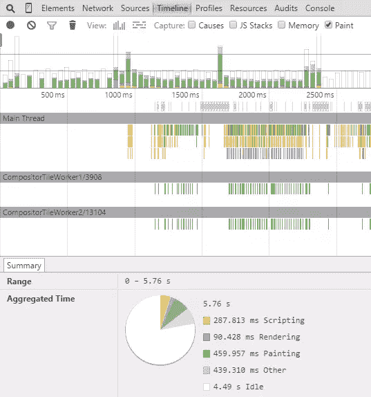
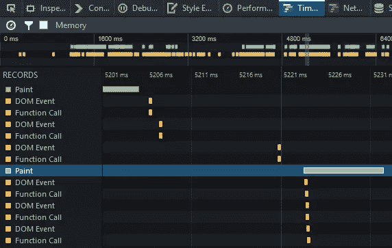
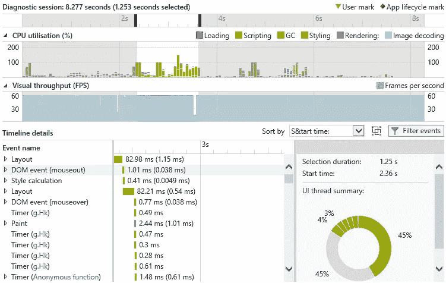

# 减少回流和提高性能的 10 种方法

> 原文：<https://www.sitepoint.com/10-ways-minimize-reflows-improve-performance/>

尽管网页达到 2MB，性能仍然是一个热门话题。你的应用越光滑，用户体验越好，转化率越高！

也就是说，我犯了添加肤浅的 CSS3 动画或操纵多个 DOM 元素而不考虑后果的错误。当应用视觉效果时，在浏览器世界中使用两个术语:

**重画**
当对影响可见性但不影响布局的元素进行更改时，会发生重画。比如`opacity`、`background-color`、`visibility`、`outline`。重画的代价很高，因为浏览器必须检查 DOM 中所有其他节点的可见性——一个或多个节点可能在被改变的元素下变得可见。

**回流**
回流影响更大。这是指重新计算所有元素的位置和尺寸，从而导致重新呈现部分或全部文档。更改单个元素会影响所有子元素、祖先元素和兄弟元素。

两者都是浏览器屏蔽；在重画或回流发生期间，用户或应用程序都不能执行其他任务。在极端情况下，CSS 效果可能会导致 JavaScript 执行速度变慢。这是你遇到滚动不稳和界面无反应等问题的原因之一。

了解何时触发回流很有用:

**添加、删除或改变可见的 DOM 元素**
第一种是显而易见的；使用 JavaScript 更改 DOM 会导致回流。

**添加、删除或更改 CSS 样式**
同样，直接应用 CSS 样式或更改类可能会改变布局。更改元素的宽度会影响同一 DOM 分支上的所有元素及其周围的元素。

**CSS3 动画和转场**
动画的每一帧都会引起一次回流。

**奇怪地使用 offsetWidth 和 offsetHeight**
，读取一个元素的`offsetWidth`和`offsetHeight`属性可以触发一个初始回流，这样就可以计算出数字。

**用户动作**
最后，用户可以通过激活`:hover`效果、在字段中输入文本、调整窗口大小、改变字体尺寸、切换样式表或字体来触发回流。

回流处理流程命中将会变化。某些浏览器在某些操作上比其他浏览器更好。有些元素的渲染成本比其他元素高。幸运的是，有几个通用的技巧可以用来提高性能。

## 1.使用最佳实践布局技术

我不敢相信我需要在 2015 年说这些，但不要使用内嵌样式或表格进行布局！

当 HTML 被下载并触发额外的回流时，内联样式将影响布局。表的开销很大，因为解析器需要多次计算单元维度。使用`table-layout: fixed`有助于显示表格数据，因为列宽是基于标题行内容的。

在主页布局中使用`flexbox`也会影响性能，因为 flex 项目的位置和尺寸会随着 HTML 的下载而改变。

## 2.尽量减少 CSS 规则的数量

使用的规则越少，重排速度越快。您还应该尽可能避免复杂的 CSS 选择器。

如果你使用的是 Bootstrap 这样的框架，这可能会特别成问题——很少有网站使用超过所提供风格的一小部分。像[未使用的 CSS](https://unused-css.com/) 、 [uCSS](https://github.com/oyvindeh/ucss) 、 [grunt-uncss](https://github.com/addyosmani/grunt-uncss) 和 [gulp-uncss](https://github.com/ben-eb/gulp-uncss) 这样的工具可以显著减少你的样式定义和文件大小。

## 3.最小化 DOM 深度

稍微复杂一点——减少 DOM 树的大小和每个分支中的元素数量。文档越小越浅，重排的速度就越快。如果你不支持旧的浏览器，也许可以删除不必要的包装元素。

## 4.更新 DOM 树中较低的类

对 DOM 树中尽可能低的元素(即没有多个深度嵌套子元素的元素)进行类更改。这可以将回流的范围限制到所需的尽可能少的节点。本质上，如果对嵌套子节点的影响很小，只对父节点(如包装器)应用类更改。

## 5.从流程中删除复杂的动画

通过使用`position: absolute;`或`position: fixed;`将动画从文档流中移除，确保动画适用于单个元素。这允许在不影响文档中其他元素的情况下修改尺寸和位置。

## 6.修改隐藏元素

用`display: none;`隐藏的元素在改变时不会导致重画或回流。如果可行，在使元素可见之前对其进行更改。

## 7.批量更新元素

通过在一次操作中更新所有 DOM 元素，可以提高性能。这个简单的例子导致三次回流:

```
var myelement = document.getElementById('myelement');
myelement.width = '100px';
myelement.height = '200px';
myelement.style.margin = '10px';
```

我们可以将其简化为单次回流，这样也更易于维护，例如

```
var myelement = document.getElementById('myelement');
myelement.classList.add('newstyles');
```

```
.newstyles {
	width: 100px;
	height: 200px;
	margin: 10px;
}
```

还可以尽量减少需要接触 DOM 的次数。假设您想要创建这个项目符号列表:

*   项目 1
*   项目 2
*   项目 3

一次添加一个元素会导致多达七次重排——追加`<ul>`时一次，每个`<li>`三次，文本三次。然而，可以使用 DOM 片段并首先在存储器中构建节点来实现单个回流

```
var
	i, li,
	frag = document.createDocumentFragment(),
	ul = frag.appendChild(document.createElement('ul'));

for (i = 1; i <= 3; i++) {
	li = ul.appendChild(document.createElement('li'));
	li.textContent = 'item ' + i;
}

document.body.appendChild(frag);
```

## 8.限制受影响的元素

避免大量元素受到影响的情况。考虑一个选项卡式内容控件，单击一个选项卡会激活一个不同的内容块。如果每个内容块具有不同的高度，周围的元素将受到影响。通过为容器设置一个固定的高度或从文档流中删除控件，也许可以提高性能。

## 9.认识到平滑度会影响性能

一次移动一个像素可能看起来很流畅，但较慢的设备可能会很吃力。每帧移动元素四个像素需要回流处理的四分之一，并且可能只是稍微不太平滑。

## 10.使用浏览器工具分析重画问题

所有主流浏览器都提供了开发者工具，强调重流如何影响性能。在 Chrome、Safari、Opera 等 Blink/Webkit 浏览器中，打开**时间轴**面板，记录一个活动:

[](https://www.sitepoint.com/wp-content/uploads/2015/07/1435764024006-minimize-reflow-1.png)

Firefox 开发者工具中有一个类似的**时间轴**面板:

[](https://www.sitepoint.com/wp-content/uploads/2015/07/1435764030006-minimize-reflow-2.png)

在 Internet Explorer F12 开发工具中，该面板被命名为 **UI 响应度**:

[](https://www.sitepoint.com/wp-content/uploads/2015/07/1435764035006-minimize-reflow-3.png)

所有浏览器都以绿色显示回流和重绘时间。上面的测试是简单的例子，不涉及重要的动画，但布局渲染比脚本等其他因素需要更多的时间。减少你的回流，更好的性能将随之而来。

如果你使用这些或其他建议成功地提高了你的动画和用户界面的性能，请在评论中告诉我们。

## 分享这篇文章