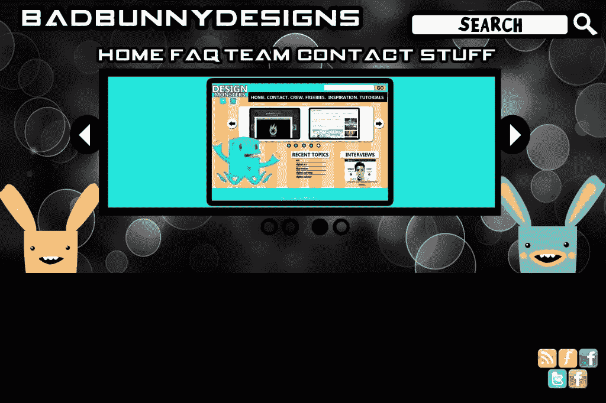
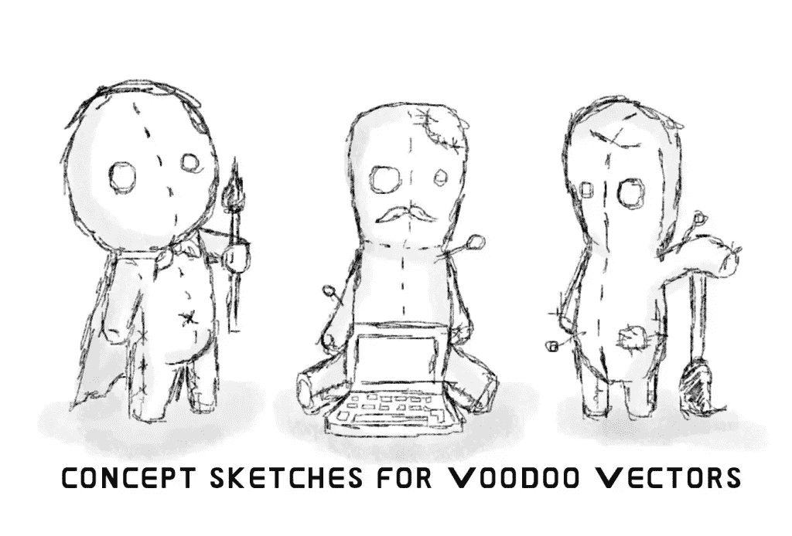
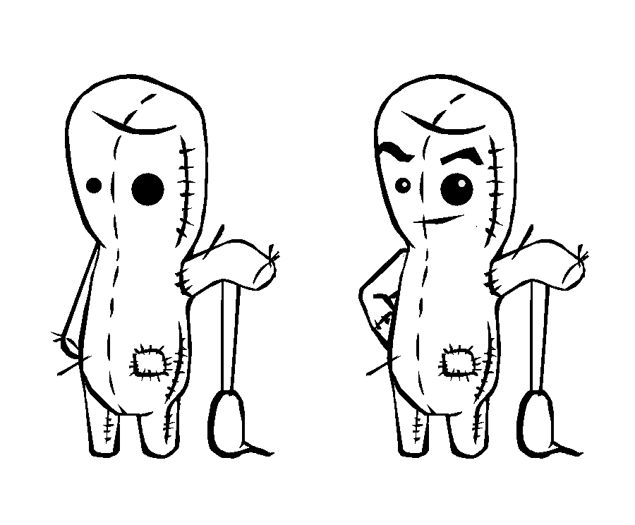
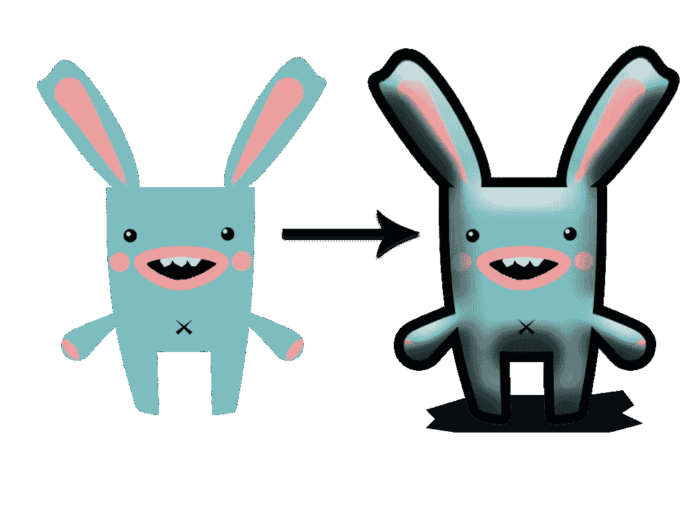
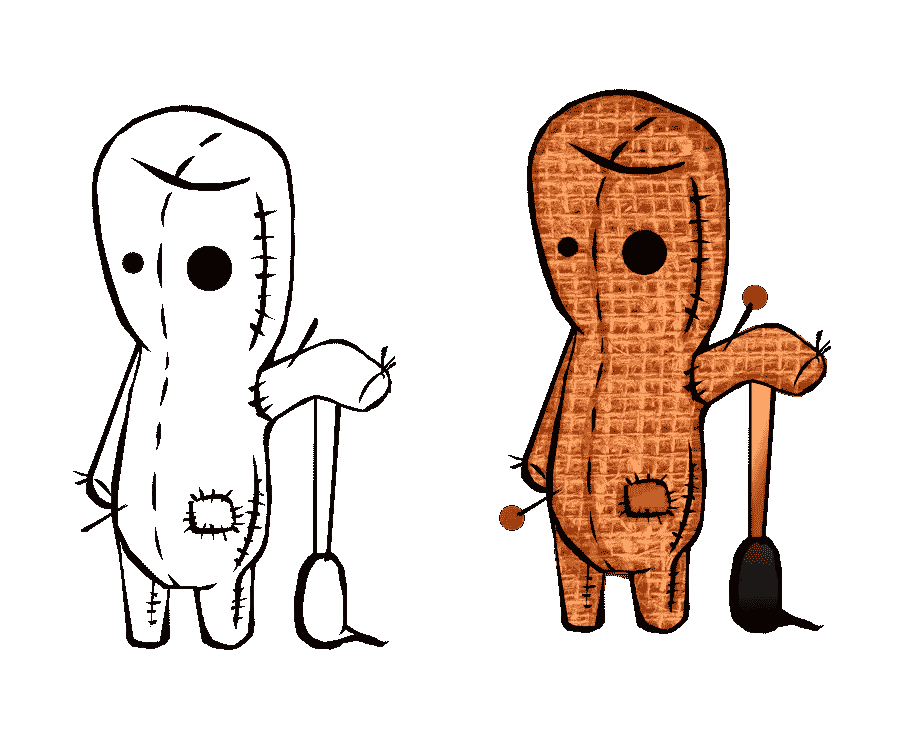
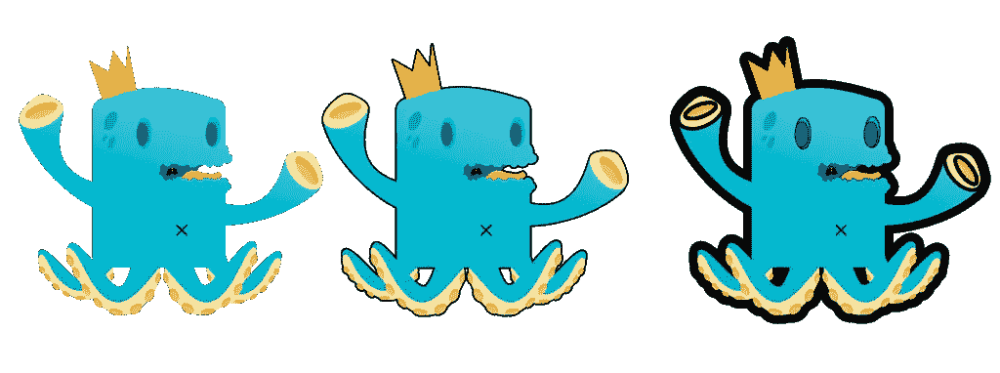
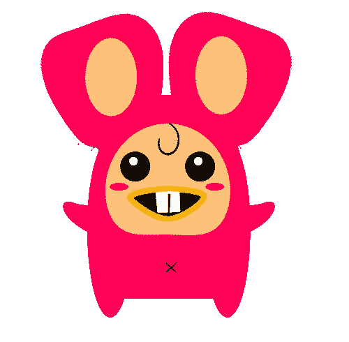
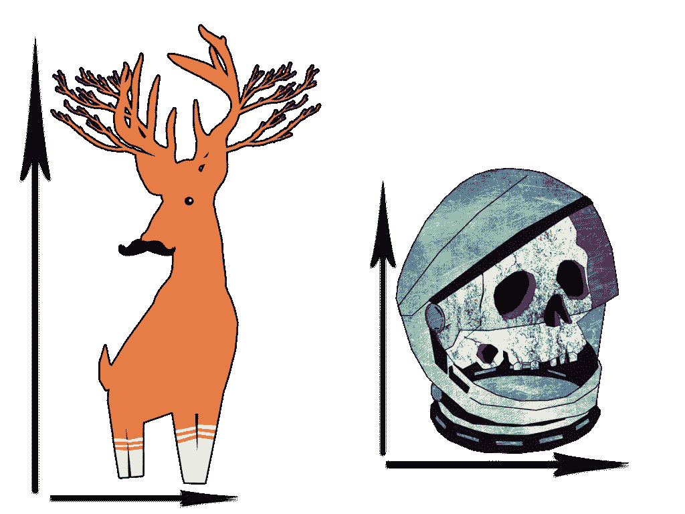
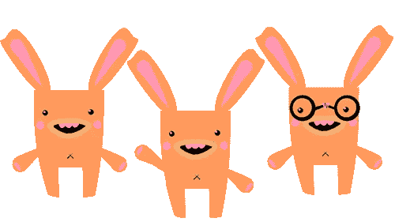
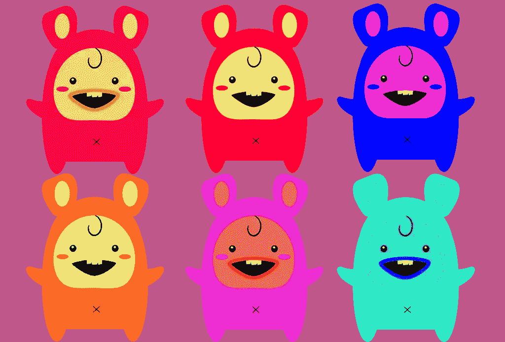

# 给吉祥物或角色增添活力的 10 种方法

> 原文：<https://www.sitepoint.com/10-ways-to-add-life-to-a-mascot-or-character/>

(上周我写了一篇文章，描述“[如何设计一个有效的公司吉祥物。](https://www.sitepoint.com/how-to-design-an-effective-company-mascot/)“由于那篇文章遵循了非常具体的步骤，并且只关注一种设计，我想我应该继续用一些更通用、更抽象的方法来说明各种用途的角色。希望你喜欢！)

作为一名 10 多年的艺术生，我知道创作能吸引任何人眼球的作品的重要性。他们说“第一印象是持久的印象”，当涉及到你设计的角色和吉祥物时也是如此。就像你的衣柜和其他任何你可以从美学角度改变的东西一样，仔细的改变可以走很长的路，甚至可以让最简单的设计看起来令人惊叹。想想数字艺术家在展示他们的成品之前使用的概念，或者是服装设计师为时装秀制作的原材料。如果我们给它添加一些生命，一切都会看起来好一点，同样的道理也适用于你的角色和插图。所以，今天我在这里分享一些技巧和诀窍，为你的作品增添一些活力和额外的光泽。为了更好地说明这些想法，我在每个技巧后面画了一些快速涂鸦来帮助解释我的意思。

### 作文

当涉及到设计的基本元素时，在你启动你的图形软件之前，为你的角色挑选最好的构图是你应该考虑的第一件事。这有点像摄影。除非你知道如何构图，否则你会坐在那里很长时间拍照，直到你想出你想要什么。从技术上来说，这并不是一件坏事(当我有休息时间的时候，我经常这样做)，但是当你在一个截止日期或者在别人的时间工作的时候，你会想要计划项目的这一部分。现在，为了防止在我提到“组合”这个词时产生任何混淆，我指的是你的角色的位置，特别是你的角色在网站上的位置。“这怎么增加生命？”你可能会问。很简单，真的。如果你的角色被放在网站上某个不为人知的地方，那么他们可能根本就不存在。为了防止这种情况发生，我建议勾画出你的角色正在浏览的网站，并创建你的角色的缩略图，以便四处移动来决定你的构图和位置。如果这太多了，只需创建一个屏幕截图，并使用您最喜欢的图像编辑软件直接在其上绘制草图。

### 概念

研究研究研究。为了创造一个角色，你不仅需要画一些草图，还需要确定一个理想的、有代表性的角色。在设计过程中，塑造一个适合你的业务或客户的角色是非常重要的。公司名称和他们的服务将有助于决定你是创造一个圆边角色还是一个锐边角色。最近，一位女士让我为她的网店设计一个标志，灵感来自于她喜欢使用不同寻常的织物印花和她孩子的名字。我得出结论，我要创造一个有趣的彩色标志，混合阶级和天真。这个过程和角色设计是一样的；了解这个行业是做什么的，他们生产什么，他们的目标受众是谁，以及这个角色应该传达什么。如果你正在为一家名为 Squid Inks 的专门从事图形多媒体的公司设计吉祥物，不要认为把一只绘制粗糙的一维 Squid 交给他们就完事大吉了。如果他们愿意的话，他们可以谷歌一条鱿鱼，然后贴在他们的网站上。既然你知道它们是做什么的，为什么不创造一个给人深刻印象的穿着衣服拿着画笔的乌贼角色呢？即时角色生活是通过花些时间弄清楚这个行业是做什么的，并在你的设计中包含这个信息来创造的。

### 个性

尽管我们可能都遇到过一些相当无聊的人，但让我们都承认我们都有自己的个性。不管它是否迷人，事实是我们的个性不仅给了我们与众不同的性格，而且还让我们充满活力。因为通常我们不会为一个网站设计一个动画吉祥物，我们可以通过姿势，服装，当然还有眼睛来传达个性。当设计你的角色时，不要让他们笔直地站着面对“摄像机”根据你角色的性别，你可以试着让他们站着，手放在臀部或口袋里。这也适用于雌雄同体的角色，但是我建议尝试使用 3/4 到的姿势，或者如果可以的话，至少让头部稍微转动一下。你希望你的角色有一些姿态，即使他们面向前方站着，你也可以用眼睛、头发和衣服来提供一些活力。

### 深度

没有人喜欢浅薄的人，也没有人喜欢浅薄的人物。试着给你的角色增加一些深度，让他们更有立体感。你不需要知道如何创建 3D 渲染来实现这一点。在角色的皮肤和衣服上添加阴影会有所帮助，同时在它们下面添加阴影。增加深度不仅可以展示你的角色，而且你还可以用它来创造一个更有活力的角色，尤其是当你的角色被设计成超级英雄或者恶棍的时候。但是，要小心你给你的角色赋予了多少深度，因为虽然它会增加更多的生活，但它可能会掩盖他们注定要去的网站，没有双关语的意思。

### 详述

一个“普通的简”没什么不好，但当涉及到你的角色时，你最不想看到的就是他们成为一个普通的吉祥物，因为相信我，没有人会对他们有一闪而过的想法。如果你的角色不令人难忘，可能是因为他们缺乏细节。现在，你不必走极端，但一些细节可能会有所帮助。你通常希望你的角色看起来像一个精心设计的，但在某些情况下，你的细节可能来自一个原始的，故意凌乱的，涂鸦式的设计。我见过一些网站没有过度修饰的角色作为他们的吉祥物。事实上，有些只是粗略绘制的铅笔渲染，但它的工作，因为涂鸦作品的细节。尝试在衣服上添加缝线、口袋或褶皱。如果可以的话，给鞋子加上鞋带，在某个地方加上一些圆点或条纹来增加质感。添加细节时，确保不要太重手；你想让你的角色脱颖而出，而不是像一个讨厌的拇指一样突出，与网站设计相冲突。

### 行高

没有什么比粗粗的线条更能表达“我在这里，看着我”的意思了，这使得线条粗细成为字符设计的一种重要而有效的技术。就像细节和性格一样，你线条的粗细完全取决于你的性格。你不必总是勾勒出你的角色，但它可以改善形象，增加角色被看到的机会。然而，过粗的线条会吞噬字符，使其显得过于庞大。没有轮廓可以给你的角色一种柔和的感觉，但是它们也可能在网站中丢失。因此，要找到一个大胆的外观而不使你的角色看起来笨重，尝试用细线来保持柔和，用粗线来定义轮廓。请记住，如果你选择勾勒出你的角色，请尝试遵循一些基本规则:角色中离观众最近的部分应该较厚，而离观众较远的部分应该较薄。你也可以在角色的外部用粗线划线，无论位置如何，并保持内部线条较细。看一下下面的变化，所有的变化只有线宽不同。

### 夸张的品质

比例夸张的角色是倾向于让人难忘的角色。想想米老鼠戴着手套的大手或巨大的耳朵。它们是如此突出和引人注目，以至于我记得小时候在迪斯尼乐园也有过同样的大手。修饰角色特征可以增加突出性和吸引力，但你不必走极端，使角色具有令人难以置信的比例。这里和那里的一些微妙的调整可以使它们更生动而不失真。如果你有一个大块头暴食型的角色，考虑让他的嘴变宽，或者给他们一个大而圆的腹部，当他转向一边时，腹部会突出来。兔子角色可以很容易地代表拥有更大的耳朵或牙齿，而更多基于人类的角色可以拥有略大的头部和眼睛，尤其是如果他们是女性的话。

### 紧凑

为你的角色保持一个紧凑的形状与其说是为了让他们的角色更生动，不如说是为了确保他们能很好地适应周围的设计。没有人想要一个占据他们网站所有空间的角色，不管这个设计有多可爱或多棒。保持角色的高度接近它的宽度会让你不必裁剪或调整你的角色，并在这个过程中丢失一些你的辛苦工作和辛苦的细节。你不想发现你设计了那么多精彩的深度、细节和修饰，却看到它被缩小和裁剪掉，是吗？即使你可以设计一个高个子或者手臂很长的角色，你最好还是不要这样做。这个角色很可能会被重新用于各种不同的媒体，为了他们自己的利益，你要保持他们的灵活性！如果你不知道如何在不占用大量空间的情况下创造一个充满活力的角色，你可能需要重新开始。

### 倍数和变化

你可能没有创造一个完整的动画角色，但这并不意味着你不能展示你的角色的动作。为你的角色设计多种变化，不仅能在网站上传达一种行动和活动的感觉，还能强化你一直努力培养的个性。大多数人可能没有想到这一点，但是，设计一个以上的角色作为吉祥物是一个伟大的想法。你不仅没有过度使用你唯一的角色设计，而且还创造了一种合作关系，这是大多数在线企业已经想与潜在客户和员工建立的关系。当创作你的一个或多个角色的多个和变化时，试着把他们画在与他们将要出现的页面相关的姿势中。例如，出现在“联系我们”页面上的角色可能戴着眼镜，拿着记事本和笔，拿着手机，甚至打扮成邮递员。相反,“主页”上的角色可能希望向网站浏览者挥手或微笑。

### 颜色

最后但同样重要的是， *color* 可以是一个非常有效的工具。为你的角色选择了错误的颜色会影响设计，并且会让你的角色的整体感觉变得更糟，而你却从来没有这样想过。首先也是最重要的，总是选择与网站互补的颜色，以防止你的角色与其他页面元素冲突或消失在相似的阴影背景中。一定要使用渐变和阴影来避免看起来单调的角色。不要害怕使用奇怪的颜色组合；如果他们工作，那么他们工作。但是，不要仅仅为了让你的角色突出而把一堆明亮的颜色放在一起。当给你的角色添加色彩时，考虑最初的概念、构图和个性。如果您不确定哪种颜色效果最好，请用不同的颜色多次创建该角色的角色表，并直观地比较并排结果。有了成功的配色方案，你的角色就会脱颖而出，看起来活泼又有活力。

### 结论

当然，你还可以做很多其他的事情来给你的角色增添活力。虽然我已经列出了一些大致的轮廓供你遵循，但不要觉得你必须坚持。归根结底，最重要的是设计一个让你、你的客户和他们的顾客都满意的角色。

你有什么可以炫耀的设计吗？你还记得任何角色设计的成功或困难吗？

## 分享这篇文章