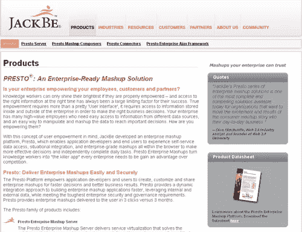
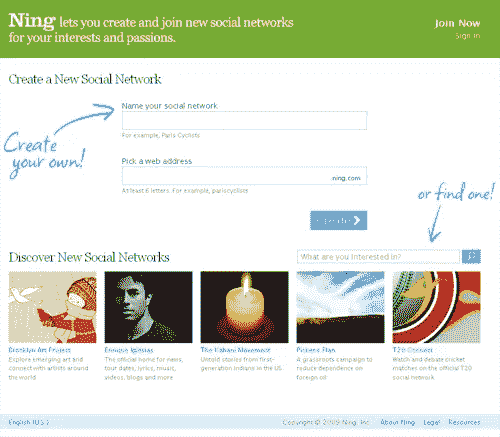
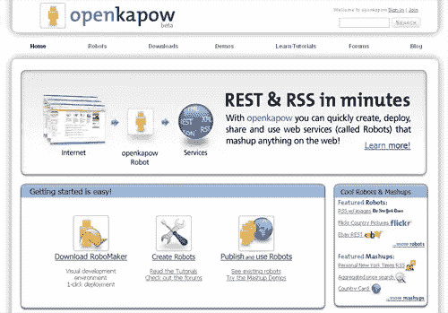
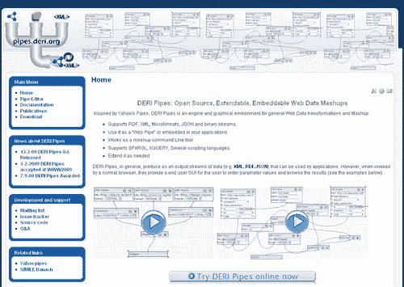
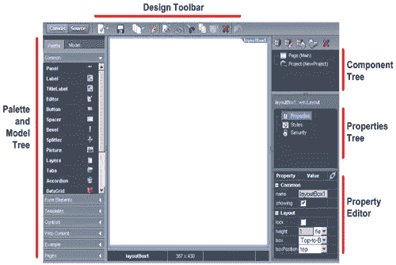

# 无需编写任何代码即可构建 10 个 Web 应用

> 原文：<https://www.sitepoint.com/10-web-apps-to-build-the-next-big-thing-without-writing-any-code/>

曾经希望有人能在谷歌地图上叠加一些让你着迷的数据吗？有没有想过开发一种新的桌面小部件来席卷计算世界？不管你的技能水平如何，世界上总有一些工具可以帮助你实现你的梦想，只需要按照你想要的顺序拖放你需要的东西。

看看这十个解决方案——从常见的日常类型的谷歌地图混搭到重型企业级应用程序——你会惊讶地发现很少的工作可以带来很大的成果。

**:开发网站的点击式解决方案，从你打开网站的那一天起就开始赚钱。主题是可定制的，所以你的站点不需要马上被认出是来自 DevHub 有一些商标表明你的站点是一个 DevHub 站点，但是它并不显眼。DevHub 是那些对网站有想法，但甚至不知道如何开始编码的人的完美解决方案(阅读 [Craig 在 SitePoint](https://www.sitepoint.com/devhub-money-making-website/) 上的报道)。**

 **

[**Iceberg**](http://www.geticeberg.com/) : Iceberg 是一款完全在可视化编辑器内运行的业务开发应用工具，任何人都可以为自己的员工构建和启动应用。你可以用它来建造任何东西，这项服务对非盈利组织和员工少于 5 人的公司是免费的。

[**IBM Mashup Center**](http://www-01.ibm.com/software/info/mashup-center/):IBM Mashup Center 提供了很多特性，但是对于想要创建新工具的非技术用户来说并不太难。它允许您为各种混搭创建小部件，并构建管道将信息转化为对您更有用的方式。*快速组装*工具允许你从网络上的任何地方获取小部件，然后拖放它们，形成一个你自己的全新作品。

[**JackBe**](http://www.jackbe.com/products/) : JackBe 是一个带有企业倾向的 mashup 构建器。使用他们的 Presto mashup Composer——一种基于 web 浏览器的可视化 Mashup 合成工具——面向业务的用户和精通 IT 的开发人员都可以生成一整套 Mashup 来为公司及其客户服务。该工具作为 Java 开发的 Eclipse 插件，允许您设计、测试、调试和部署混搭。

宁 :虽然世界上已经有数百个独立的社交网络，如果不是数千个的话，但总得有人为收集火柴盒的人建立一个。这正是宁试图解决的问题，因为它致力于让你建立一个社交网络，致力于你选择的主题。当一个人第一次建立他们的网络时，只需要你回答问题，就会有宁控制的广告支持。这可以通过支付月费来关闭，如果你需要更多的功能，如额外的存储空间，更多的带宽或唯一的 URL，还有其他级别的月订阅。

OpenKapow : OpenKapow 将允许你重新混合你能想到的任何网络服务，并把它们捆绑成一个小部件与他人分享。想知道一个电话在地理上是从哪里打来的？输入号码，YellowPages.com 将在谷歌地图上显示位置。虽然这是一个简单的例子，但这里的可能性是无穷无尽的，创造成品的道路再简单不过了。

**:Deri.org 承认他们受到了雅虎 Pipes 的启发，但看起来他们肯定是从大 Y 那里学到了东西，并做了足够的改变来保持它的趣味性。您可以使用 RDF、XML、微格式、JSON 或二进制流获取信息，然后以 XML、RDF 或 JSON 输出。你可以选择使用成品作为一个独立的网站，也可以将其嵌入到现有的应用程序中。**

 **

Tarpipe : Tarpipe 是另一种 pipes 风格的解决方案，用于将各种内容重新混合到一个应用程序或目的地，但与竞争对手的解决方案有几点不同。尽管 Tarpipe 解决方案的核心是将各种在线服务混搭在一起，但您也可以通过电子邮件消息、即时消息更新和第三方应用程序来触发流程。你也可以在 Evernote、FriendFeed、Flickr 和 Twitter 等网站上轻松分享你完成的项目。

[**WaveMaker**](http://www.wavemaker.com/downloads/):WaveMaker 提供桌面应用和云托管版本，提供拖放项目的能力，无需编码即可创建复杂的应用。对于那些准备将他们的*下一个大事件*带到下一个大水平的人来说，Wavemaker 也有企业版。

雅虎管道(Yahoo Pipes):雅虎管道(Yahoo Pipes)是雅虎的一款产品，致力于帮助你从任何有某种提要的来源构建混搭。假设您想要查看美国人口的可视化表示[——您所要做的就是将一些模块拖放到管道中，输入来自提要的数据，以您想要的方式进行过滤，然后就完成了。没有硬编码——只是填写提要信息和检查一些框。成品都托管在雅虎上，可以分享给任何人。](http://pipes.yahoo.com/pipes/pipe.info?_id=_Ia89ose3BGMZ6YNlvXiAA)

不要让你缺乏编码技能阻止你构建下一个大东西！**** 

## ****分享这篇文章****