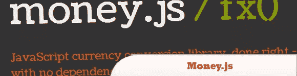
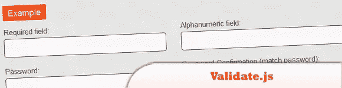
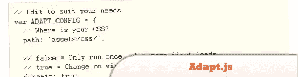
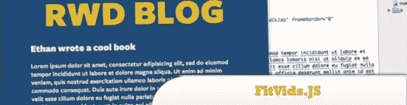

# 10 ++ 2011 年最佳 Web 开发人员资源和工具(第二部分)

> 原文：<https://www.sitepoint.com/10-web-developers-resources-tools-2011-part-2/>

正如我们在上一篇文章中承诺的，这里是我们选择的 2011 年最有用和**创新的工具和资源的第二部分(也是最后一部分)(包括框架、样板文件、应用程序、JavaScript 资源、CSS3 动画工具等。).尽情享受吧！**

相关帖子:

*   [**2011 年 9 月的 10 个新 jQuery 插件**](http://www.jquery4u.com/plugins/jquery-september-2011/)
*   [**网上有趣的 Web 开发——2011 年 10 月**](http://www.jquery4u.com/random/october-2011/)

## 1.CoderDeck

将 Deck.js 与 CodeMirror2 突出显示代码编辑器相结合，以便于直接在浏览器中演示和教授实时 HTML、CSS 和 JavaScript。

  
[来源](https://github.com/cykod/CoderDeck)
[演示](http://cykod.github.com/CoderDeck/)

## 2.ApeJS

一个使用 JavaScript 语言开发 Google App Engine 网站的小框架。还有其他 JS 框架可以和 App Engine 一起使用——RingoJS 和 App Engine ejs 制作得非常好。

  
[源+演示](http://lmatteis.github.com/apejs/)

## 3.money.js

是一个超级简单和微小的(刚刚超过 1kb！)JavaScript 库，用于实时货币转换和汇率计算，从任何货币，到任何货币。

  
[源+演示](http://josscrowcroft.github.com/money.js/)

## 4.验证. js

是一个受 CodeIgniter 启发的轻量级(1kb gzipped) JavaScript 表单验证库，允许您验证来自十几个规则的表单字段。它没有依赖性，可定制，也适用于所有主流浏览器(甚至 IE6！).

  
[源+演示](http://rickharrison.github.com/validate.js/)

## 5.Recurly.js

是一个开源的 JavaScript 库，用于创建美观的信用卡表单，以安全地创建订阅、一次性交易和更新账单信息。该库旨在创建完全可定制的订单，同时最大限度地降低您的 PCI 合规性范围。

  
[来源](http://js.recurly.com/)
[演示](https://js.recurly.com/examples/)

## 6.引导程序

是 Twitter 的一个工具包，用来快速启动你的 web 应用或网站的开发。它包括基本的 CSS 和 HTML，用于排版、表单、按钮、表格、网格、导航，并附带完整的样式指南文档。

  
[源+演示](http://twitter.github.com/bootstrap/)

## 7.Adapt.js

是一个轻量级的 JavaScript 文件，它决定了在浏览器呈现页面之前要加载哪个 CSS 文件。如果浏览器倾斜或调整大小，Adapt.js 只是检查其宽度，并在需要时只提供所需的 CSS。

  
[源+演示](http://adapt.960.gs/)

## 8.适应性图像

旨在与响应式和流畅的布局技术一起使用，是一种可以自动创建、缓存和交付适合设备(它检测访问者屏幕的分辨率)的网站内容图像的解决方案。不需要改变你的标记，它管理自己的图像大小，并将在任何 CMS 甚至平面 HTML 页面上工作。

  
[源+演示](http://adaptive-images.com/)

## 9.deck.js

是制作现代 HTML 演示文稿的工具。幻灯片是基本的 HTML。deck.core 模块跟踪幻灯片状态和 deck 状态，让 CSS 定义每个状态的样子以及如何在它们之间转换。扩展使用核心事件和方法来添加好吃的东西，让演示者可以自由添加他们想要的东西，忽略他们不想添加的东西。

  
[来源](http://imakewebthings.github.com/deck.js/docs/)
[演示](http://imakewebthings.github.com/deck.js/)

## 10.FitVids。射流研究…

是一个轻量级，易于使用的 jQuery 插件，用于响应宽度视频嵌入。它自动化了 Thierry Koblentz 的固有比率方法，以在您的响应式网页设计中实现流体宽度视频。

  
[来源](https://github.com/davatron5000/FitVids.js)
[演示](http://fitvidsjs.com/)

## 分享这篇文章