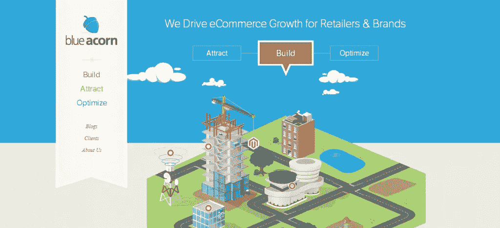
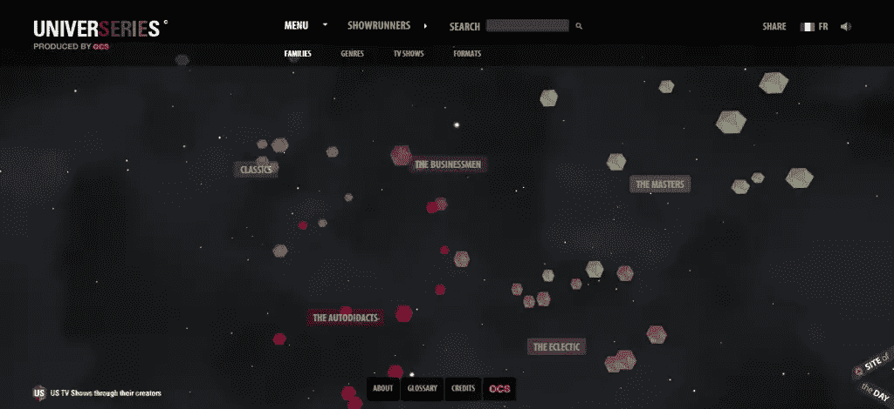
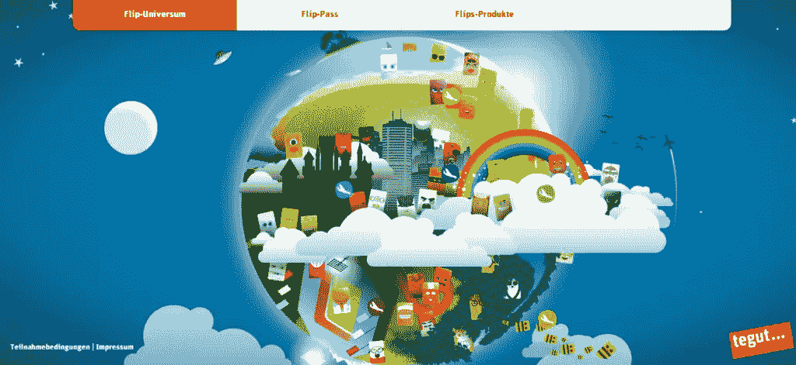
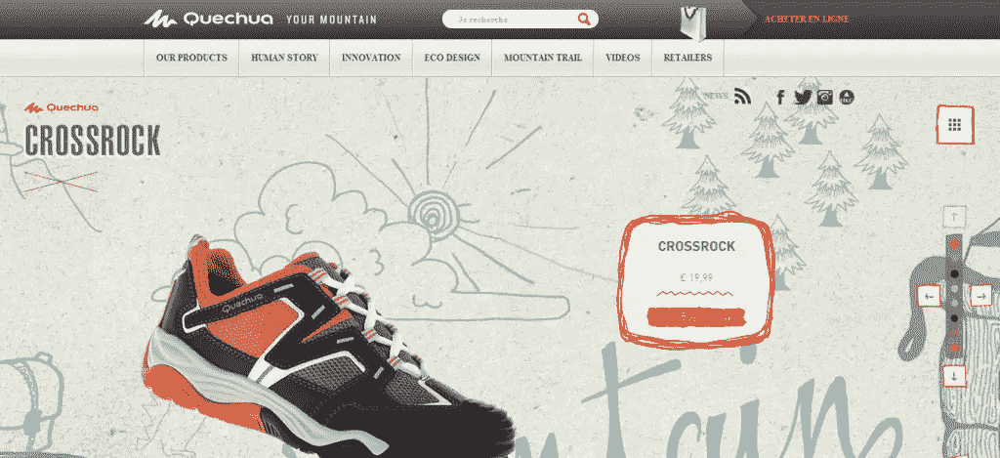
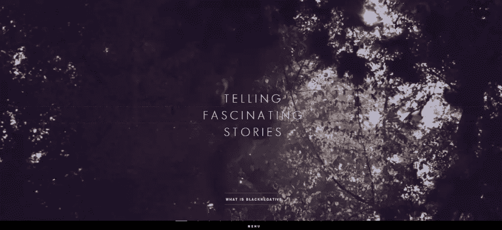
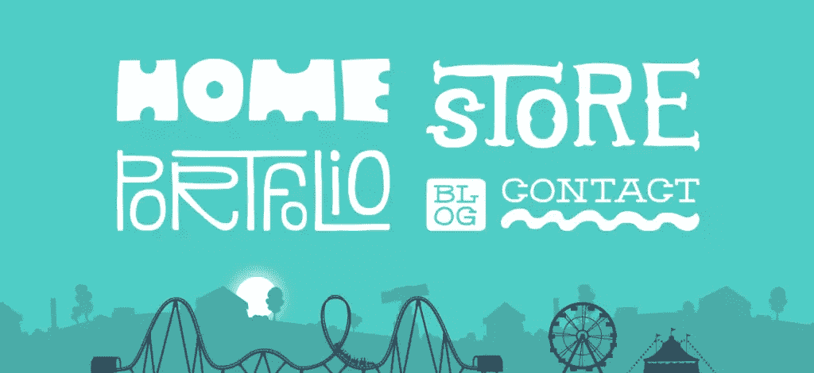
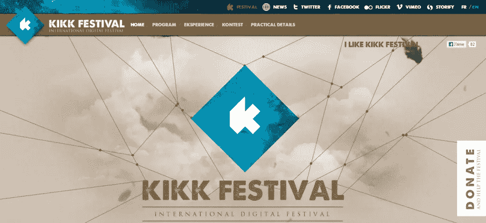
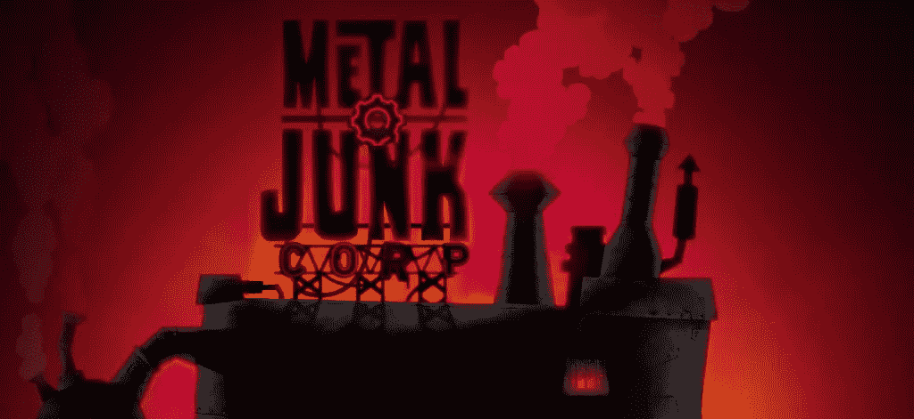
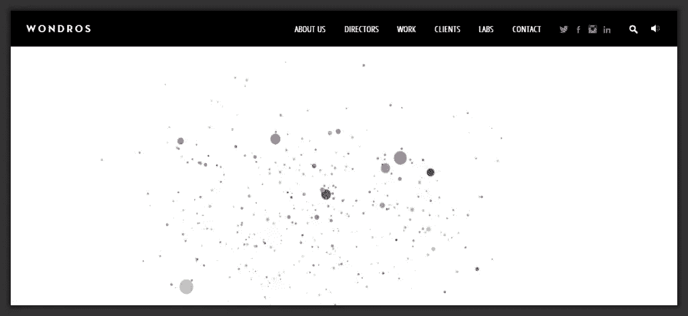
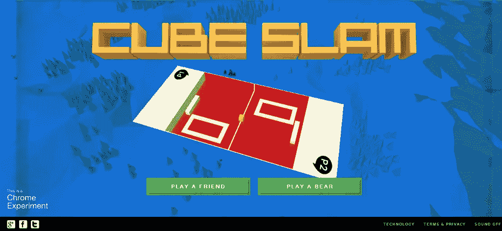

# 10 个有创意的移动元素的网站

> 原文：<https://www.sitepoint.com/10-websites-creative-moving-elements/>

设计师花了无数的时间来精心选择颜色、字体和布局，但是尽管付出了这些值得付出的努力，没有什么比动作更能吸引眼球了。经过验证的进化和行为心理学证明了我们对移动和变化的可见元素的本能吸引。尽管技术取得了巨大的进步，人类的大脑仍然像往常一样工作——对活力和运动有着视觉上的偏好。有了这个可靠的原则，我们为什么不在网页设计和网络营销中加入一些动画呢？

在你的设计中加入动画是让它与众不同并吸引注意力的好方法。下面是 10 个网站，他们已经熟练地将动画融入到他们的设计中。希望它们能证明运动的吸引力，也是你下一个项目的灵感来源。

**蓝色橡子**

干净的网页设计是添加动画的完美平台，无论动画是大是小。Blue Acorn 的网站是简单和动感结合的典范。动画发生在屏幕的中央，只需点击三个标注中的一个，您就会看到一个城市通过下降到位而变得栩栩如生。

**宇宙**

如果你想在你的网页设计中加入动画，确保它有一个明确的目的，而不仅仅是表面的附加。Universeries 微妙而富有创意的动画是对设计的真正增强，而不是多余的装饰。

**倒装宇宙
**

网络是一种抽象的媒介，有着巨大的动画潜力，让你可以逃离现实的常规，钻研创意。Flip-Universum 的网站看起来不像你的典型网站，它有着风格化的卡通外观，简单的视差类型动画非常棒。

**盖丘亚语**

混合设计元素是让你的网站在互联网上数以百万计的网站中脱颖而出的好方法。Quechua 的 CrossRock 2013 网站不仅将摄影与动画元素相结合，还包括纹理和看起来像是手工绘制的图画。整个网站的动画简单而平衡。

**黑负**

另一个没有夸大动画使用的网站，Blacknegative 起初看起来像一个普通的网站，使用水平布局而不是垂直布局。但是，这个网站设计得很巧妙，在每个页面上都添加了某种形式的动画。有些不太明显，但运动的要素是永远存在的。

**丹尼斯·钱德勒**

没有必要在网站的每一页都添加动画。有时，仅仅在主页上添加动画是一种更微妙的实现。丹尼斯·钱德勒的创意设计网站就是这样做的。摩天轮和过山车的动画被有策略地放置，这样你可以看到它们，但不会被它的循环动画分散注意力。

**菊花节**

Kikk Festival 的网站和所使用的动画非常简单，当涉及到集成一个不影响用户体验的普通循环动画时。动画只是从天空飘下的各种大小的羽毛。羽毛透视的使用是一个很好的补充，增加了深度和多样性。

**金属垃圾**
T3

当你的网站处理游戏或卡通时，没有比这更好的机会给你的网站添加动画了。金属垃圾马上就利用了这一点。从动画加载图标到实际的主页，动画非常棒。搭配上令人敬畏的配色方案，你就有了一个伟大的设计。

**绝技**

网站上的动画很少会考虑公司的名字，不管是有意还是无意，Wondros 就是这么做的。不断移动的颗粒点创造了各种形状，甚至一个清晰的“W”来代表网站和品牌本身。这部动画并不令人兴奋，但却非常感人。

**立方体猛击**

当你决定让你的动画主导你网站的大部分内容时，这是一个非常勇敢的举动，但 Cube Slam 通过围绕复古视频游戏外观设计网站来实现这一点。一开始你可能会大吃一惊，但很难否认动画本身和交互性的吸引力。

你有什么运动驱动的网站可以分享吗？你认为动画是一种增加设计吸引力的合理技术，还是一种陷入浏览器兼容性问题、插件和其他技术挑战的累赘的装饰？

## 分享这篇文章