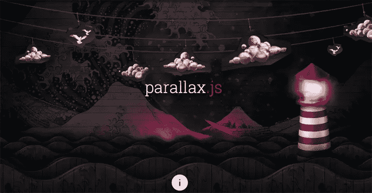
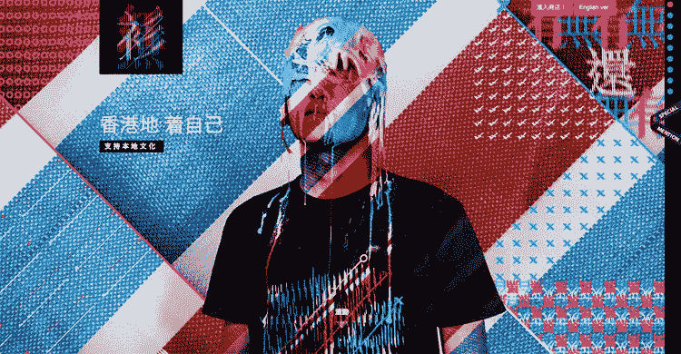
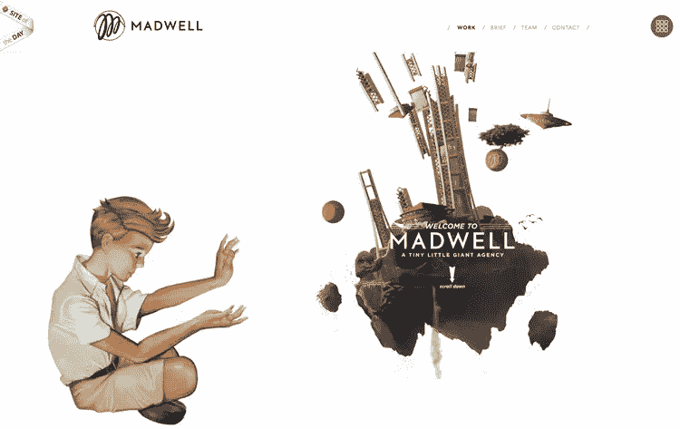
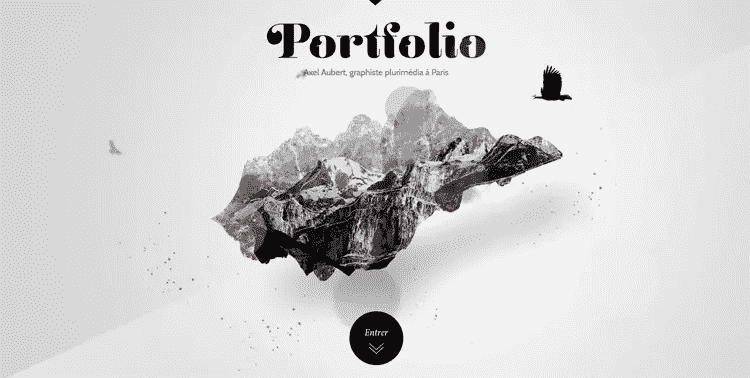
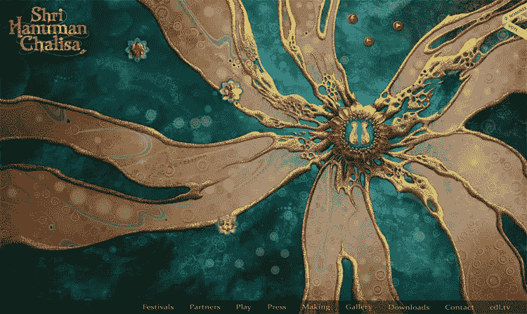
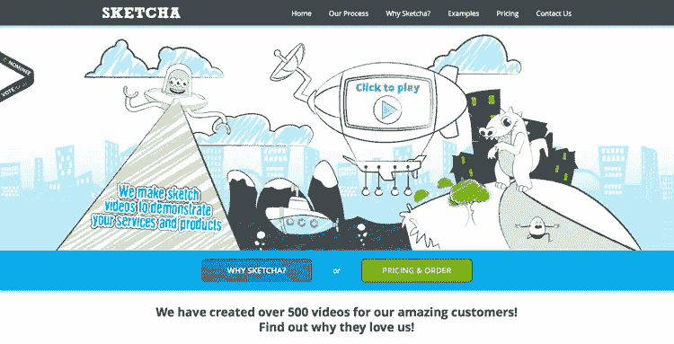
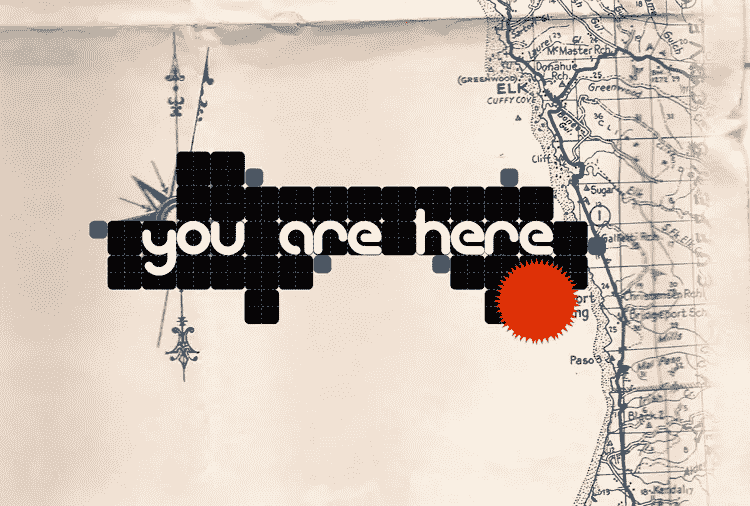

# 10 个非常规的网页设计

> 原文：<https://www.sitepoint.com/10-wildly-unconventional-web-designs/>

遵循最佳实践和遵循惯例之间有很大的区别。最佳实践使您的设计工作与业务和品牌目标保持一致，同时仍然允许独特性和创造性。然而，遵循惯例通常会产生普通的结果，无法提供独特的吸引力——这是设计师的主要责任。

下面这些非常规的网页设计是以独特、与众不同、与众不同的方式实现更大组织目标的典型例子。他们故意拒绝常见的惯例，这加强了他们的努力，使他们的项目真正与众不同。看看这十个非常规的网页设计。

[视差。JS](http://wagerfield.github.io/parallax/)
 
你很少看到一个网站以视差的方式工作。JS 管用。这个网站是 Matthew Wagerfield 和 Claudio Guglieri 的心血结晶，拥有如此多变的调色板，绝对漂亮。所有对象都在页面上移动(除了背景和集成的 parallax.js)，无论您是在移动设备上还是在台式计算机上，页面方向都会改变图层和场景。

红鱼服饰

用大图片作为你网站的背景绝不是一种新趋势，但是红鱼服饰用这种大胆的颜色表现出惊人的效果。创意捕捉使这个网站脱颖而出，更不用说在背景的固体部分发现的抽象图案和纹理。

石上明吉

设计师经常担心在有限的空间里塞进太多东西，但有时真的越多越好。Ishigami 丰富多彩的网站证明，不仅加入更多的元素，但更多的颜色。虽然这个网站可能不符合每个人的审美偏好，但它确实向你展示了突破界限和打破规则可以产生有趣和创造性的结果。

[米阿贵](http://www.miagui.cc/)

如果你想让你的网站脱颖而出，有时候让你的图片脱颖而出(无论是字面上还是象征性的)是个好主意。你很少在网站上看到大型恐龙，更不用说以这样的方式摆姿势了。迷人的图像在你的网页设计中是至关重要的，这个特殊的例子培养了强烈的吸引力。

马德威尔

 
插图在艺术家的网站上屡见不鲜，但很少如此与众不同。信不信由你，你不一定要成为一个艺术家才能在你的网站上使用插图，就像 Madwell 向我们展示的那样。这幅画有一种神奇的特质，体现了马德威尔将小创意融入生活的使命。该图是一个完美的设计和概念的大小。

阿克塞尔·奥贝特

 
就我个人而言，我从未见过像阿克塞尔·奥贝特的网站那样运作和移动的网站。一个非常漂亮的网站，Aubert 提供了一个很好的例子，告诉你如何拒绝典型的投资组合惯例，建立一个成熟的网站，以创造性地使用动作和编码为特色。

施里·哈奴曼·查丽莎

 
如果你想使用大背景，你不必总是走使用大而美的摄影路线。有时你可以走使用大，美丽的艺术品的路线，就像什里哈奴曼查丽莎网站。由于花朵般的形状，调色板很有吸引力，真的会让你眼前一亮。如果你想要一个有很多独特个性的简单网站，这个网站提供了强大的灵感。

[Sketcha](http://www.sketcha.com/)

 
有时候，与众不同的设计可以很简单地来到你面前。你的网站给人的印象比你写了多少代码更重要。虽然 Sketcha 的绘图对一些人来说可能显得幼稚，但它确实赋予了网站很多特色，使其显得热情友好，这是任何企业或组织都梦寐以求的品质。

[设计师图集](http://www.designersatlas.com/)

 
极简主义网站对于设计界来说并不新鲜，以简约为目标，你会不由自主地被 Designer Atlas 过于简单化的设计所吸引。该网站以其精致的方式进行补偿，以指南针和地图为背景，与名称保持一致。大而醒目的颜色会吸引你的注意力。

[Edita 的选角](http://www.editoskastingas.lt/)

对一些人来说，没有什么比在你的网站上添加一些动态元素更有创意的了，当这些元素相互作用时，它们会移动或改变。Edita 的网站是这种活力的一个很好的例子。中间是有趣的拼贴图片，组成了一个人的个人资料，你会发现自己不断点击这个网站。

你有什么非常规的设计要加入吗？你什么时候打破广泛使用的惯例？

## 分享这篇文章