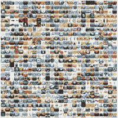

# 10，000 个 iPhone 应用程序——有多少是好的？

> 原文：<https://www.sitepoint.com/10000-iphone-apps-how-many-are-good/>

苹果 iPhone 和 iPod Touch 设备的应用程序商店今天在 7 月份推出，拥有超过 10，000 个应用程序。无论你怎么看，苹果的应用商店都取得了巨大的成功。在最初的 30 天里，该公司每天的销售额为[100 万美元](http://www.newsfactor.com/story.xhtml?story_id=61264&full_skip=1)——约占其销售额的三分之一——一些分析师预测，到明年，苹果的应用商店将成为[10 亿美元的业务。事实上，谷歌、RIM 和微软都效仿了苹果的分销方式，为移动和桌面平台开发了自己的应用下载商店。](http://www.informationweek.com/news/personal_tech/iphone/showArticle.jhtml?articleID=208403482)

用户愿意为 App Store 上发布的应用程序付费，这使得 iPhone 成为对程序员有吸引力的开发平台。我们在 8 月份写道，许多开发者现在以销售应用程序为生，特别是如果他们能够降低生活成本的话。iPhone 内部博客上周报道称，全职合同开发人员为 iPhone 编写应用程序每周能赚 5000 美元，相当于每年 25 万美元。

但是这些 iPhone 应用程序中有多少值得你花费时间呢？有这么多的人争夺注意力，如何从有价值的应用程序中挑选出无关紧要的东西呢？

与脸书平台的比较是不可避免的。尽管明显存在许多差异(例如，iPhone 开发者可以对应用程序收费，而 iPhone 用户由于支付了手机和每月服务费用，总体上可能更愿意为应用程序付费)，但也有相似之处，因此这种比较是有道理的。尽管 iPhone 平台上的应用数量只有脸书平台上应用总数的五分之一，现在已经超过了 48000 个，但去年 1 月我们开始在脸书看到应用疲劳的报告，当时该平台只有 15000 个应用。

随着越来越多的开发者涌入这些平台试图赚快钱，噪音水平不可避免地上升。我们在脸书看到了这一点，那里的应用数量继续稳步增长，但用户参与度已经稳定下来。同样的事情会发生在 iPhone 上吗？

事实上，我们可能已经看到了它的开端。据 148Apps.com 称，iPhone 平台上大约三分之一的应用程序属于游戏或娱乐类别。在脸书，这些类别通常是“无聊”应用的代码。iPhone 现在被作为一个游戏平台进行营销，因此游戏类别可能不像脸书那样经常意味着制作糟糕的应用程序，但加上大多数应用程序的价格低于 1.99 美元的事实，iPhone 平台上的噪音正在增加似乎是合理的。

Compete 最近对智能手机用户进行了调查，发现 93%的用户添加了来自 App Store 的应用程序，45%的用户添加了超过 11 个应用程序。观察这个数字如何变化将会很有趣。希望 Compete 会做后续调查，看看有多少人在 3 到 6 个月后仍在使用这些应用。

因为 App Store 的前 100 名榜单——它推动了平台上的大量销售——是基于每天售出的应用数量，所以自苹果 7 月份推出该商店以来，成功应用的价格一直在持续走低。这可能会对质量产生负面影响，因为开发人员现在可能更倾向于将他们的开发时间分散在一些更便宜的应用程序上，而不是花更多时间开发更昂贵(制作更好、更有用)的应用程序，这些应用程序不太可能卖得好。

我们很想听听你对此的想法。你觉得应用商店的噪音水平太高了吗？区分好的和坏的应用程序容易吗？还是 iPhone 应用程序商店正在向脸书的平台前进？请在评论中告诉我们，一定要查看我们的[列表，这是 5 款必须为 iPhone](https://www.sitepoint.com/5-awesome-productivity-apps-for-the-iphone/) 配备的生产力应用。

## 分享这篇文章