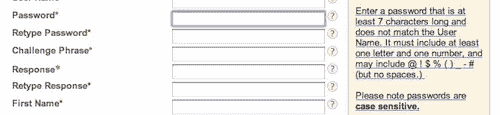

# 不会让人生气的网络表单

> 原文：<https://www.sitepoint.com/web-forms-that-dont-make-people-angry/>

没有比在线表单更好的地方来照顾你的网站访问者了。这是一个他们自愿给你发送信息，甚至付款的地方。通过考虑以下三条执行准则，减少被抛弃的可能性，让别人开心:

## 不要要求你不需要的东西

*   这是你需要的信息吗？太好了，自讨苦吃。
*   它是你不需要但真正有价值的信息吗？只问你是否提供价值作为回报。
*   是你不需要但觉得有趣的信息吗？想都别想。

销售一般不喜欢这个。他们的论点是这样的:“但是，他们已经在网站上填写信息了。如果我们只需要他们的电话号码和其他信息，我们就可以打电话给他们。想想利润吧！”

一个电话号码只是一个例子，你可能有一个合法的理由要求它。但是一定要权衡对你公司的价值和填写表格的人的成本。信息不是免费的，你是在要求他们用联系他们的许可来交换一些东西。

长而复杂的表单很好，因为它的长度有一个明确的目的，并且对用户有很大的价值。一些例子将是大学申请或在房地产网站上列出一所房子。

## 答案将从何而来？

在创建表单时，为每个字段考虑这个问题:填写表单的人从哪里获得这条信息？

使用你的表单的人将不得不去寻找信息，而不是从记忆中提取所有信息，这不是不可能的。它可能是一个地址，一个驾照号码，或者是他们写在一张纸上的确认密码。。。某处。

即使有些东西直接从他们的大脑中出来，进入你的网站，那也不意味着这是一个快速的过程。想想一篇大学作文，或者一个诗歌比赛的参赛作品，或者一个特别发人深省的问题，需要一个简短而机智的答案；所有这些都需要深谋远虑。

如果表格很长，他们不能保存他们的进度，那么你需要让他们知道在开始之前他们应该准备好哪些困难或耗时的信息。翻到第二页，然后在你寻找一张纸片的时候让系统超时，这一点都不好玩。

## 慎重发展

一个美丽而精心设计的表单可能会因为短视的执行而变得令人抓狂。

*   避免过多的格式化指令。每一个说明列表都是完成表格的另一个障碍。不要要求电话号码格式化，除非这对后端系统非常重要。不要给出一长串密码要求，可以考虑在输入密码时显示密码的强度，并给出如何增强密码强度的建议。
*   考虑逐步披露。假设您正在创建一个城市多式联运(即自行车/火车/步行/汽车)交通网站。你可以设置一个问题来回答“你有自行车吗？”而不是十个关于骑自行车习惯的多选题，其中最后一个选项是“我没有自行车”如果他们有自行车的话，只透露另外十个问题。这是额外的工作，但更尊重你的访客的时间。
*   小心无益的错误处理。“记录无法更新”对于一般的网络用户来说，除了“出现了问题，我不知道如何修复它”之外，没有任何意义如果用户名不能包含符号，那么只要有人输入“%”，字段边框就会变成红色，并显示类似“哎呀！只允许字母和数字。错误消息响应越快、越详细，人们就能越快地解决问题并继续前进。

一旦你知道你的形式提高了效率，并且做得很好，你就可以专注于创造额外的享受！

## 分享这篇文章