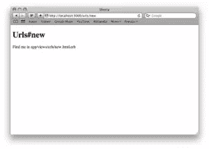
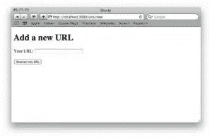
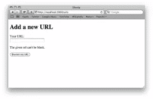
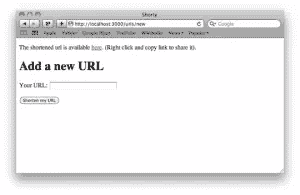

# 构建您的第一个 Rails 应用程序:视图和控制器

> 原文：<https://www.sitepoint.com/building-your-first-rails-application-views-and-controllers/>

欢迎来到我们两部分教程的第二部分。[上次](https://www.sitepoint.com/building-your-first-rails-application-models/)，我们在 Rails 上安装了 Ruby，生成了一个缩短 URL 的应用程序，并为它创建了模型。

现在我们要为我们的应用程序创建控制器，编写视图，看看我们是否能让应用程序工作。你可能想快速回顾一下我们在第一部分的进度，然后继续。

## 创建您的第一个控制器

现在我们已经创建了模型(Rails 负责持久性和验证)，是时候编写控制器了。应用程序的控制器部分处理输入(例如，POST 和 put 中来自 URL 或请求体的数据)，然后与模型交互，并为视图部分设置数据。

## RESTful 控制器

默认情况下，Rails 强调“RESTful”方法；也就是说，它使用给定的 HTTP 动词(例如，GET、POST、PUT、DELETE)和组织良好的 URL 来表示资源，从而形成一个通用的结构，其中代码用于对象上的操作。它提供了对数据进行基本 CRUD(创建、读取、更新、删除)操作的工具。在 Rails 术语中，这些操作通常是:

*   `index`—返回所有资源列表的动作；例如`GET /urls`将点击 URL 控制器上的索引动作，列出已知的 URL。
*   `show`—对单个资源执行读操作的动作；例如`GET /urls/1`将点击 URL 控制器上的显示，显示 id 为 1 的 URL 的详细信息。
*   `new`—显示新对象表单的动作，在我们的例子中，是新的 URL 表单；例如`GET /urls/new`将点击 URL 控制器上的新动作并显示新的 URL 表单。
*   `create`—从新动作中获取表单数据并尝试创建记录的 post 动作；例如`POST /urls`将点击 URLs 控制器上的创建动作，通常带有一些相关的表单数据。
*   `edit`—将显示编辑特定资源的表格；例如，`GET /urls/1/edit` 将点击 URL 控制器上的编辑动作，并显示一个表单来编辑 id 为 1 的 URL。
*   `update`—将尝试更新给定的资源；例如，`PUT /urls/1`将点击 URL 控制器上的更新操作，并尝试更新 id 为 1 的 URL。
*   `destroy`—将试图破坏给定的资源；例如,`DELETE /urls/1` 将点击 URLs 控制器上的销毁操作，并尝试销毁 id 为 1 的 URL。

## 生成我们的控制器

在我们的例子中，我们将从一个完整的 CRUD 控制器中削减它，并实现三个基本动作:`new`、`create`和`show`。当用户点击`new`动作时，它会呈现一个新的 URL 表单。当我们提交表单并试图创建 URL 对象时，这将依次点击`create`动作。

最后，当用户点击`show`动作时，我们会将他们重定向到存储的 URL。

因此，使用开始菜单中的“Command Prompt with Ruby and Rails”选项打开命令提示符，并切换到存储代码的目录。我们将通过运行以下命令，用一个新动作生成一个新的 URL 控制器:

```
rails generate controller urls new
```

我们只传入`new`动作(而不是`new`、`create`和`show`)的原因是因为 Rails 会自动为生成器调用中包含的每个动作生成一个虚拟视图。在这种情况下，我们只想要一个`new`动作的虚拟视图，所以我们排除了其他的。

运行该命令应该已经创建了一个`app/controllers/urls_controller.rb`文件和一个`app/views/urls/new.HTML.erb`文件，以及一些测试文件。现在，打开控制器文件，您会看到类似于以下内容的内容:

```
class UrlsController < ApplicationController
  def new
  end

end
```

而且，如果你打开`config/routes.rb`，你也应该看到它为我们增加了一条虚拟路线:

```
get "urls/new"
```

首先，在`config/routes.rb`中，将上面的行替换为:

```
resources :urls, :only => [:show, :new, :create]
```

保存文件，切换回命令提示符，并运行`rake routes`。这将打印出我们所有路线的列表。可以看到，Rails 自动为我们设置了三个 URL——`GET /urls/new`、`GET /urls/:id`和`POST /urls`，分别指向`new`、`show`和`create`动作。

如果我们启动服务器(使用`rails server`)并在浏览器中点击新动作的 URL(`http://localhost:3000/urls/new`)，您现在应该会看到一个类似下图的占位符页面。

[](https://www.sitepoint.com/wp-content/uploads/2011/03/fig2.png)

## 编写我们的控制器逻辑

在这种情况下，我们的控制器逻辑将非常简单:

*   当用户点击新页面时，它会将`@shortened_url`实例变量设置为一个新的、未保存的 URL 对象(我们使用`@shortened_url`而不是`@url`作为实例变量，因为后者由 Rails 内部使用)。
*   当用户提交新表单时，我们应该尝试创建一个新的 URL。如果它是有效的并被保存，我们将设置一条消息告诉用户他们被缩短的链接的 URL，然后我们将再次重定向回被缩短的页面。
*   如果 URL 无效，我们将重新呈现新表单，这次显示错误。
*   当用户点击显示操作时，我们会将他们重定向到 URL。

因此，现在在编辑器中打开`appcontrollersurls_controller.rb`,用以下代码替换所有代码:

```
class UrlsController < ApplicationController
  def new
    @shortened_url = Url.new
  end

  def create
    @shortened_url = Url.new(params[:url])
    if @shortened_url.save
      flash[:shortened_id] = @shortened_url.id
      redirect_to new_url_url
    else
      render :action => "new"
    end
  end

  def show
    @shortened_url = Url.find(params[:id])
    redirect_to @shortened_url.url
  end

end
```

保存文件。这里需要注意的重要一点是，我们选择的模型名称——Url——导致了潜在的混淆路径(例如`new_url_url`)。为了理解这到底意味着什么，我们只需要记住`rake routes`的输出。在那里，我们看到了一条名为`new_url`的路线(以及其他一些路线)。Rails 自动为我们提供了`new_url_url`方法(如果我们在`config/routes.rb`中的资源调用是`:posts`而不是`:urls`，那么将会是`new_post_url`)以及等价的`_path`；比如`new_url_path`。两者的区别在于`_url`变量包括主机、端口和协议，而`_path`变量只包括路径和查询字符串。

在上面的控制器代码中，您可能已经注意到包含以下内容的行:

```
flash[:shortened_id] = @shortened_url.id
```

如果您以前使用过 PHP 之类的语言，并且有存储数据的会话，您会很高兴地知道 Rails 也支持在请求之间共享数据的会话。除此之外，它还有第二个功能—flash—这是一个自动使条目过期的会话。当我们在闪存中存储数据时(就像上面我们缩短的 URL 的 id)，它将在被访问后被删除。这对于传递错误和状态消息(相对于在 URL 中)这样的任务特别有用，因为它们将显示一次，并在后续的页面加载中消失。

完成所有这些后，我们现在需要做一个小的调整:我们希望这样，如果用户点击我们应用程序的根页面(例如`http://localhost:3000/`)，他们会自动重定向到新的 URL 表单。在这种情况下，做两件事相当简单:

1.  移除`public/index.html`文件。这只是默认的“欢迎使用 Rails”页面，但是当它出现时，它会覆盖我们的根目录，向每个用户显示“欢迎使用 Rails”页面。
2.  在`config/routes.rb`文件中，在我们的资源调用下面添加一个新行。

我们添加的行应该如下所示:

```
root :to => redirect('/urls/new')
```

这告诉 Rails，当我们点击根 URL(相当于 routes 文件中的`get '/'`)时，它应该自动重定向到新的 URL 动作。

要尝试一下，回到终端，重启 Rails 服务器(如果关闭了的话)，然后将浏览器指向`http://localhost:3000/`。如果一切按预期进行，您的浏览器应该会自动重定向到`http://localhost:3000/urls/new`。

## 书写您的视图

Shorty 的控制器和模型已经准备就绪，是时候添加最后一层了:一个视图。

视图是实际显示给用户的部分。默认情况下，我们的视图是用 ERb: embedded ruby 编写的。ERb 允许我们在 HTML 中嵌入一些 ruby 来生成动态页面。例如，为了显示 URL 对象的 URL 属性的值，我们将在视图中使用如下内容:

```
<%= @shortened_url.url %>
```

然后，在运行时，Rails 将解释 ruby 部分来生成我们的 HTML。因为我们的应用程序非常简单，我们只需要编辑两个视图:`app/views/urls/new.html.erb`文件和我们的布局，`app/views/layouts/application.html.haml`。

## 编辑您的布局

布局是 Rails 定义页面总体结构或布局的方式。虽然`new.html.erb`文件用于特定于我们动作的 HTML(也就是说，例如，另一个控制器上的新动作将使用另一个模板)，但布局通常会在几个或所有动作中重用。它们通常用于设置一般的页面结构；例如页眉、菜单、页脚等，而特定于页面的内容则放在普通视图中。

在这种情况下，我们的默认`application.html.erb`看起来像:

```
<!DOCTYPE html>
<html>
<head>
  <title>Shorty</title>
  <%= stylesheet_link_tag :all %>
  <%= javascript_include_tag :defaults %>
  <%= csrf_meta_tag %>
</head>
<body>

<%= yield %>

</body>
</html>
```

这是一个非常基本的 HTML5 页面，除了在 body 标签中呈现 action 视图之外什么也不做。在这个页面上，我们要改变的唯一方面(为了在将来扩展应用程序时使其可重用)，是当我们缩短一个链接时，我们会在页面顶部获得一个指向它的链接。因此，在它的 `opening tag and above the line with `yield`下面，添加以下内容:`

```
<% if flash[:shortened_id].present? %>
  <p class='shortened-link'>
    The shortened url is available <%= link_to 'here',
url_url(flash[:shortened_id]) %>.
    (Right click and copy link to share it).
  </p>
<% end %>
```

代码中的`link_to`仅仅是对一个助手方法的调用；在这种情况下，Rails 为我们定义了一些东西，当一个 URL 被缩短时，这些东西为一个链接生成 HTML，该链接带有指向给定 URL(在这种情况下，类似于`http://localhost:3000/urls/1`)的给定文本(在这种情况下)。如果 flash 中没有`:shortened_id`值，则不会显示任何内容，但是当有值时，它会在段落标记中输出一个链接。

## 编辑您的表单

更新了布局以显示我们的链接帖子缩短后，我们现在需要设置我们的表单。首先，在编辑器中打开`app/views/urls/new.html.erb`。默认情况下，它应该是这样的:

```
<h1>Urls#new</h1>
<p>Find me in app/views/urls/new.html.erb</p>
```

删除并替换为:

```
<h1>Add a new URL</h1>
<%= form_for @shortened_url do |form| %>

  <p>
    <%= form.label :url, "Your URL:" %>
    <%= form.text_field :url %>
  </p>

  <% if @shortened_url.errors[:url].any? %>
    <p class='error-messages'>
      The given url <%= @shortened_url.errors[:url].to_sentence %>.
    </p>
  <% end %>

  <p class='buttons'>
    <%= form.submit "Shorten my URL" %>
  </p>

<% end %>
```

运行时，这段代码将生成一个表单标签(带有正确的操作和方法),其中包含一堆其他 HTML。在这里，它将为我们的 URL 字段生成一个包含标签和文本输入的段落。在这种情况下，我们通过`form_for`方法使用一个特定的助手类。这些是 Rails 提供的类，通过处理生成字段等使构建复杂表单变得更容易。

接下来，我们检查缩短的 URL 对象的 URL 字段是否有错误，如果有，就生成一个带有类`error-messages`的段落标记。如果对象没有任何错误，它根本不会输出这部分的 HTML。

最后，我们生成一个带有文本“Shorten my URL”的 submit 标记，完成我们的表单。

## 测试它

回到控制台，再次启动 Rails 服务器(如果它已经停止)，在浏览器中重新加载`http://localhost:3000/urls/new`,您应该会看到以下内容。

[](https://www.sitepoint.com/wp-content/uploads/2011/03/fig3.png)

如果您单击“缩短我的 URL ”,而没有在“您的 URL”字段中输入任何 URL，您将收到以下错误页面。

[](https://www.sitepoint.com/wp-content/uploads/2011/03/fig41.png)

如果您在您的 URL 字段中输入一个有效的 URL，然后单击“缩短我的 URL ”(例如`http://google.com/`),您将看到下图。

[](https://www.sitepoint.com/wp-content/uploads/2011/03/fig5.png)

另外，通过使用表单生成器，Rails 提供了许多额外的功能。例如，它会自动设置文本字段的值，这样当我们第二次提交它时(出错后)，它会插入一个特殊的令牌来防止[跨站点请求伪造](http://en.wikipedia.org/wiki/Cross-site_request_forgery)。一般来说，它使得构建表单变得非常容易。

## 把一切都包起来

正如你所看到的，用很少的代码，我们已经能够构建一个基本的 URL 缩短器(URL 是否真的更短取决于你的域和输入的 URL，但这是最重要的总体思想)。我们仅仅触及了你能用 Rails 做的事情的表面，但是我们已经设法在短时间内涵盖了相当多的 Rails。

当然，我们构建的应用程序并非没有缺陷。例如，当我们验证一个 URL 实际上是给定的，我们不验证它是一个 URL(我们盲目地重定向到那个值)；因此，这不是您实际部署的那种代码。同样，工作流本身也非常初级。

如果您对目前为止所做的事情感兴趣，那么您现在有了一个学习更多 Ruby on Rails 的好起点。例如，您可能会着手添加[更好的 url 验证](http://api.rubyonrails.org/classes/ActiveModel/Validations/HelperMethods.html#method-i-validates_format_of)，添加一种方法来列出所有缩短的 URL，或者更好的是，使用 routes 和一个自定义操作，其工作方式更像现有的 URL 缩短器。为了加分，你可以切换到另一个表单生成器，比如 [formtastic](https://github.com/justinfrench/formtastic) ，它会为我们生成更好的深度 HTML(不再需要手动打印错误信息)。

对于 Rails 初学者来说，有大量的文档，有些比其他的好，有些需要付费。我强烈建议您从以下资源开始:

*   官方 Rails 指南——免费，包含大量相关信息，是一个很好的起点。
*   Ruby on Rails API—Rails 中可用方法的 API 参考。
*   [Rails casts](http://railscasts.com/)——大量(250 个，还在增加)关于在 Rails 中执行不同任务的免费短片。
*   peep code——付费但专业制作的主题截屏。比铁轨更长，通常更深。
*   [Rails 教程](http://railstutorial.org/)—一本免费的书(有付费下载版本)，作为对 Rails 的深入指导。

我希望您喜欢对 Rails 的工作方式有一个简单的了解。

*精选图片鸣谢:[http://www.flickr.com/photos/wwworks/2475349116/](http://www.flickr.com/photos/wwworks/2475349116/)*` 

## `分享这篇文章`