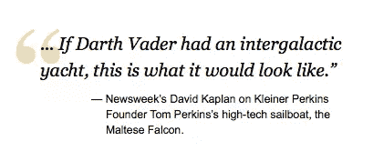
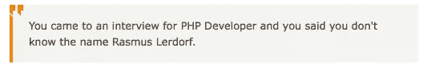
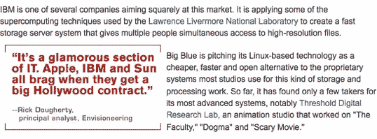
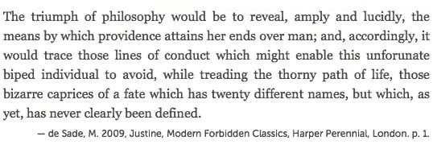

# 引用和引文的排版

> 原文：<https://www.sitepoint.com/typography-of-quotations-citations/>

我们通常引用他人的话。语言约定、风格指南和印刷区别被用来微妙地(有时不那么微妙地)区分引文和页面上的其他语义元素。这篇文章研究了引文的排版。

## 区别元素和特征

在网页中，我们以两种方式“标记”引用:行内引用(出现在一个文本块中的引用)和单独的块引用(例如，整个段落或列表，或两者的混合)。我们分别使用`q`和`blockquote`元素。

虽然都很相似，但我们使用语言惯例来表示某事被引用，通常是用引号将引用的材料括起来。引用标点也用于其他目的(强调、表示讽刺等)，但这种扩展用法更加多样，有时会引起争议，远远超出了手头的印刷问题。

常见斑点标记:

| 描述 | 性格；角色；字母 | Unicode 参考。 | HTML 引用。 |
| --- | --- | --- | --- |
| 左单引号 | ' | `U+2018` | `&lsquo;` |
| 单引号，对吗 | ' | `U+2019` | `&rsquo;` |
| 左双弯引号 | " | `U+201C` | `&ldquo;` |
| 双曲引号，对吗 | " | `U+201D` | `&rdquo;` |
| 左下单引号 | , | `U+201A` | `&sbquo;` |
| 低双弯引号，左侧 | „ | `U+201E` | `&bdquo;` |
| 双尖括号，左 | « | `U+00AB` | `&laquo;` |
| 双尖括号，对吗 | » | `U+00BB` | `&raquo;` |
| 左单角引号 | ‹ | `U+2039` | `&lsaquo;` |
| 单角引号，对吗 | › | `U+203A` | `&rsaquo;` |

仅用这十个字符，我们就可以满足 50 多种语言的引用惯例，包括英语、几乎每一种欧洲语言，以及日语、韩语、中文、俄语、希伯来语、泰语、越南语等等。只需要多一个字符来适应额外的引用约定，即初始引用用引用缩进条(“―”)缩进；`U+2015`；`―`)或长破折号(—)，例如:

> 查尔斯叔叔抽烟抽得如此凶，以至于最后他的侄子建议他去花园尽头的一个小厕所里享受早晨的烟雾。很好，西蒙。“一切都很平静，西蒙，”那人平静地说。你喜欢的任何地方。户外厕所对我很好:它会更有益健康。代达罗斯先生坦率地说，我真该死，如果我知道你怎么会抽这种恶心的烟草。就像火药一样，上帝啊。
> ――非常好，西蒙，老人回答道。非常凉爽和安抚。因此，每天早上…

—乔伊斯，J. 1992，*《一个年轻艺术家的肖像》*，现代经典版，企鹅出版社，纽约，第 62 页。

## 丰富引文

除了选择正确的字符来标点我们的引语(避免“哑引语”——这些是主要的标记，用于标记小时和分钟，或者英尺和英寸，而不是引语)，我们可以在印刷上增强我们的引语。

### 基础知识

行内引用是相当简单的，应该得到相同的印刷待遇和尊重，他们已经收到的副本；除了用引用标点符号正确标注之外，没有什么理由通过应用额外的样式来扰乱文本的流动。这使得块引号有点孤立，常常被忽视。为了迎合批量报价，请记住以下三个一般原则:

1.  在整块引用之前和之后提供额外的引导(空间)(注意页面基线),以确保整块引用与文本的其余部分明显分开
2.  将诗行引语左对齐，右对齐
3.  缩进和居中引用诗句

为了进一步表明块引用是一个单独的引用，它可以被附加的左右页边空白包围(注意:不要挤压文本)，或者与正文不同地对齐(例如，不整齐的右边)。准备好尝试——例如，温和地改变背景颜色，或者使文本颜色变浅，或者如果你渴望变得大胆，也许可以从衬线字体换成 sanserif 字体——但是如果不确定，坚持使用基本的字体，因为它们很有效。

### 图形或更大的引号

一个流行的趋势是对整体报价使用更大的引号，通常使用(不必要的)图形，并经常应用于网站上的所有整体报价。创意介入，现在我们有了广泛的报价风格，从简单到相当奢侈，例如:


大图引自[数码日报](http://digitaldaily.allthingsd.com/category/quotes/)。


引用来自[克里斯·希弗莱特博客](http://shiflett.org/)的造型。


[CNET 的](http://www.cnet.com/)座报造型。

### 保持简单

然而，让事情变得美好而简单是可能的，就像格言所说的那样。用一点聪明的 CSS 来增加 blockquotes 的味道是很有可能的。

例如，我们可以使用伪选择器在 CSS 中自动添加引号:

```
blockquote:before { content: "“"; }</code>
<code>blockquote:after { content: "”"; }
```

请注意，您需要确保您的文档使用 UTF-8 字符编码来正确呈现这些字符。用标题中的`meta`元素设置它:

```
<meta http-equiv="Content-Type" content="text/html; charset=UTF-8" />
```

另外，我们可以用一个负的文本缩进来伪造[悬挂标点](https://secure.wikimedia.org/wikipedia/en/wiki/Hanging_punctuation "Wikipedia (EN): Hanging punctuation")至少用左引号:

```
blockquote { text-indent: -0.4em; }
```


较大的双引号，没有使用图像作为西蒙·科利森对 24ways.org 的详细描述[。](http://24ways.org/2005/swooshy-curly-quotes-without-images "Swooshy Curly Quotes Without Images")

### 和一些高级的东西…

元素允许定义许多属性和变量。有趣的是:

*   `cite`属性，允许我们引用引用的来源
*   `lang`和`xml:lang`属性，定义引用文本的语言
*   `dir`属性，其中标注了语言的方向性，例如 rtl(从右到左)和 ltr(从左到右)

通过一点简单的 CSS，我们可以自动提取`cite`属性的值，并将其显示在 blockquote 下面，以引用源代码:

```
blockquote[cite]:after {
    display: block;
    text-align: right;
    content: "2014 " attr(cite);
    font-style: normal;
    font-size: 1.2em;
    }
```

在这里，我们调用`blockquote`元素的`cite`属性的内容，并在该元素之后显示它，带有在`content: "";`中定义的前缀，在本例中是一个 [em 破折号](http://www.fileformat.info/info/unicode/char/2014/index.htm "FileFormat.info: Unicode Character 'EM DASH' (U+2014)")。例如，应用了上述样式的以下标记—

```
<blockquote cite="de Sade, M. 2009, Justine, Modern Forbidden Classics, Harper Perennial, London. p. 1.">
    <p>The triumph of philosophy would be to reveal, amply and lucidly, the means by which providence attains her ends over man; and, accordingly, it would trace those lines of conduct which might enable this unforunate biped individual to avoid, while treading the thorny path of life, those bizarre caprices of a fate which has twenty different names, but which, as yet, has never clearly been defined.</p>
</blockquote>
```

会这样呈现—



## 进一步阅读

*   [粉碎杂志:阻止引用和拉动引用:范例和良好实践](http://www.smashingmagazine.com/2008/06/12/block-quotes-and-pull-quotes-examples-and-good-practices/ "SmashingMagazine.com: Block Quotes and Pull Quotes: Examples and Good Practices")
*   [SitePoint CSS 参考:`quote`](https://reference.sitepoint.com/css/quotes "SitePoint.com CSS Reference: Quotes")
*   [SitePoint CSS 参考:`blockquote`](https://reference.sitepoint.com/html/blockquote "SitePoint.com CSS Reference: Blockquotes")
*   [维基百科:引号](https://secure.wikimedia.org/wikipedia/en/wiki/Quotation_mark "Wikipedia (EN): Quotation mark")
*   [维基百科:引号的非英语用法](https://secure.wikimedia.org/wikipedia/en/wiki/Quotation_mark,_non-English_usage "Wikipedia (EN): Non-English usage of quotation marks")
*   [维基百科:引号符号](https://secure.wikimedia.org/wikipedia/en/wiki/Quotation_mark_glyphs "Wikipedia (EN): Quotation mark glyphs")

## 正误表

弗洛伦特·弗舍尔德[善意地指出](https://twitter.com/#!/fvsch/status/86025637894172674)`cite`只能用来指向来源的 <acronym title="Uniform Resource Indicator">URI</acronym> ，而不能在语义上指代来源。此外，许多浏览器并不使从`cite`属性中提取的变量可选和可复制，如果你想链接到源代码，你也不能把它包装成一个锚使它成为一个链接。

关于正确的用法，包括对 <acronym title="HyperText Markup Language 5">HTML5</acronym> 中`blockquote`、`q`和`cite`元素(以及`cite`属性)的更改，请查看 [HTML5Doctor.com 关于 <acronym title="HyperText Markup Language">HTML</acronym>](http://html5doctor.com/blockquote-q-cite/ "HTML5Doctor.com: Quoting and citing with blockquote, q, and the cite attribute ") 中引用的文章。这篇文章读起来很舒服，并且很好地涵盖了主题——强烈推荐看一看。

## 分享这篇文章