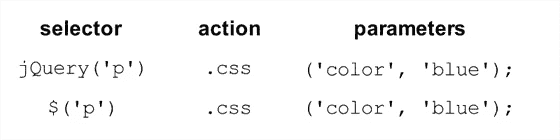

# 下载并包含 jQuery

> 原文：<https://www.sitepoint.com/downloading-and-including-jquery/>

在爱上 jQuery 之前(或者至少自己判断一下)，您需要获得最新版本的代码，并将其添加到您的 web 页面中。有几种方法可以做到这一点，每种方法都有几个可用的选项。无论您选择什么，您都需要在 HTML 页面中包含 jQuery，就像对待任何其他 JavaScript 源文件一样。

**只是 JavaScript 而已！**

不要忘记 jQuery 只是 JavaScript！它的外表和行为可能不同——但本质上它是用 JavaScript 编写的，因此它不能做普通的旧 JavaScript 做不到的事情。这意味着我们会像对待其他 JavaScript 文件一样将它包含在页面中。

**下载 jQuery**

这是获取 jQuery 库的最常见的方法——下载它！最新版本总是可以从 jQuery 网站上获得。闪亮的大下载按钮将把我们带到谷歌代码库，在那里我们可以获得最新的“产品压缩级别”版本。

单击下载链接，将 JavaScript 文件保存到一个新的工作文件夹中，准备开始使用。你需要把它放在我们的 HTML 文件可以看到的地方:通常在你站点的文档根目录下的`scripts`或`javascript`目录中。对于下面的例子，我们将保持它非常简单，并将库放在与 HTML 文件相同的目录中。

为了让它正常工作，我们需要告诉我们的 HTML 文件包含 jQuery 库。这是通过在 HTML 文档的`head`部分使用一个`script`标签来完成的。一个非常基本的 HTML 文件(包括 jQuery)的 head 元素看起来有点像这样:

```
<head>

  <title>Hello jQuery world!</title>

  <script type='text/javascript' src='jquery-1.5-min.js'></script>

  <script type='text/javascript' src='script.js'></script>

</head>
```

页面上的第一个脚本标签加载 jQuery 库，第二个脚本标签指向一个`script.js`文件，我们将在这里运行自己的 jQuery 代码。就这样:您已经准备好开始使用 jQuery 了。

我们前面说过，下载 jQuery 文件是最常见的方法——但是您也可以使用其他一些方法，所以在继续之前，让我们快速浏览一下。如果您只是想开始使用 jQuery，可以安全地跳过本节的其余部分。

**谷歌 CDN**

包含 jQuery 库的另一个值得考虑的方法是通过 Google *内容交付网络(CDN)* 。CDN 是一个计算机网络，专门用于以快速和可扩展的方式向用户提供内容。这些服务器通常分布在不同的地理位置，每个请求都由网络中最近的服务器提供服务。

Google 在他们的 CDN 上托管了几个流行的开源库，包括 jQuery(和 jQuery UI——我们很快就会访问到)。因此，你可以选择让 Google 承担你的部分带宽费用，而不是像我们上面所做的那样将 jQuery 文件托管在你自己的 web 服务器上。您可以从 Google 庞大的基础设施的速度和可靠性中获益，还可以选择始终使用最新版本的 jQuery。

使用 Google CDN 的另一个好处是，许多用户在访问另一个网站时已经从 Google 下载了 jQuery。因此，当他们访问您的站点时，它将从缓存中加载(因为 JavaScript 文件的 URL 将是相同的)，从而大大加快加载速度。您还可以通过相同的方法包含更强大的 jQuery UI 库，这使得 Google CDN 非常值得为您的项目考虑:当您的最新工作成为病毒时，它将为您节省资金并提高性能！

从 Google CDN 中包含 jQuery 有几种不同的方法。我们将使用更简单(尽管灵活性稍差)的基于路径的方法:

```
<head>

  <title>Hello jQuery world!</title>

  <script type="text/javascript" src="https://ajax.googleapis.com/

  ➥ajax/libs/jquery/1.5.1/jquery.min.js"></script>

  <script type='text/javascript' src='script.js'></script>

</head>
```

它看起来很像我们的原始示例——但是它没有将脚本标记指向 jQuery 的本地副本，而是指向 Google 的一个服务器。

**使用谷歌 CDN 获取最新版本**

如果仔细观察指向 Google 服务器的 URL，您会发现 jQuery 的版本是由其中一个路径元素指定的(在我们的例子中是`1.5.1`)。但是，如果您喜欢使用最新和最好的版本，您可以从版本字符串的末尾删除一个数字(例如，1.5)，它将返回 1.5 系列中可用的最新版本(1.5.1、1.5.2 等等)。你甚至可以把它提升到整数(1)，在这种情况下，即使 jQuery 1.6 和更高版本发布了，Google 也会给你最新的版本！

不过要小心:当新版本的 jQuery 发布时，不需要更新 HTML 文件，但是有必要注意任何可能影响现有功能的库更改。

如果你想研究稍微复杂一点的“Google loader”方法来包含库，在它的[网站上有很多关于 Google CDN 的内容。](http://code.google.com/apis/ajaxlibs/documentation/)
**夜生活与颠覆**

获得 jQuery 的更多高级选项在官方下载 jQuery 文档页面上列出。第一个选项是每夜构建。 *Nightlies* 是 jQuery 库的自动化构建，包括一天中添加或修改的所有新代码。每天晚上都有最新的开发版本可供下载，并且可以像常规的、稳定的库一样被包含进来。

如果每一个夜晚对您来说仍然太不频繁，您可以使用 Subversion 存储库来检索最新的源代码。 *Subversion* 是 jQuery 团队使用的开源版本控制系统。每次开发人员提交对 jQuery 的更改，您都可以立即下载。

但是要注意:nightly 和 Subversion jQuery 库通常都没有经过测试。它们可能(也将会)包含 bug，并且会经常更改。除非您打算使用 jQuery 库本身，否则最好跳过这些选项。

**解压缩还是压缩？**

如果您浏览过 jQuery 下载页面，您可能还会发现一些不同的下载格式选项:压缩的(也称为*缩小的*)和未压缩的(也称为“开发”)。

通常，您会希望使用精简版的生产代码，其中 jQuery 源代码被压缩:空格和换行符被删除，变量名被缩短。结果是完全相同的 jQuery 库，但是包含在一个比原始文件小得多的 JavaScript 文件中。这对于降低您的带宽成本和加快最终用户的页面请求非常有用。

压缩文件的缺点是可读性差。如果您在文本编辑器中检查缩小的 jQuery 文件(继续！)，您会发现它几乎难以辨认:只有一行看起来乱码的 JavaScript。库的可读性在大多数时候是无关紧要的，但是如果您对 jQuery 的实际工作方式感兴趣，未压缩的开发版本是一个注释过的、可读的、非常漂亮的 JavaScript 示例。

**jQuery 脚本剖析**

既然我们已经在网页中包含了 jQuery，那么让我们来看看这个宝贝能做什么。第一次看到 jQuery 语法时，可能会觉得有点奇怪，但它确实非常简单，最棒的是，它高度一致。写完最初的几个命令后，这些风格和语法会留在你的脑海中，让你想写更多。

**jQuery 别名**

在页面中包含 jQuery 可以让您访问一个名为(奇怪的是) `jQuery`的神奇函数。就一个功能？正是通过这一功能，jQuery 提供了数百个强大的工具来帮助您为 web 页面添加另一个维度。

因为单个函数充当整个 jQuery 库的网关，所以库函数名很少会与其他库或您自己的 JavaScript 代码冲突。否则，可能会出现这样的情况:假设 jQuery 定义了一个名为 hide 的函数(它确实有),而您自己的代码中也有一个名为 hide 的函数，其中一个函数会被覆盖，导致意外的事件和错误。

我们说 jQuery 库包含在 jQuery *名称空间*中。命名空间是一种很好的方法，可以很好地处理页面上的其他代码，但是如果我们要使用大量的 jQuery(我们确实在使用),为我们使用的每个命令输入完整的 jQuery 函数名很快就会变得很烦人。为了解决这个问题，jQuery 提供了一个较短的别名来访问这个库。简单来说，就是美金。

美元符号是一个简短、有效、看起来很酷的 JavaScript 变量名。这似乎有点懒惰(毕竟，使用别名只节省了五次击键)，但是一整页的 jQuery 将包含大量的库调用，使用别名将使代码更具可读性和可维护性。

**使用多个库**

您可能希望使用完整的 jQuery 调用而不是别名的主要原因是，当您在同一个页面上有多个 JavaScript 库时，它们都在争夺美元符号函数名的控制权。$是几个库中常用的函数名，通常用于选择元素。如果你有多个库的问题，请查看第 3.1 节“避免冲突”。

**剖析 jQuery 语句**

我们知道 jQuery 命令是从调用 jQuery 函数或其别名开始的。现在让我们拿出手术刀，检查 jQuery 语句的其余组成部分。图 1.3，“典型的 jQuery 语句”显示了同一个 jQuery 语句的两种变体(使用完整的函数名或$ alias)。

**图 1.3。典型的 jQuery 语句**


每个命令由四部分组成:jQuery 函数(或其别名)、选择器、动作和参数。我们已经知道了 jQuery 函数，所以让我们依次看看其他元素。首先，我们使用选择器来选择网页上的一个或多个元素。接下来，我们选择一个动作应用于我们选择的每个元素。随着我们在整本书中实现特效，我们会看到越来越多的动作。最后，我们指定一些参数来告诉 jQuery 我们到底想要如何应用所选择的动作。每当你看到 jQuery 代码时，试着把它分成几个部分。当你刚开始的时候，这会让你更容易理解。

在上面的例子中，我们要求选择器选择页面上所有的段落标签(HTML

标签)。接下来，我们选择了 jQuery 的 css 动作，该动作用于修改最初选择的段落元素的 CSS 属性。最后，我们传递了一些参数来将 CSS 颜色属性设置为值 blue。最终结果？我们所有的段落现在都是蓝色的！我们将在第 2 章*选择、装饰和增强*中深入探讨选择器和 css 动作。

我们的示例向 css 动作传递了两个参数(color 和 blue ),但是传递给动作的参数数量可以变化。有些不需要参数，有些接受多组参数(用于一次改变一大堆属性)，有些要求我们指定另一个 JavaScript 函数，用于在事件发生时(比如一个元素被点击)运行代码。但是所有的命令都遵循这个基本原理。

**note:**Want more?

看看这本书，并在网上购买:jQuery:忍者新手，作者厄尔·卡斯尔丁&克雷格·沙尔基

## 分享这篇文章