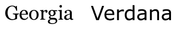
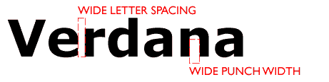

# 常见网络字体去神秘化

> 原文：<https://www.sitepoint.com/common-web-fonts-demystified/>

选择字体是排版设计的起点，甚至可能会影响页面的整体设计或感觉。传统上，当谈到字体选择时，网页排版缺乏选择，因为字体只有在用户电脑上可用时才能显示。那么，网页排版人员的第一项工作就是区分可用的字体，并了解哪种字体最适合他或她的特定任务。

一般来说，网络上使用的字体主要有两种:衬线字体和无衬线字体。这种差异在这张图片中很容易体现出来:

*衬线和无衬线类型*

衬线是添加到上面乔治亚字体主要笔画末端的额外线条或小装饰。这些衬线背后的理论是，它们有助于字母流动，并在阅读过程中引导视线穿过文本。衬线字体在印刷中非常受欢迎，尽管关于哪种字体在屏幕上最易读有一定的争论，但我坚定地支持无衬线字体是更合适的选择的阵营。

衬线字体的可变粗细和精细的额外笔画，尤其是在较小的正文字体中，常常显得杂乱无章。即使使用最现代的抗锯齿技术，情况仍然如此。启用抗锯齿后，衬线字体在其曲线和终端周围看起来模糊不清(这正是它们的本来面目)。另一方面，无衬线字体的直的、低对比度的、开放的笔划，例如 Verdana，总是会在屏幕上留下好印象。

***常见网页字体***

大多数设计师可能都很熟悉常见的网页字体。下面这个 CSS 规则大概不会引起太多的非议。

`body {
font-family: verdana, "trebuchet MS", helvetica, sans-serif;
}`

这里，我们有三种在网络上广泛使用的经典字体。然而，不只是复制和粘贴这个规则，让我们看看为什么我们决定使用这三种字体，以及它们适合我们的目的的特征。

Verdana 是我们这里的首选字体。这种字体是为屏幕设计的，是当今网络上最常用的无衬线字体。

*详细的凡尔纳面容*

请注意每个字符之间的大量空间，以及字符(字形)本身的大量空白。这使得 Verdana 字体在屏幕上清晰可辨，也是网页上无衬线字体的绝佳选择。

投石机是为屏幕创造的另一张脸。由 Vincent Connare 于 1996 年设计，它可能是常见网络字体中最有特色的，可以传达大量的能量和个性。这种字体的某些特征与我们所期望的经典 grotesk 字体有很大的不同，例如，下面看到的大写 M。

*投石机详细面目*

尽管有鲜明的个性，但投石机的笔触是块状的，清晰的。它有一个大的 x 高度，有助于提高较小尺寸的易读性。

最后，我们去了 Helvetica。Helvetica 设计于 20 世纪 50 年代，在整个 20 世纪下半叶非常流行，它本身就是一个经典。它能很好地转移到屏幕上，这既是对其易读性的证明，也是对网络印刷商的祝福。

*详细介绍一下 Helvetica 的面容*

尽管它的宽度很小，但由于其较大的 x 高度，Helvetica 在屏幕上读起来很好。它给人一种一致统一的感觉，这不仅节省了空间，也让它看起来很舒服。

最后，我们的 CSS 规则将 sans-serif 声明为通用字体系列。这确保了如果用户没有我们指定的其他字体，他们的系统至少会默认为无衬线字体。

如果你使用上面的规则，你一定会为你的大多数用户提供好的、易读的文本。然而，为什么不多做一点实验呢？还有哪些好的屏幕字体，我们可以提供给有这些字体的用户？

## 分享这篇文章