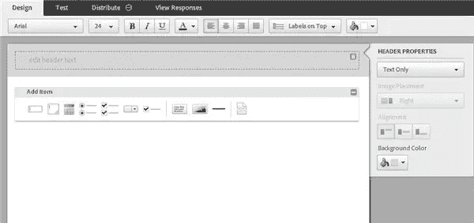

# 使用 Adobe FormsCentral 简化表单设计

> 原文：<https://www.sitepoint.com/form-design-made-easy-with-adobe-formscentral/>

本周早些时候，我们看了一些[联系页面](https://www.sitepoint.com/contact-us)上的表格示例。在相关新闻中，Adobe 本周宣布发布了[**for central**](https://formscentral.acrobat.com/)。这是一项设计、分发、收集和分析 HTML 表单数据的在线服务。您可以创建几种不同类型的 web 表单和调查，包括注册页面、联系表单、邮件列表和问卷。表单由 Adobe 托管。

 表单创建器是一个易于使用的拖放设置。创建表单时，您可以添加文本、段落、单选、多选、日期、下拉选项和复选框。有很多可用的模板，可以说你不会被基本的设计所打动，但是你可以通过添加自己的图像和设置自己的配色方案来美化和增强那些单调的 web 表单。

然而，缺少的一个主要功能是将表单嵌入到您自己的站点或博客中的能力。让访问者在您自己的网站上填写表格或调查，而不是被带到一个单独的页面，这将是很好的，但这可能会在未来的更新中解决。

##### 

##### 一旦您的访问者填写了表单，您就可以通过搜索和智能过滤以不同的方式查看数据。您可以将所有回复作为一个整体来查看，也可以将单个回复作为一个记录视图来查看。返回的数据可以在同事之间共享，您可以决定谁可以访问这些数据以及他们可以用这些数据做什么。如果您进行在线调查，您可以查看表格格式的所有回答，或者将数据导出为 XLS、CSV 和其他格式。您可以向响应表中添加其他列和公式，以帮助您分析表单数据。

FormsCentral 有三个定价级别:

*   免费(一份在线表格或调查，最多可获得 50 份回复)
*   每月 14.00 美元(五份表格或每份表格 500 份调查问卷)
*   外加 199 美元/年(不限数量的表格或调查，每份表格有 5，000 份回复)

你试过其他的 HTML 表单构建服务吗？你会推荐哪些？

## 分享这篇文章