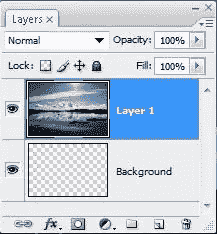
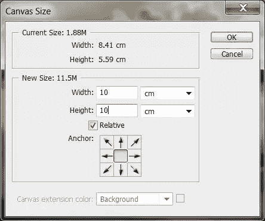
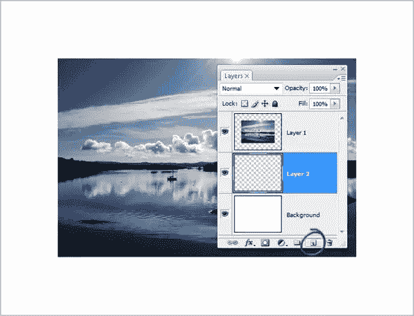
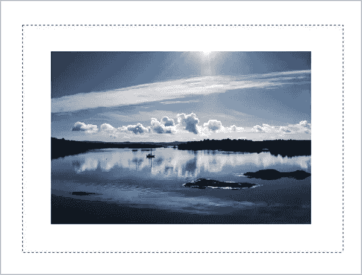
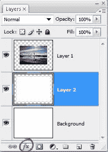
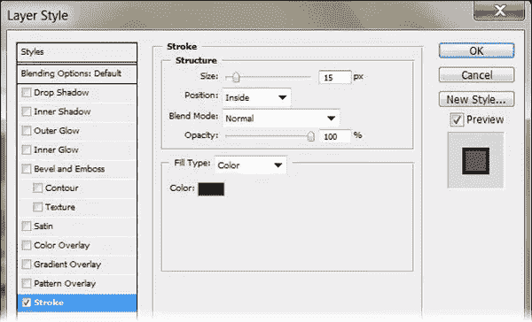
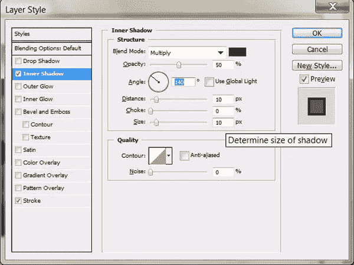
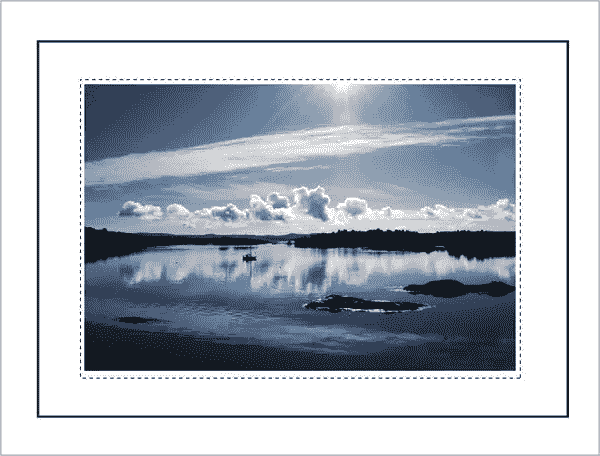
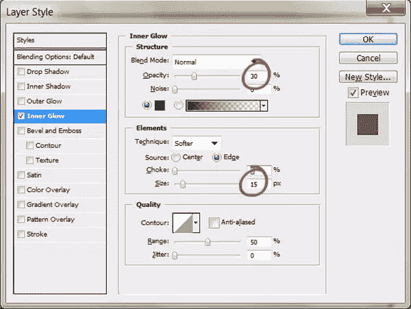
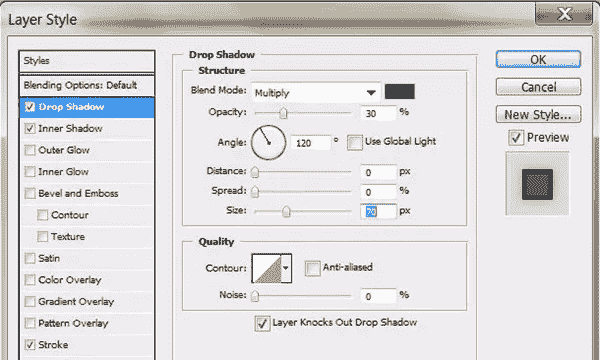

# 在 Photoshop 中用相框美化您的网络照片

> 原文：<https://www.sitepoint.com/enhance-your-web-photos-with-a-frame-in-photoshop/>

这是一个简单而优雅的技术，可以用来整理你的图片，以便在网上展示，甚至以 PDF 的形式展示，应该对网页设计师和摄影师有用。它可以让您在图像周围创建遮罩和边框效果。

1.打开您想要加框的照片。通过按键盘上的 D 键将前景和背景颜色分别设置为黑色和白色。

2.按 Ctrl + A (Windows)或 Cmd + A (Mac)将选区放在整个图像周围，然后按 Shift + Ctrl + J (Windows)或 Shift + Cmd + J (Mac)将选区放在它自己的图层上。

3.选择“图像”>“画布大小”,当对话框打开时，打开“相对”复选框，并将画布扩展颜色设置为白色。现在设置框架和遮罩的宽度和高度。你可能需要尝试一些不同的价值观。对于我在这里处理的图像，我将宽度和高度设置为 10 厘米。

单击“确定”在照片周围添加空白。

4.在照片图层下面新建一个图层。
(注意这些图像中的浅灰色边框用于表示画布的边缘，不会出现在您的图像中。)

5.现在你要画一个比照片大的选区，这将是相框的边缘。选择矩形选框工具(M)并拖出一个矩形选区，大小与您希望的框架一样大。

注:如果您想在拖动时移动字幕，只需按住空格键即可。当您将它移到您想要的位置时，释放空格键并继续拖移。

6.按键盘上的 X 键将前景色设置为白色，按 Alt-Backspace (Windows)或 Option-Delete (Mac)将此选区填充为白色。现在按下 Control-D / Command-D 来取消选择。

好了，现在看起来没有什么变化，因为你已经在白色背景上添加了一个白色矩形，但是如果你看看你的图层面板，你会看到中间层缩略图发生了变化。

7.现在，您将在中间矩形的边缘添加一个描边。点击图层面板底部的图层样式按钮，从下拉菜单中选择描边。

当图层样式对话框打开时，将大小设置为 15 像素，将位置设置为内部(通过选择内部边缘保持美观和清晰),并在颜色选择器中选择深灰色。

注意:您可能会对大小值进行一些反复试验。这真的取决于你的图像有多大，你希望笔画有多粗。

先不要单击确定。

8.你现在将通过在中间矩形的左上角创建一个非常微妙的内阴影来增加一些深度，所以点击图层样式对话框左侧的文字内阴影。

将不透明度设置为 50%，取消选中使用全局灯光复选框。将角度设置为大约 140 度，并将距离和大小设置为 10。

单击“确定”添加描边和内部阴影。

9.在图层面板上，点击创建新图层图标。这一次，你在照片和相框之间创造了一个小的遮罩。再次选择矩形选框工具，画一个比照片稍大的选框。

10.现在，您将通过按 Alt + Backspace / Option + Delete 用白色填充该选区。按 Ctrl + D / Cmd + D 取消选择所有内容。同样，图像中没有什么新的东西，因为您已经在白色背景上添加了一个白色框。

11.点击图层面板上的添加图层样式图标，从下拉菜单中选择内发光。

当对话框打开时，将“混合模式”弹出菜单更改为“正常”，将不透明度降低到大约 30%，然后单击色样，并在拾色器中将发光颜色更改为黑色。

当您单击“确定”时，一个柔和的阴影会添加到图层中，给人一种内部遮罩的感觉。

现在完成，你将添加一个软阴影到框架(层与中风和内部阴影已经在它上面)。单击该图层，然后从“添加图层样式”弹出菜单中选择“投影”。

将不透明度设置为大约 30%，关闭“使用全局灯光”复选框，将大小(阴影的柔和度)增加到 70 像素，然后单击“确定”。(注意:如果您正在处理低分辨率图像，请减小尺寸设置。)

您的最终图像应该是这样的:

当然，你可以调整框架的大小、内部磨砂的大小和颜色，为你网站上的在线作品集、画廊或图片带来不同的效果。

## 分享这篇文章