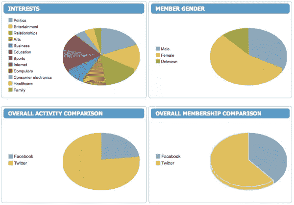
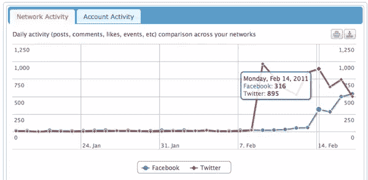
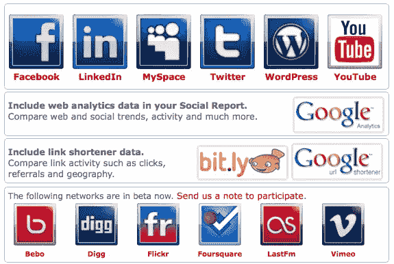
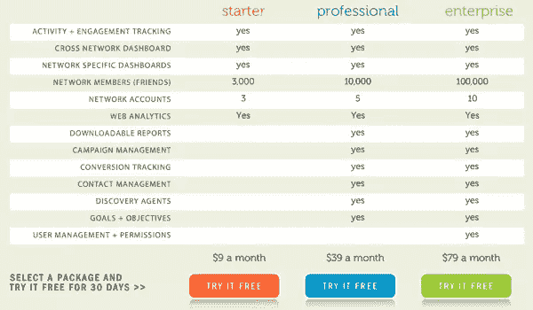

# 使用 SocialReport 挖掘社交数据

> 原文：<https://www.sitepoint.com/digging-into-social-data-with-socialreport/>

[SocialReport](http://www.socialreport.com/) 是一个社交仪表盘，可以帮助你追踪所有的社交账户、网络、网站、短链接和博客。它收集你所有社交网络中的活动，然后生成大量报告来帮助你分析你的社交数据。

我对它进行了几周的测试，以下是一些特性。

## 广泛的数据采集

SocialReport 可能最好被描述为 Google Analytics 的社交数据版本。测量的数据如此之多，以至于我很难在覆盖的数据中找到漏洞。以下是该工具在各种网络连接中捕获的一些数据列表:

*   活动
*   人口统计(年龄、性别)
*   约会
*   位置
*   兴趣
*   链接

## 丰富的视觉数据

如果你喜欢折线图和饼图，你会喜欢数据的呈现方式。一切都是可视化的，鼠标经过时可以显示具体的数字。

## 许多集成选项

您可以将您在最受欢迎的社交网络上的帐户添加到社交报告中，包括:

*   脸谱网
*   推特
*   商务化人际关系网
*   WordPress
*   油管（国外视频网站）
*   聚友网（网站）
*   谷歌分析
*   Bit.ly

以下网络目前处于测试阶段:Bebo、Digg、Flickr、Foursquare、LastFm 和 Vimeo。

## 面向各种用户的高级功能

SocialReport 有三个定价级别，并为定价较高的客户增加了一些功能。一些新增功能包括:

*   可下载的报告
*   活动管理
*   转换跟踪
*   联系人管理
*   发现代理

### 我的看法

总的来说，我喜欢捕捉到的数据的深度，以及它的呈现方式。这项服务相当实惠，可以免费试用(你必须提供信用卡才能免费试用)。

然而，由于可用的数据量如此之大，一开始很难确定应该关注哪些报告。最终，它只是漂亮的数据，直到你用它做一些事情。你需要有一个计划来解释数据，并将其应用到你的社交活动中，以使这样的工具有价值。

你使用 SocialReport 或其他类似的社交仪表盘吗？我很想听听你如何利用收集的数据来改善你的社交媒体活动。

## 分享这篇文章