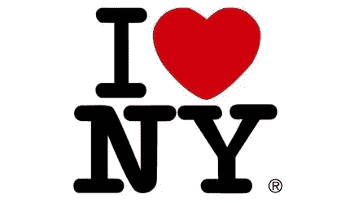
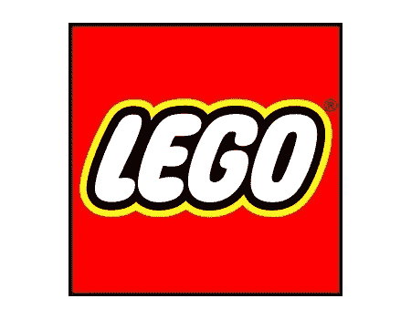
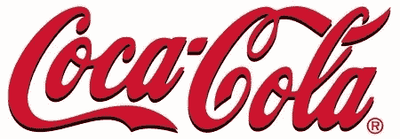

# 标志设计 101:创建标志性标志的六个技巧

> 原文：<https://www.sitepoint.com/logo-design-101-six-tips-for-creating-iconic-logos/>

标志设计无疑是平面设计中最具挑战性的方面之一。乍一看，这似乎很容易，但成功的标志往往有几个共同的特点。这些特征是:

*   简单
*   独特性
*   关联
*   难忘的
*   集中
*   传统(或者不跟风)。

以下是对这些特征的简要概述，并通过一个知名品牌的例子来说明这一点。

1.保持简单。新设计师经常犯的一个错误是过度复杂或过度设计。简单是一件好事，对于设计来说，少就是多。

2.让它独一无二。在一个充满 swooshes、弧线、树叶和其他陈词滥调的世界里，这说起来容易做起来难。Nike 标志是一个勾号或正确的标记，但却是立即可识别的和独特的。

3.保持相关性。当你设计一个标志时，考虑一下你使用的符号或字体是否合适。例如，骷髅头不会为婚礼策划公司工作。乐高标志使用明亮的原色和儿童友好的字体，非常适合其目标受众。

4.让它令人难忘。你的标志设计是公司代表的视觉表现。该标志往往只会收到一个快速的外观，所以它需要做出快速的印象。

5.保持焦点，用一个想法让设计与众不同。Fed Ex 标志在字母 E 和 X 之间有一个箭头，代表将包裹从一个地方移动到另一个地方的想法。

6.以长寿为目标。虽然许多标识会在一生中更新，但设计一些一年后看起来不会过时的东西可能是个不错的主意。避免“时髦”的字体和符号。可口可乐标志是世界上最受认可的标志和品牌之一。该标志独特的草书在其漫长的一生中没有发生巨大变化。

这些当然是指导方针和指针。所有的规则都是用来打破的，但是如果你在打破规则之前知道规则会有所帮助。你还有什么其他的规则或指导方针要添加到这个列表中？

## 分享这篇文章