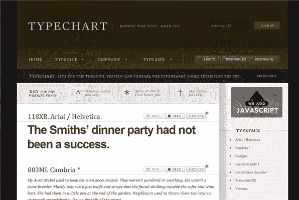
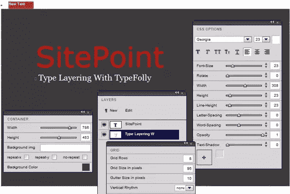
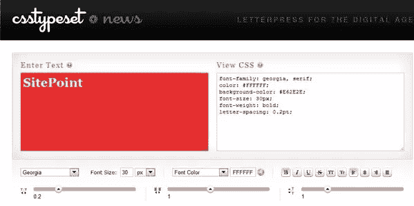

# 为网页设计师设计的三个 CSS 排版工具

> 原文：<https://www.sitepoint.com/three-css-typography-tools-for-web-designers/>

字体是设计和交流中非常重要的一部分。作为他们技能的一部分，设计师必须很好地掌握字体设计，还要知道如何将这些知识应用到他们的网页设计中。有许多可用的工具，在这篇文章中，我们将看看三个工具，它们专门帮助使用级联样式表的类型布局。

#### [类型密码](http://www.typechart.com/)

Typechart 是一个时尚的网站，可以让你在检索 CSS 的同时浏览、预览和比较网页排版。你可以这样做:

*   浏览排版样式，从网页安全字体、大小和样式中进行选择。
*   下载 CSS。
*   比较 Windows (ClearType)渲染和 Apple 字体渲染。
*   每种风格都对应一个“风格 ID”，这允许您在编码时注释原型和检索 CSS。

**[【类型疯狂】](http://www.typefolly.com/)**

TypeFolly 是一个排版工具，它允许设计师使用一组调色板或面板来创建分层的排版图像，类似于 Photoshop 的调色板。该网站的创建者将这些分层的组合称为“活字”当您创建合成时，应用程序会创建完全符合 <acronym>html</acronym> & <acronym>css3</acronym> 的代码。在编写的时候，它支持以下 <acronym>CSS</acronym> 属性:字体系列、字体大小、颜色、字母间距、单词间距、字体样式、字体粗细、文本修饰、文本对齐、z 索引、行高、宽度、高度、不透明度、moz/webkit-transform、文本阴影和字体。

调色板可以在屏幕上自由移动，你可以使用滑块来改变字体、大小、颜色和间距。完成创建后，您可以保存和导出您的类型项目。所有的项目都可以保存在我们的数据库或导出为符合 <acronym>CSS/html</acronym> 。我发现这有时有点笨拙，文本偶尔不会响应我在调色板上所做的更改，但总的来说，这是一种很好的视觉方式来处理文字，任何使用图像编辑软件和调色板的人都会很熟悉。

[**CSS 类型设置**](http://csstypeset.com/)

在这里介绍的三种工具中，CSS 排版可能是最容易使用的。你只需在左边输入一段文字，使用下拉菜单和滑块调整颜色、大小、重点和间距，瞧！在右边你会看到 CSS 代码，然后你可以复制并在你的网页设计中使用。

你以前用过这些工具吗？你还会为设计师推荐什么类型的工具？

## 分享这篇文章