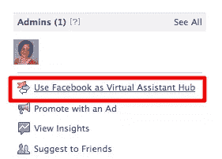
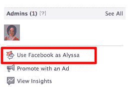
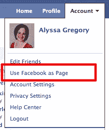
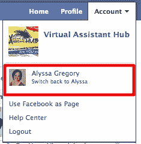
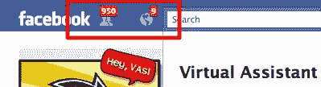
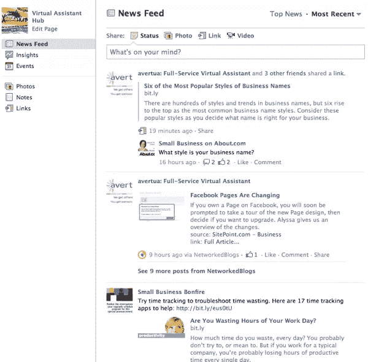
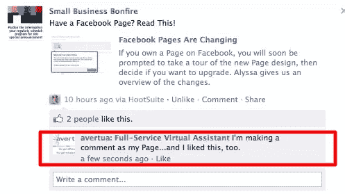

# 使用脸书作为你的页面

> 原文：<https://www.sitepoint.com/using-facebook-as-your-page/>

昨天，我写了一篇文章概述了脸书页面的变化。这些都是相当大的变化，从我目前看到的评论来看，它们引入了一些潜在的问题，特别是对于使用脸书页面的企业。

既然这种升级似乎正在发生，不管有没有脸书大约 300 万页面背后的人们的支持，我们都应该尽快尽可能多地了解如何有效地使用新设计。

我在一个最令人困惑的特性上做了一些探索——使用脸书，就好像你是作为你的页面登录的，而不是你自己。以下是我的发现。

## 如何登录您的页面

有两种方法可以在配置文件模式和页面模式之间切换。在你的页面上，你可以点击右边的链接“使用脸书作为[你的页面名称]”，然后通过点击“使用脸书作为[你的名称]”切换回来

 

你可以使用顶部的导航，点击“帐户”，然后“使用脸书作为页面”，或者点击链接切换回来。

 

## 作为你的页面你能做什么

基本上，当你使用脸书作为你的页面时，你做的任何事情都会在脸书上显示为来自你的页面。

您可以通过顶部导航栏查看页面活动和新粉丝的通知。好友请求图标现在显示新粉丝，通知图标在您的页面上显示新活动:

您可以查看关于您的页面和您喜欢的页面的新闻提要(以您的页面身份登录时，可通过单击脸书徽标来访问):

您还可以订阅自己页面的活动订阅源:

您可以“喜欢”其他页面，从其他页面共享到您的页面，并对其他页面的帖子发表评论，作为您的页面:

## 作为你的页面，你不能做什么

通过我自己的反复试验，我发现这是行不通的。

我无法与任何启用了隐私设置的个人资料进行交互；我只能从我自己的个人资料分享到我的页面。根据脸书的说法，只有当一个人允许脸书上的每个人对他们的帖子发表评论时，你才有可能在自己的页面上对个人资料发表评论。

我也不能用脸书作为我 iPhone 上的页面。据脸书称，这一功能并不适用于任何手机。

这些变化肯定需要一些时间来适应。我发现作为多个页面的管理员，处理各种登录功能特别麻烦。在页面和个人资料之间，需要一些额外的努力来确保你作为正确的实体发布到正确的地方。

但所有的变化都需要时间，我们必须看看尘埃落定后这些变化对脸书用户的影响。如果你探索了新的变化，我很想听听你自己的反馈。你喜欢什么？讨厌？

## 分享这篇文章