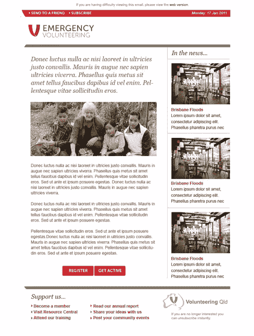
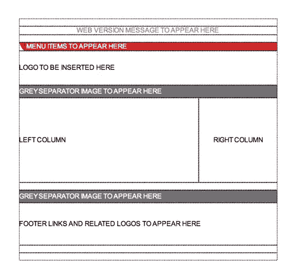
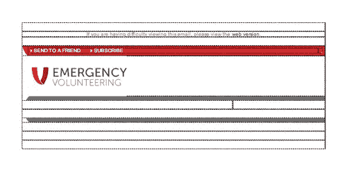
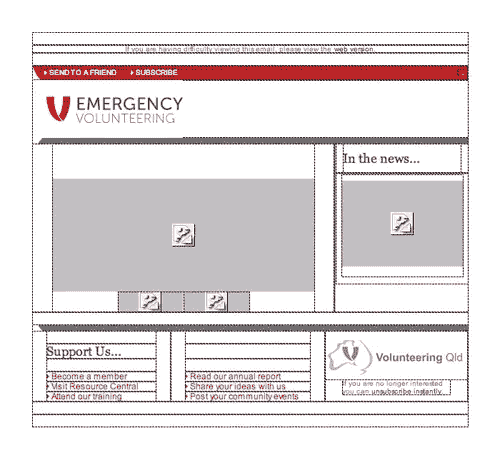

# 把你的 PSD 变成一个坚实的 HTML 电子邮件

> 原文：<https://www.sitepoint.com/turn-your-psd-into-a-solid-html-email/>

将 Photoshop 文件转换成动态网页是网页设计师的一项常见任务。我们都有自己的过程来提取视觉元素，抓取颜色，并以可爱的、符合标准的 HTML 和 CSS 构建布局。

HTML 电子邮件是一个不同的——也更黑暗的——故事。现代网络标准只适用于少数最流行的电子邮件客户端。如果你打算把你的邮件发送给一批确认的苹果邮件用户，任何在 Webkit 中工作的布局都可以，但是除此之外，需要一种不同的方法。

在本教程中，我们将逐步完成从设计师那里获取 PSD 模型的过程，并将其转换为可靠的 HTML 电子邮件，在当今最流行的电子邮件客户端中呈现良好。警告:*将会有表格*。

**会见客户**

你可能已经看过最近淹没澳大利亚昆士兰州大片地区的洪水的毁灭性照片。随着一项巨大的重建工作开始，昆士兰州的志愿者[找到我们，请求我们通过电子邮件向愿意伸出援手的大量民众提供帮助。](http://www.volunteeringqld.org.au/home/)

我们主动提出帮助发送邮件，并创建了一个简单的 HTML 电子邮件模板，组织可以用它来进行电子邮件活动。志愿昆士兰已经有了一个设计，并向我们提供了 Photoshop 文件。

这是原始布局的图像:

我们的工作是把 PSD 变成一个模板，在电子邮件客户端世界的限制和不兼容性范围内很好地工作。这项任务由 Stephen Jesson 接手，他是我们优秀的支持团队成员之一，在他的时代创造了许多电子邮件设计。

**规划基本结构**

电子邮件设计的不幸现实是，在大多数情况下，基于表格的布局仍然是最好的选择。Outlook 2007/2010 之类的邮件客户端不支持浮动，所以 CSS 定位不靠谱。

相反，我们将依靠老式的 HTML 表来创建一个几乎在任何地方都可以组合在一起的结构。在这一点上，我们需要做出一个哲学上的决定:目标是尽可能接近原始设计的电子邮件布局，或者目标是尽可能现代和干净的标记。

虽然这两种方法都有效——取决于你的最终目标——但一般来说，标记越少越好，因为电子邮件的重点是内容。HTML 只是呈现内容的一种方式。

有时候，尽可能匹配设计是很重要的，了解帮助我们实现这一目标的技巧和窍门是很有用的。因此，在本教程中，我们将探索电子邮件设计的那些肮脏的小秘密。

下面是我们的基本顶级表结构:

这张桌子将容纳整个设计，它将在`<body>`内居中；使用一个`align=center`参数。这是最可靠的桌子居中方式，几乎在任何地方都适用。

我们电子邮件的正文使用`margin=0`和`padding=0`来重置一切，我们将在正文标签和`<td>`表格单元格上设置字体大小和字体系列，以确保它们得到应用。

在外部表格上设置一个固定的像素宽度会使一切变得简单得多，600 像素大约是你想要发送电子邮件的宽度。如果你承认你的布局在不同的电子邮件客户端可能会有很大的变化，你可以设置一个百分比宽度，但这将使各列保持一致的宽度变得更加困难。

**为段落设置明确的边距和填充**

填充和空白是电子邮件设计者生存的祸根，因为它们在主流电子邮件客户端的支持是如此的不一致。最值得注意的是雅虎！Mail 删除了默认`
`标签中的所有空格，所以你应该自己定义它，防止你的段落挤在一起，就像日本地铁上的[通勤者一样。](http://quietube.com/v.php/http:/www.youtube.com/watch?v=b0A9-oUoMug&feature=player_embedded#at=47)

回到 PSD，我们可以测量各个列的宽度和内容元素之间的间距。现代网页设计会使用分隔线和边距来创建布局，而我们将使用表格和表格单元格的组合。

**一路向下的桌子**

我们最初的设计有一些很好的列槽，我们想匹配。不幸的是，当我们试图在内容周围创建一致的间距时，Lotus 和 Outlook 给我们带来了特别的麻烦。

我们不会让每个客户端应用自己对填充和边距的解释，而是测量列的大小和间距，并在每列中嵌套一个表格。

在这种情况下，方便起见，左侧和右侧的檐槽大小相同，因此计算变为:

`Npx`的总列宽–(左边距 20px +右边距 20px) =嵌套表格宽度

对于嵌套表，我指的是包含在一个`<td>`元素中的整个表。因此，在左列中，我们将放置一个嵌套的表`Npx`，并向其添加一个`align=center`属性。现在我们有了一个内容容器，它位于列的中间，居中在两边创建了装订线。

这种嵌套技术也将用于右栏和页脚。任何时候，如果希望保持块或元素周围的间距一致，可以通过嵌套表格来消除许多可能的变化。

“空的”表格单元格也可以用作间距。例如，看看我们设计顶部文本行周围的间距:

你最终会得到比你习惯的多得多的 HTML 代码，但是如果需要防弹布局，表格是你的朋友。

有时，您可以通过在图像中包含所需的空间来避免依赖渲染引擎来获得间距。在图像文件中包含徽标和照片周围的空间意味着您可以依赖它的存在，并使您的表格单元格适合已知的尺寸。

如果您的制作过程使您无法轻松地将空间添加到图像中，请考虑使用 CSS 或 HTML 边框。他们几乎在任何地方工作。

**收尾工作**

有了稳固的表格结构，我们可以安全地添加内容，而不会破坏电子邮件客户端的布局。这是 Dreamweaver 中最终布局的屏幕截图，因此您可以很容易地看到这些表格。

您会注意到，即使是页脚项也包含在单独的单元格中。在许多情况下，这可能是多余的，因为一个简单的段落可能就足够了。然而，在这种情况下，我们全力以赴，只是为了展示间距和项目高度的最大一致性需要什么。

列表项目符号在电子邮件客户端会表现得很奇怪，所以请使用内嵌图片。同样，项目符号图像和项目之间的间距内置于图像本身，没有必要试图将它们匹配起来。

分割线使用规定尺寸的图像，但它们也指定了背景颜色，以防[图像被遮挡](http://www.campaignmonitor.com/blog/post/2559/current-conditions-and-best-pr-1/)。

至此，大部分编码已经完成。我们有一个 HTML 文件，可以容纳尽可能多的主要电子邮件客户端。为了确认这一点，你可以添加一些内容，并通过像 [Litmus](http://litmus.com/) 这样的电子邮件测试服务运行你的文件——或者你的电子邮件服务提供商提供的服务。

下面是我们的模板在众所周知的挑剔的 Lotus Notes 8 客户端中的外观。

任务完成。如果此时您将工作交给内容编辑，请确保在发送电子邮件之前再次测试，以防他们添加了可能会导致问题的格式。我们经历的过程缓解了大部分这些问题，但它们仍然可能出现。

**十大防子弹 HTML 邮件技巧**

*   对于实体结构，使用具有固定像素宽度的表格。
*   如果需要，使用`align=center`参数将主表居中。
*   在正文和表格单元格中定义字体堆栈。
*   使用内联 CSS 来避免被剥离。
*   记得在图像标签上设置`border:0;`。
*   明确设置段落的边距和填充。
*   在你的图片中尽可能地加入空格。
*   背景色中的边框也可以起到边距的作用，但呈现的效果更一致。
*   在其他地方使用嵌套表格以获得一致的间距。
*   想想如果图像加载失败，或者单元格的高度或宽度不正确会发生什么，然后编写一个备份选项。

**电子邮件构建的额外资源**

在 Campaign Monitor 网站上，我们有通用的[设计指南](http://www.campaignmonitor.com/design-guidelines)和 [CSS 支持图表](http://www.campaignmonitor.com/css)，或者你也可以[阅读我的 SitePoint 书籍](https://www.sitepoint.com/books/htmlemail1/)了解更多关于 HTML 电子邮件设计的信息。

如果你是一名平面设计师，这听起来有点痛苦，我可以推荐这个领域的专家布莱恩·提斯。他是将图形设计转化为坚如磐石的 HTML 电子邮件的魔术师，他还在[电子邮件设计论坛](http://campaignmonitor.com/forums)提供帮助。

下一次你需要从 PSD 转到 HTML 电子邮件，你想避免停留在头发拉扯和沉默绝望城，我希望这个教程为你做的把戏。

## 分享这篇文章