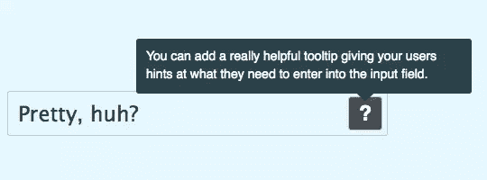
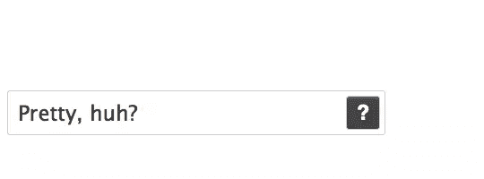

# 漂亮的输入:用 jQuery 帮助用户输入正确的数据

> 原文：<https://www.sitepoint.com/pretty-inputs-help-users-enter-the-right-data-with-jquery/>

在大字段中输入数据可能是 UX 的噩梦；让用户简单地输入他们的数据可能是一个挑战。他们怎么知道该输入什么？你真的能解释它们在一个输入标签中应该输入什么吗？

[](https://www.sitepoint.com/wp-content/uploads/2011/02/image.png)

在我最近参与的一个项目中，我们遇到了同样的问题。用户可以输入一篇文章的标题(在这种情况下)，虽然这是必需的——只有在标题字段中输入了内容，表单才会提交——但我们想让用户放心，他们以后总是可以更改标题。此外，我们想给一些有用的提示，并提供一些好标题的例子。所以我们认为，如果需要的话，友好、有用的工具提示会显示出来，但不会碍事，这才是正确的做法。

[](https://www.sitepoint.com/wp-content/uploads/2011/02/image2.png)

工具提示的 HTML 非常简单。`helpToolTipSubject`的类用于设置 jQuery 动作。

 ``包含问号(出现在按钮上的文本)和工具提示的内容。`

 ``给你一个在工具提示底部添加点的 CSS 钩子。它的代码如下。

```
<input class="helpToolTipSubject" type="text" name="name" id="name" value="Pretty, huh?"></input>
<div class="helpToolTipTrigger">?
<div class="tooltip">
<!-- The tooltip content goes here -->
<p>You can add a really helpful tooltip giving your users hints about what they need to enter into the input field.</p>
<!-- This is for the point -->
<div class="point"></div>
</div>
</div>
```

我们可以在用户需要的地方提供一些帮助，但又不妨碍用户的想法很好地满足了我们的需求。我们使用工具提示来显示提示，一旦它们被阅读，就不需要再看了(除非用户觉得他们需要提醒)。

因此，JavaScript 必须找到所有的工具提示触发器(通过我们添加的 CSS 类)，将一个 click 事件绑定到按钮，并知道当按钮被单击时，它可以打开工具提示，添加一个覆盖图(覆盖页面上的所有内容并等待单击)，并准备好隐藏工具提示和覆盖图，如果有另一次单击。

为了检查 JavaScript(有点复杂，但是我已经仔细检查过了，并对其进行了彻底的评论)和 CSS，[查看这个例子的源代码](https://www.sitepoint.com/wp-content/uploads/2011/02/example.zip)。

## 分享这篇文章```