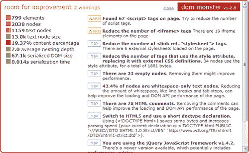

# 用 DOM Monster 剖析你的 HTML！

> 原文：<https://www.sitepoint.com/dom-monster-bookmarklet-tool/>

DOM Monster 是一个新的跨浏览器 bookmarklet 工具，它分析你的文档对象模型和你的 HTML 页面的其他特性。它报告关于元素数量、空节点、内容比率和嵌套深度的有价值的信息。然而，最有用的功能是一个总体评级和一系列警告和提示，以帮助您优化您的代码…

点击这个 **[DOM Monster](javascript:(function(){var%20script=document.createElement('script');script.src='http://mir.aculo.us/dom-monster/dommonster.js?'+Math.floor((+new Date)/(864e5));document.body.appendChild(script);})())** 链接来查看这个页面的结果，或者把它拖到你的书签栏来创建一个永久链接。

DOM Monster 是 Amy Hoy 和 JavaScript 大师 Thomas Fuchs 的创意。bookmarklet 可以在所有主流浏览器上运行，但是，尽管应该包括 Internet Explorer，它对我不起作用？Firefox、Chrome、Safari 和 Opera 都像预期的那样运行，webkit 浏览器提供了一些额外的 CSS3 效果。

虽然有许多可用的代码分析器，但 DOM Monster 提供了我在别处没有见过的有用信息。结果让人想起了 [Firebug](http://getfirebug.com/) 的 [YSlow 插件](https://developer.yahoo.com/yslow/),但是比起分析网络性能和文件大小，更强调优化 HTML 文档的性能。

有一些很好的提示，例如:

*   当 JavaScript 库的新版本可用时通知您
*   减少`script`标签的数量
*   警告您有太多的 JavaScript 全局变量
*   报告过多的空白
*   建议移除内联 JavaScript
*   提供内容与 HTML 代码的比率(超过 50%被认为是好的)。

DOM Monster 是一个方便的开源免费工具。更多信息，请访问 [DOM Monster 主页](http://mir.aculo.us/dom-monster/)或 [GitHub 知识库](http://github.com/madrobby/dom-monster)。

## 分享这篇文章