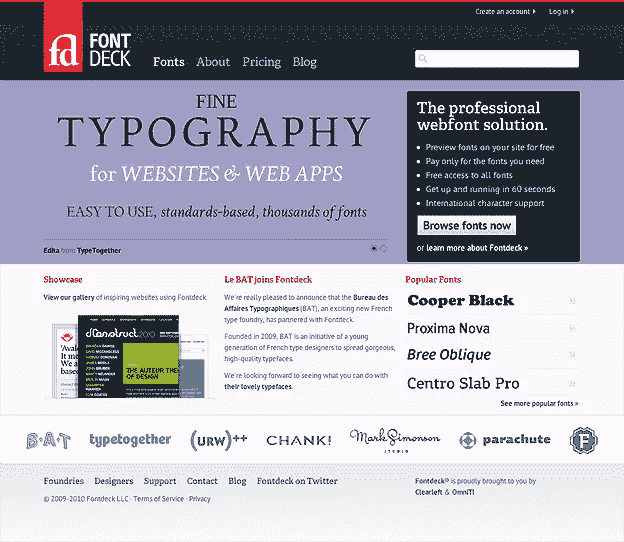
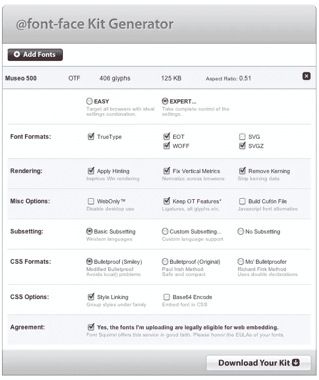
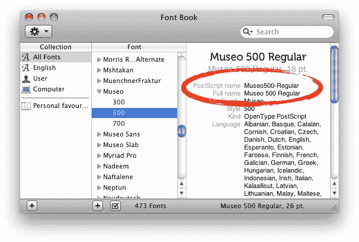

# 让文字进入网络

> 原文：<https://www.sitepoint.com/getting-type-to-the-web/>

在过去的一年半时间里，网页排版重新激起了人们的兴趣，这主要是因为像[ilovetypography.com](http://ilovetypography.com)这样的网站很受欢迎(现在有超过 69，000 名订阅者),以及在整个网页设计和开发社区中，越来越多的关于这个主题的排版文章。字体设计仍然是美学、可访问性，当然还有易读性的核心。那些掌握它并将其应用于网络的人因其作品的独创性而受到钦佩，无论是在风格上还是在技术实现上。

印刷术给信息带来美学秩序，帮助用户阅读和导航。字体区分；这是品牌的核心要素。底线是，当好的排版应用到网页上时，会创造更容易和更愉快的使用体验。这一领域重新燃起的热情翻开了网页排版的新篇章，这主要归功于网页字体的兴起及其在浏览器范围内的不断增长的可用性，这使我们能够超越核心的“网页安全”字体(Andale Mono、Arial、Courier、 <acronym title="Times New Roman">TNR</acronym> 、Impact、Verdana、Georgia 和 Trebuchet MS)。好的排版从选择好的字体开始，以纪念被排版的文本；适合正确作品的正确字体或字体组。一部以 T2、TNR 或 Helvetica 为背景的图文恐怖小说会与这本书的类型和它所使用的图文媒介产生冲突、分散注意力和冲突。与此同时，一本好的引人入胜的小说(像 TNR 这样的<acronym title="Times New Roman">过渡字体更适合)很难用脚本字体阅读。</acronym>

> 排版是为了尊重内容而存在的

选择好的字体是一个步骤，而且这个步骤可能会变得更加困难，因为我们已经有了比核心的网页安全字体更多的工作内容(或者是接下来最有可能被安装的字体)。在我们的网站上实现它们是另一个技术障碍。本文将重点介绍在 web 上获取类型的选项，然后详细介绍每种方法，同时重点关注 web 标准。一旦我们在网上选择了字体，我们就需要把字体设置得非常漂亮——请关注这个二重奏系列的下一篇文章，它将包含更好的美学。

## 将字体带到 web 的选项

许多不同的浏览器在将自定义字体带到 web 上的实现上有各种不同。这种差异归结为一场开放与封闭的辩论——锁定方法以保护字体资产，使其无法从使用它们的网站上轻松下载，而不是建立在信任基础上的更开放的模型。在某种程度上，这场争论与图片首次出现在网络上时的激烈争论有相似之处，类似地，这些实现上的差异已经在很大程度上得到了解决，因为 <acronym title="World Wide Web Consortium">W3C</acronym> 希望<acronym title="Web Open Font Format">WOFF</acronym>T2 最终成为标准。

在将字体带到网络上排版时，我们有多种选择。按照可用性的历史顺序，它们大致如下:

*   已安装的字体(大多数是网络安全的)
*   闪光(如<acronym title="Scalable Inman Flash Replacement">、sIFR</acronym> 等 <acronym title="JavaScript">JS</acronym> 替代技术
*   cufón 等人。
*   网络字体:<acronym title="Embedded OpenType">EOT</acronym>/<abbr>EOT</abbr>Lite via`@font-face`
*   网络用户:/<acronym title="TrueType">【TT】</acronym>通过`@font-face`
*   网络字体: <acronym title="Scalable Vector Graphic">SVG</acronym> via `@font-face`
*   网络字体: <acronym title="Web Open Font Format">WOFF</acronym> via `@font-face`
*   托管和许可服务

### 安装的字体

调用已安装的字体是选择用于排版网页的字体的最简单和最容易的方法。在我们的 <acronym title="Cascading Style Sheets">CSS</acronym> 样式表中，我们简单地通过`font-family`属性调用一个字体列表，并对它们进行分类:

*   渴望的
*   后退
*   通用(如`serif`、`sans-serif`、`monospace`、)

例如，过渡衬线字体堆栈:

```
p {
    font-family:
        Baskerville,
        Times
        'Times New Roman'
        serif;
    }
```

和一个新奇形怪状的堆栈:

```
h1, h2, h3, h4, h5, h6, h7 {
    font-family:

        Univers,
        Helvetica
        'Helvetica Neue'
        Arial
        sans-serif;
    }
```

这里很简单，如果堆栈中的第一个可用字体没有安装在客户端机器上，它显然不能用于呈现，所以它跳到列表中的下一个属性，等等，直到找到可用的字体。通过考虑流行操作系统的默认字体库，我们可以设计出好的字体堆栈来反映用户机器上可能安装的字体。这允许我们通过在列表中放置另一种仍然非常流行的首选字体，谨慎地扩展核心 web 安全字体之外的字体。

### 闪存替代技术

Flash 替换是一种在 JavaScript 文件的帮助下用 Flash 文本替换 <acronym title="HyperText Markup Language">HTML</acronym> 文本的好方法。最流行的技术是[可扩展因曼闪存替换](http://www.mikeindustries.com/blog/sifr/ "mikeindustries.com: sIFR 2.0") ( <acronym title="Scalable Inman Flash Replacement">sIFR</acronym> )。

虽然它支持子设置，但对于将真正的自定义字体带到 Web 上来说，这不是一个可行的长期解决方案，特别是它依赖于非标准技术和 JavaScript 的使用。它还需要较长的页面加载时间(主要是由于对所需 Flash、JavaScript 和 <acronym title="Cascading Style Sheets">CSS</acronym> 文件的请求数量)。它的最佳用途是设置单个标题或一系列小标题，但对于设置正文来说，它远不实用。

### cufón 等人。

随着 Flash 替换技术的出现，一系列其他 JavaScript 替换选项变得可用，以努力在没有 Flash 的情况下完成相同的工作。 [Cufón](http://cufon.shoqolate.com/generate/ "cufon.shoqolate.com: Cufón") 可能是其中最受欢迎的，它有一个在线前端，可以轻松地将字体数据转换为 JavaScript，为子设置提供良好的支持，还有一系列关于字距调整、缩放、跨对象资源共享( <acronym title="Cross Object Resource Sharing">CORS</acronym> )的其他选项，以限制一系列域的使用。

Cufón 将字体路径转换为存储在 <acronym title="JavaScript Object Notation">JSON</acronym> 中的 <acronym title="Vector Markup Language">VML</acronym> (现在大部分已被 <acronym title="Scalable Vector Graphics">SVG</acronym> 弃用)，并由用户代理内的 JavaScript 渲染引擎进行渲染。虽然它有很好的浏览器支持，但由于可访问性差，它也不是一个可行的长期解决方案。

### 网页字体: <acronym title="Embedded OpenType">EOT</acronym> / <abbr>EOT</abbr> Lite

自 1997 年底以来，Internet Explorer 4 通过在 <abbr>CSS2</abbr> 规范中引入的`@font-face`规则支持嵌入式 OpenType ( <acronym title="Embedded OpenType">EOT</acronym> )的使用。 <acronym title="Embedded OpenType">EOT</acronym> 是微软对一种远程方法的解决方案，该方法允许下载自定义字体资源用于在网页上呈现字体(并且已经见证了将默认情况下不支持的书写系统引入网络的良好历史),而不会使这些资源变得有用，也不会使字体版权侵权变得可行。

<acronym title="Embedded OpenType">EOT</acronym> 子集化、压缩并最终加密 TrueType 字体资源。 <acronym title="Cross Object Resource Sharing">CORS</acronym> 通过“可信根”列表的方式提供。不出所料，专有的压缩方法、专有的加密/解密过程，以及仅在 Internet Explorer <acronym title="Embedded OpenType">EOT</acronym> 甚至 <acronym title="Embedded OpenType">EOT</acronym> Lite(省略了专有的 <acronym title="MicroType Express">MTX</acronym> 压缩和 <acronym title="Cross Object Resource Sharing">CORS</acronym> 可信根列表)中的支持，是一种专有的非标准的 webfont 格式解决方案。

<acronym title="Embedded OpenType">EOT</acronym> 文件可以用微软的 [<acronym title="Web Embedding Fonts Tool">纬</acronym>](https://www.microsoft.com/typography/weft.mspx "Microsoft.com: Microsoft Typography — WEFT") 创建，也可以通过`ttf2eot`，一个转换器的开源实现。<acronym title="Web Embedding Fonts Tool">纬</acronym>值得跳过，原因如下:

*   <acronym title="Web Embedding Fonts Tool">纬</acronym>将使用 <acronym title="MicroType Express">MTX</acronym> 压缩方法，并由 gzip 等其他方法执行。
*   WEFT 只在 Windows 上运行，在模拟器(例如 Parallels)下运行不可靠。
*   `ttf2eot`不压缩—使用服务器端压缩。
*   [字体松鼠的@font-face web 前端](http://fontsquirrel.com/fontface/generator "FontSquirrel.com: Create your own @font-face kits")到`ttf2eot`简单易用。

#### 网络字体: <acronym title="OpenType">OT</acronym> / <acronym title="TrueType">TT</acronym>

功能类似于 <acronym title="Embedded OpenType">EOT</acronym> webfonts 在`@font-face` `src:`声明中链接，下载后直接用于渲染字体。

OpenType/TrueType 是一种可行的开放方法，为 webfonts 提供了相当好的浏览器支持(Safari 3.1+，Firefox 3.5+，Opera 10+，Chrome 4+； <abbr>IE9</abbr> beta，以及 Android 2.2+)。当然，显而易见的是，字体资产没有加密，没有绑定到任何受信任的根，也没有 <acronym title="Cross Object Resource Sharing">CORS</acronym> 的限制，并且一旦下载，其格式可以在浏览器环境之外的桌面上使用(例如桌面出版和文字处理)。此外，子设置和压缩不是自动的，而是字体资源的主机的责任。

### 网络字体: <acronym title="Scalable Vector Graphics">SVG</acronym>

同样坐在`@font-face` webfonts 规范上， <acronym title="Scalable Vector Graphics">SVG</acronym> 在`src:`声明中被引用，就像 <acronym title="Embedded OpenType">EOT</acronym> 、 <acronym title="OpenType Font">OTF</acronym> 或 <acronym title="TrueType Font">TTF</acronym> 字体一样。

同样， <acronym title="Scalable Vector Graphics">SVG</acronym> 文件不会被隐藏，因此可以很容易地从引用它们的网页之外下载使用。浏览器支持也相当广泛(火狐 3.5+ Chrome 0.3+，Opera 9+，苹果 <abbr>iOS1</abbr> +，和 Safari 3.1+)，和 <acronym title="OpenType">OT</acronym> / <acronym title="TrueType">TT</acronym> webfonts 一样，子设置和压缩归结于主机。

<acronym title="Scalable Vector Graphics">SVG</acronym> 文件可以 gzip 压缩成`.svgz`文件。

### 网络字体: <acronym title="Web Open Font Format">WOFF</acronym>

Flash/JavaScript 替换技术和 Cufón 向 web 排版人员和技术人员展示了专用、开放和标准化的 web 字体格式是必需的。微软的 <acronym title="Embedded OpenType">EOT</acronym> 、Ascender 的扩展、 <acronym title="Embedded OpenType">EOT</acronym> Lite、 <acronym title="OpenType">OT</acronym> / <acronym title="TrueType">TT</acronym> 和 <acronym title="Scalable Vector Graphics">SVG</acronym> direct font linking 都在网络的空地上展开了一场流行竞赛，看哪一个最先被采用，并得到最广泛的使用和浏览器支持。这场比赛在 W3C 的<acronym title="World Wide Web Consortium">上重新引发了关于开放、标准化网络字体格式的讨论。WOFF 试图填补这一空白。</acronym>

使用`@font-face` <acronym title="Web Open Font Format">WOFF</acronym> 将压缩的 sfnt 字体数据(PostScript、TrueType 或 OpenType)与 <acronym title="Extensible Markup Language">XML</acronym> 元数据捆绑在一起，创建一个开放的字体文件，非常适合将字体带到 web 上。 <acronym title="Web Open Font Format">WOFF</acronym> 文件是用开源`[sfnt2woff](https://people.mozilla.com/%7Ejkew/woff/ "people.mozilla.com: ~jkew/woff")`创建的。分设归结于主持人。 <acronym title="Cross Object Resource Sharing">CORS</acronym> 可通过 <acronym title="Hypertext Transfer Protocol">HTTP</acronym> 响应头获得。最终仍然可以提取字体数据，但是如果子集化解包一个 <acronym title="Web Open Font Format">WOFF</acronym> 字体文件以提取有用的字体数据供外部使用，则需要花费精力，并且很可能产生的字体数据将受到限制(由于子集化)。

目前，火狐 3.6+、WebKit、Chrome 5+和 T2 IE9 T3 开发测试版都支持 WOFF。

### 托管和许可服务

当寻找一个好的、开放的、标准化的网络字体格式的过程正在进行时，许多铸造厂和技术专家开始探索他们自己的想法，把定制字体带到网络上。因为许多虚拟主机和授权服务已经涌现，提供各种免费和商业计划的字体库: [TypeKit](http://typekit.com/) 、 [Kernest](http://kernest.com/) 、 [Fontdeck](http://fontdeck.com/) 、 [Monotype 的 webfonts.fonts.com](http://webfonts.fonts.com/)、 [Typotheque 的 webfont service](http://www.typotheque.com/webfonts) 等。创建账号，浏览库，选择，支付，注入几行代码，刷新。你完了。

[](https://www.sitepoint.com/wp-content/uploads/2011/01/fontdeck-homepage.png)

fontdeck.com 主页。

在技术方面，这些服务为正确的浏览器提供正确的或最好的字体( <acronym title="Embedded OpenType">EOT</acronym> 、 <acronym title="OpenType">OT</acronym> / <acronym title="TrueType">TT</acronym> 、 <acronym title="Scalable Vector Graphics">SVG</acronym> ，很快<acronym title="Web Open Font Format">WOFF</acronym>)——如果用户使用 Internet Explorer 进行查询，则会提供一个 <acronym title="Embedded OpenType">EOT</acronym> 文件。子设置由他们根据你可能或希望使用的语言和特性来完成，压缩也在服务端处理。

这些实现很大程度上是基于标准的，并且提供了非常广泛的浏览器支持。web 前端易于使用，并且有大量高质量的字体供所有服务提供商选择。

## 查找免费许可的字体

现在我们可以使用`@font-face`在 Web 上实现自定义字体，您可能想知道在哪里可以获得免费许可和免费的高质量字体用于 Web(和其他地方)。值得您关注的地方:

*   [openfontlibrary.org](http://openfontlibrary.org/)
*   [theleagueofmoveabletype.com](http://theleagueofmoveabletype.com/)
*   [fontsquirrel.com](http://www.fontsquirrel.com/)，特别是[预先生成的`@font-face`套件](http://www.fontsquirrel.com/fontface "FontSquirrel.com: Pre-generated @font-face kits")
*   webfonts.info 维基列表
*   而[谷歌的字体目录](https://code.google.com/webfonts)可以通过他们的字体 <acronym title="Application Programming Interface">API</acronym> 直接进行链接

## 使用`@font-face`

如果您选择不使用托管和许可服务，而是选择自己使用`@font-face`托管和引用字体文件，那么创建各种字体文件并获得正确的声明语法可能会令人望而生畏。实际上，由于 Paul Irish 和 Font Squirrel 的`@font-face` web 前端的防弹语法，这简直是小菜一碟。

### 创建`@font-face`网络字体文件

你已经拥有了一个你想要的字体，可以在网页上使用，或者你已经找到了一个很好的免费字体，可以作为网页字体使用。您的字体很可能是一个 <acronym title="OpenType">OT</acronym> / <acronym title="TrueType">TT</acronym> 或 PostScript 文件，您需要为其创建压缩并子集化的 <acronym title="Embedded OpenType">EOT</acronym> 、 <acronym title="OpenType">OT</acronym> / <acronym title="TrueType">TT</acronym> 、 <acronym title="Web Open Font Format">WOFF</acronym> 、 <acronym title="Scalable Vector Graphics">SVG</acronym> 文件。满足所有这些目标的最简单方法是使用 [Font Squirrel 的@font-face web 前端](http://fontsquirrel.com/fontface/generator "FontSquirrel.com: Create your own @font-face kits"):

[](https://www.sitepoint.com/wp-content/uploads/2011/01/font-squirrel-webfont-generator-museo500-example.png)

字体松鼠`@font-face`套件生成器。

只需选择并上传您的字体，然后您可以采取简单的方式，使用默认设置让 Font Squirrel 生成您的工具包供您下载，或者您可以选择专家的方式，对生成的字体文件的每个细微细节进行微调。访问自定义子设置允许对子设置字符类型、语言子设置、通过 Unicode 表和范围的子设置以及特定字符进行精确控制，呈现将包括在最终子设置字体文件中的所有字符的列表。

完成后，下载您的工具包准备部署。

### `@font-face`【防弹】宣言

写一个防弹的`@font-face`并不困难，但是有一些陷阱需要注意。我们开始工作吧。

基本上，我们希望向 Internet Explorer 提供一个 <acronym title="Embedded OpenType">EOT</acronym> 文件，并向其他浏览器提供 <acronym title="OpenType">OT</acronym> / <acronym title="TrueType">TT</acronym> 文件，同时为支持 <acronym title="Web Open Font Format">WOFF</acronym> 的浏览器提供前向支持。我们在`src:`声明中列出这些文件的顺序很重要，因为(惊讶吧，惊讶吧)否则 Internet Explorer 将不必要地下载其他文件，即使它不能处理它们，在不必要的额外连接和流量上浪费页面加载时间。因此，使用 Museo:

```
@font-face {
  font-family: 'Museo 500';
  src: url('Museo500.eot');
  src: local('?'),
       url("Museo500.woff") format("woff"),
       url("Museo500.otf") format("opentype"),
       url("Museo500.svg#museo") format("svg");
    } 
```

剖析这一点，我们从给我们想要链接的字体起一个名字开始，这个名字可以作为字体堆栈的参考。该属性是任意的。

接下来是 <acronym title="Embedded OpenType">EOT</acronym> 文件，首先放在`src:`列表中，以避免<abbr>即</abbr>出现上述情况。

然后是本地`src:`调用，尽管我们实际上省略了指定本地`src:`声明，而是输入“？”。这主要有两个原因。首先，它防止了(虽然不太可能)用户安装了一种与您的本地属性匹配但实际上不是您想要的字体的字体(将会使用这种字体，从而保存下载内容),这会破坏您的字体堆栈，甚至可能破坏您的设计。安装的字体不太可能被命名为“？”，并且在 [OpenType 规范](http://www.adobe.com/devnet/opentype/afdko/topic_feature_file_syntax.html#9.e "adobe.com:OpenType Feature File Specification — §9.e. name table")下，任何双字节 unicode 字符都不能作为字体名称，这种解决方案将 MAC 完全排除在这个问题之外。

其次，在处理本地引用时，Webkit 和 Mac <abbr>OS X</abbr> 中仍然存在各种明显的错误。如果你确定某个用户很有可能安装了你想要的字体(例如，它是一种免费提供和免费许可的流行字体，如 [Museo](http://www.josbuivenga.demon.nl/museo.html "josbuivenga.demon.nl: MUSEO, a free font from exljbris font foundry") )，并且不太可能安装另一种带有相同本地引用的字体，那么输入`local`是完全可以的——这就需要权衡两种情况的可能性。

如果你想定义一个本地的`src:`引用，你可以为`src:`中的`local`写两个稍微不同的条目，例如:`src: local("Museo 500 Italic"), local("Museo500-Italic"),`，这看起来有点奇怪。

啊？这是因为一些浏览器通过它们的 PostScript 名称引用本地字体。要在 Mac <abbr>OS X</abbr> open Font Book 下查找字体的本地名称，请选择您的字体，然后选择*预览* → *显示字体信息*(或⌘ + I)。对于 Windows，有一个可下载的 [*字体属性扩展*](https://www.microsoft.com/typography/TrueTypeProperty21.mspx "Microsoft.com: Microsoft Typography — Font properties extension") 。安装后，右键单击并压缩到字体文件上的*属性*，然后单击*名称*选项卡查看名称详情。

[](https://www.sitepoint.com/wp-content/uploads/2011/01/font-book-postscript-font-name-screenie.png)

演示字体信息查看模式的 Mac OS X 字体册的屏幕截图。

然后是 <acronym title="Web Open Font Format">WOFF</acronym> 和 <acronym title="OpenType">OT</acronym> / <acronym title="TrueType">TT</acronym> `src:`定义，接着是 <acronym title="Scalable Vector Graphics">SVG</acronym> 定义。注意`"Museo500.svg#museo"`中的`#museo`。这是因为 <acronym title="Scalable Vector Graphics">SVG</acronym> 文件是 <acronym title="Extensible Markup Language">XML</acronym> 文件，因此我们需要引用引用字体矢量路径起点的起始`div`(例如，在开始元数据之后)。

就是这样；完成了。信用和荣誉归于[保罗·爱尔兰人，他揭示了编写防弹`@font-face`语法定义](http://paulirish.com/2009/bulletproof-font-face-implementation-syntax/ "paulirish.com: Bulletproof @font-face syntax")的本质细节。

#### 问题:“双重设置”风格和变体

当使用`@font-face`时，我们很可能会处理不同字体风格的同一系列的不同字体文件，例如`foobar-regular.otf`、`foobar-italic.otf`、`foobar-bold.otf`、`foobar-smallcaps.otf`等等。

这可能会成为一个问题——考虑一下像`strong`和`em`这样的元素，它们的样式分别是将字体设置为粗体和斜体。如果我们像通常在 <acronym title="Cascading Style Sheets">CSS</acronym> 中那样声明斜体(就像我们将样式加入到设计中一样)，将会发生的是斜体被字体渲染引擎数字化(假斜体)。结果？我们的斜体或粗体字体被采用并数字化成斜体或粗体，产生难看的结果。

如果我们避免或覆盖了各种声明(例如`em { font-style: normal; }`)并且由于某种原因我们想要的`@font-face`字体不可用，我们就剥夺了字体堆栈中其他字体的样式。我们通过在`@font-face`声明中设置字体样式来克服这两个问题，通知用户代理我们实际上已经定义了斜体或粗体，当用于设置通过 <acronym title="Cascading Style Sheets">CSS</acronym> 声明的内容是斜体还是粗体时，应该保持原样:

```
@font-face {
  font-family: 'Museo 500';
  font-style: italic;

  src: url('Museo500.eot');
  src: local('?'),
       url("Museo500.woff") format("woff"),
       url("Museo500.otf") format("opentype"),
       url("Museo500.svg#museo") format("svg");
    } 
```

### 考虑

警告、缺点和妥协存在于任何事物中，类型设置也不例外。当把文字放在网页上时，有许多需要考虑的事情要做并牢记在心。印刷世界做出的许多妥协并不适用于网络媒体，但其他人会取而代之。

#### 更多≠更好

与网络上不断增长的新字体相对应，值得注意的是更多的字体并不意味着更好的排版。字体是资产。它们可以被认为是工具箱中的一个工具；室内设计师宝库中的壁纸。她可能有一千种不同的墙纸图案和颜色，但如果其中大多数是劣质材料，或者只是缺乏打开和照亮(或根据情况变暗)它们所应用的空间所需的令人愉悦的优雅，那么再有一千种也没有什么好处。

### 用于屏幕还是打印？

除了艺术方面的考虑，许多可用作 web 字体的字体并不是为 web(或者更准确地说是屏幕)使用而设计的。字体设计和印刷术在印刷业蓬勃发展。有数百种精致的专业设计和剪裁的字体和字体系列可用于所有类型的印刷工作，但其中许多还没有准备好在屏幕上使用。被设计或被带到数字世界的好字体已经被仔细优化，以在像素屏幕上完美呈现。这种优化被称为*提示*，好的网络字体随后会有好的*提示表*。

#### sb 设置

数字字体是数据，而大字体，即具有覆盖大字符范围的大字形集的字体，将开始成为用户代理下载用于呈现的相当大的资产。这里使用了两种技术来减小字体资源的大小，使它们更小，从而减少网络延迟。

第一种技术称为子设置，是从字体文件中移除不使用的字符的字形的过程。想象一下一个伟大的高质量超家族，它具有出色的语言支持，还拥有额外的历史连字、各种额外的文体集、连字符号、小型大写字母等等。一个单独的字体，即使只是这个家族的罗马字体，也可能超过 1024kB。如果只需要 <acronym title="American Standard Code for Information Interchange">ASCII</acronym> 、Latin 1、Latin Extended-A 和 Latin Extended-B(这涵盖了所有西欧语言，还有一点回旋的余地),那么就会有大量未使用的字符被多余地下载。

子设置可以在字体编辑器中完成(如 [FontForge](http://fontforge.sourceforge.net/) ，自由软件字体编辑器)。只需打开你的字体，选择不用的字符块并删除它们；保存——不过，一定要保留一份原件的副本。

#### 压缩

第二种技术是压缩。压缩字体资源非常类似于压缩文件以减小电子邮件附件的大小。通过压缩字体文件，我们可以进一步减少延迟和网络流量。这个操作是在服务器端完成的，压缩用户代理请求的各种资产，这些资产在下载时被动态解压缩并用于呈现 web 页面。

两种最流行的方法是通过 Apache web 服务器的外部扩展模块； [mod_deflate](http://httpd.apache.org/docs/2.0/mod/mod_deflate.html) 和 [mod_gzip](http://schroepl.net/projekte/mod_gzip/) 。

很可能你的虚拟主机服务会提供至少一个支持(如果不是，这是一个值得提出的请求——毕竟降低它们的延迟和流量符合它们自己的运营利益)。

如果你发现自己在使用微软的 [<acronym title="Internet Information Services">IIS</acronym> ，有一个 <acronym title="Hypertext Transfer Protocol">HTTP</acronym> 压缩设置](http://technet.microsoft.com/en-us/library/cc771003%28WS.10%29.aspx "Microsoft.com: IIS 7.0 Documentation — Using HTTP Compression (IIS 7.0)")可以启用和调整。

##### 配置 mod_deflate

安装并启用后，我们可以在`.htaccess`文件中配置 mod_deflate:

```
# Compression using deflate
AddOutputFilterByType DEFLATE text/html text/plain text/xml text/css

<FilesMatch "\.(js|css|html|htm|php|xml|txt|otf|ttf|eot|svg|woff)$">
    SetOutputFilter DEFLATE
</FilesMatch> 
```

在`FilesMatch`中，列出 mod_deflate 应该压缩的文件扩展名。

###### 配置 mod_gzip

类似地，mod_gzip 也可以在`.htaccess`文件中配置:

```
# Gzips content if possible
<IfModule mod_gzip.c>
    mod_gzip_on Yes
    mod_gzip_dechunk Yes
    mod_gzip_item_include file .(html?|txt|css|js|php|pl|otf|ttf|eot|svg|woff)$
    mod_gzip_item_include handler ^cgi-script$
    mod_gzip_item_include mime ^text.*
    mod_gzip_item_include mime ^application/x-javascript$
    mod_gzip_item_include mime ^application/json$
    mod_gzip_item_include mime ^application/vnd.ms-fontobject$
# There is no content-type for OTF yet, so we can get away by just
# listing the extension in the mod_gzip_item include file listing.
# For the sake of being good I have added the vendor-specific
# IANA content-type for EOT.
mod_gzip_item_exclude mime ^image.*
mod_gzip_item_exclude rspheader ^Content-Encoding:.*gzip.*
    mod_gzip_send_vary On
</IfModule> 
```

就像 mod_deflate 的`FilesMatch`使用`mod_gzip_item_include file`一样，我们可以列出 mod_gzip 应该试图压缩的文件的文件扩展名。内容类型也可以通过`mod_gzip_item_include mime`行列出，方法是将 [IANA 媒体类型](http://www.iana.org/assignments/media-types/)标记为特定于供应商的<acronym title="Embedded OpenType">EOT</acronym>。

你可以通过各种浏览器开发插件或使用马克诺丁汉的 REDbot 来测试压缩的表现，这是一个检查 <acronym title="Hypertext Transfer Protocol">HTTP</acronym> 资源中常见问题和陷阱的机器人。例如，当检查`[http://www.sitepoint.com](http://redbot.org/?uri=http%3A%2F%2Fwww.sitepoint.com%2F "REDbot: <https://www.sitepoint.com/>")`时，REDbot 通过`Content-Encoding`注意到 mod_gzip 正在使用中。当[检查资产](http://redbot.org/?descend=True&uri=https://www.sitepoint.com/ "REDbot: <http://www.sitepoint.com> — Checking assets")时，我们可以看到通过使用 mod_gzip 节省了页面原始大小的 84%(解压缩时),并显示了各种资产的详细数字。

#### 贮藏

最后，我们还可以缓存字体文件，减少延迟和网络流量。缓存允许我们通知访问我们的站点和下载我们的资产的用户代理，一些资产在可预见的未来不太可能改变，因此在以后访问我们的站点时再次下载它们将是浪费时间和数据——只需将这些资产存储(“缓存”)在用户代理的本地缓存中。不太可能改变的资产可能包括样式表(`.css`文件)、用于站点功能的 JavaScript 文件(`.js`脚本文件)，当然还有字体资产。

我们可以通过`.htaccess`文件缓存各种资产，方法是使用`FilesMatch`再次选择一系列内容类型，然后设置用户代理在再次下载资产之前缓存这些资产的最长时间(以确保缓存的副本保持更新)。注:`max-age`时间以秒为单位设定(这里 2592000 秒= 43200 分钟= 720 小时= 30 天)。

```
# Cache following file types for one month
<FilesMatch ".(js|jpeg|jpg|...|otf|ttf||eot|svg|woff)$">
    Header set Cache-Control "max-age=2592000"
</FilesMatch> 
```

## 好了

现在可以在 web 上应用自定义字体了，无论是自托管的还是通过 web 字体许可和托管服务，请务必关注本系列的第二篇文章《新字体设计》。

## 分享这篇文章