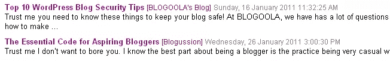

# jQuery 获取 RSS 提要 Live Reader

> 原文：<https://www.sitepoint.com/jquery-rss-feed-display-live/>

使用 jQuery get rss(使用 JavaScript)让博客(或网站)在您的网页上显示 rss 提要。**使用 Google Ajax Feed API 检索提要条目，并将其作为要显示的提要条目列表返回**。然后可以根据您的风格定制提要，以适合您的外观——例如，它可以用作 jQuery 新闻聚合器。

[真实世界演示](http://blogoola.com)

## jQuery RSS 插件特性

*   当你的网页加载时，自动加载 rss 源
*   刷新按钮来刷新 **jQuery rss 阅读器直播**
*   您可以**添加多个 rss 源**
*   您可以**指定返回的馈送项目**的限制
*   **在阅读 rss 源时显示加载按钮**



[下载源文件](https://www.sitepoint.com/wp-content/uploads/jquery4u/2011/01/jquery-rss-feed.zip)

## jQuery RSS 插件代码

The jQuery RSS Plugin mainly uses JavaScript to call google.load(feed) to get the rss feed items.

```
var gfeedfetcher_loading_imageimg/page-images/loader.gif" //Full URL to "loading" image. No need to config after this line!!

google.load("feeds", "1") //Load Google Ajax Feed API (version 1)

function gfeedfetcher(divid, divClass, linktarget){
	this.linktarget=linktarget || "" //link target of RSS entries
	this.feedlabels=[] //array holding lables for each RSS feed
	this.feedurls=[]
	this.feeds=[] //array holding combined RSS feeds' entries from Feed API (result.feed.entries)
	this.feedsfetched=0 //number of feeds fetched
	this.feedlimit=5
	this.showoptions="" //Optional components of RSS entry to show (none by default)
	this.sortstring="date" //sort by "date" by default
	document.write('`') //output div to contain RSS entries
	this.feedcontainer=document.getElementById(divid)
	this.itemcontainer="*   " //default element wrapping around each RSS entry item
    }

    gfeedfetcher.prototype.addFeed=function(label, url){
    	this.feedlabels[this.feedlabels.length]=label
    	this.feedurls[this.feedurls.length]=url
    }

    gfeedfetcher.prototype.filterfeed=function(feedlimit, sortstr){
    	this.feedlimit=feedlimit
    	if (typeof sortstr!="undefined")
    	this.sortstring=sortstr
    }

    gfeedfetcher.prototype.displayoptions=function(parts){
    	this.showoptions=parts //set RSS entry options to show ("date, datetime, time, snippet, label, description")
    }

    gfeedfetcher.prototype.setentrycontainer=function(containerstr){  //set element that should wrap around each RSS entry item
    this.itemcontainer=""
    }

    gfeedfetcher.prototype.init=function(){
    	this.feedsfetched=0 //reset number of feeds fetched to 0 (in case init() is called more than once)
    	this.feeds=[] //reset feeds[] array to empty (in case init() is called more than once)
    	this.feedcontainer.innerHTML='

    加载博客订阅源...

    '
    	var displayer=this
    	for (var i=0; i<this .feedurls.length="" i="" through="" the="" specified="" rss="" feeds="" urls="" var="" feedpointer="new" google.feeds.feed="" new="" instance="" of="" google="" ajax="" feed="" api="" items_to_show="(this.feedlimit<=this.feedurls.length)?" :="" math.floor="" entries="" to="" show="" for="" each="" if="">0 && this.feedlimit>this.feedurls.length && i==this.feedurls.length-1) //If this is the last RSS feed, and feedlimit/feedurls.length yields a remainder
    			items_to_show+=(this.feedlimit%this.feedurls.length) //Add that remainder to the number of entries to show for last RSS feed
    		feedpointer.setNumEntries(items_to_show) //set number of items to display
    		feedpointer.load(function(label){
    			return function(r){
    				displayer._fetch_data_as_array(r, label)
    			}
    		}(this.feedlabels[i])) //call Feed.load() to retrieve and output RSS feed.
    	}
    }

    gfeedfetcher._formatdate=function(datestr, showoptions){
    	var itemdate=new Date(datestr)
    	var parseddate=(showoptions.indexOf("datetime")!=-1)? itemdate.toLocaleString() : (showoptions.indexOf("date")!=-1)? itemdate.toLocaleDateString() : (showoptions.indexOf("time")!=-1)? itemdate.toLocaleTimeString() : ""
    	return ""+parseddate+""
    }

    gfeedfetcher._sortarray=function(arr, sortstr){
    	var sortstr=(sortstr=="label")? "ddlabel" : sortstr //change "label" string (if entered) to "ddlabel" instead, for internal use
    	if (sortstr=="title" || sortstr=="ddlabel"){ //sort array by "title" or "ddlabel" property of RSS feed entries[]
    		arr.sort(function(a,b){
    		var fielda=a[sortstr].toLowerCase()
    		var fieldb=b[sortstr].toLowerCase()
    		return (fielda<fieldb :="">fieldb)? 1 : 0
    		})
    	}
    	else{ //else, sort by "publishedDate" property (using error handling, as "publishedDate" may not be a valid date str if an error has occured while getting feed
    		try{
    			arr.sort(function(a,b){return new Date(b.publishedDate)-new Date(a.publishedDate)})
    		}
    		catch(err){}
    	}
    }

    gfeedfetcher.prototype._fetch_data_as_array=function(result, ddlabel){	
    	var thisfeed=(!result.error)? result.feed.entries : "" //get all feed entries as a JSON array or "" if failed
    	if (thisfeed==""){ //if error has occured fetching feed
    		alert("Some blog posts could not be loaded: "+result.error.message)
    	}
    	for (var i=0; i<thisfeed .length="" i="" each="" entry="" within="" feed="" result.feed.entries="" it="" with="" a="" property="" this.feeds="this.feeds.concat(thisfeed)" to="" array="" holding="" all="" entries="" this._signaldownloadcomplete="" the="" retrieval="" of="" this="" as="" complete="" move="" on="" next="" one="" if="" defined="" gfeedfetcher.prototype._signaldownloadcomplete="function(){" this.feedsfetched="" feeds="" fetched="" this._displayresult="" results="" gfeedfetcher.prototype._displayresult="function(feeds){" var="" rssoutput="(this.itemcontainer==&quot;<li">")? "

    <feeds .length="" i="" var="" itemtitle="<a rel=" nofollow="" href="" feeds="" target="" this.linktarget="" class="titlefield">" + feeds[i].title + ""
    		var itemlabel=/label/i.test(this.showoptions)? '['+this.feeds[i].ddlabel+']' : " "
    		var itemdate=gfeedfetcher._formatdate(feeds[i].publishedDate, this.showoptions)
    		var itemdescription=/description/i.test(this.showoptions)? "
    "+feeds[i].content : /snippet/i.test(this.showoptions)? "
    "+feeds[i].contentSnippet  : ""
    		rssoutput+=this.itemcontainer + itemtitle + " " + itemlabel + " " + itemdate + "n" + itemdescription + this.itemcontainer.replace("")? "</feeds>

    " : ""
    	this.feedcontainer.innerHTML=rssoutput
    }</thisfeed></fieldb></this>`

## HTML 代码

```
 [刷新实时博客文章](javascript:newsfeed.init()) 
```

## CSS 代码

```
/** RSS FEED **/
.labelfield{ color:brown; font-size: 90%; }
.datefield{ color:gray; font-size: 90%;}
#rssfeeds a{ color: purple;text-decoration: none;font-weight: bold;}
#rssfeeds p{ margin-bottom: 2px;}
code{ color: red;}
#blogoolafeed, #blogoolafeed a { color:white; }
#blogoolafeed a:hover{ color:#8E7BD3; }
#blogoolafeed ul { margin-left:-15px }
#rssfeed-wrap { text-align:left; margin-left:15px; }
```

插件来源:http://www.dynamicdrive.com

## 分享这篇文章

```