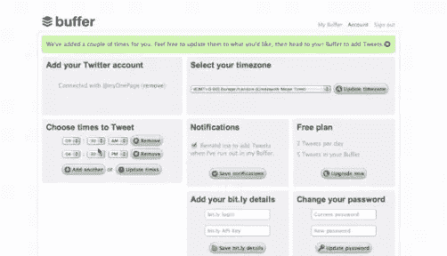
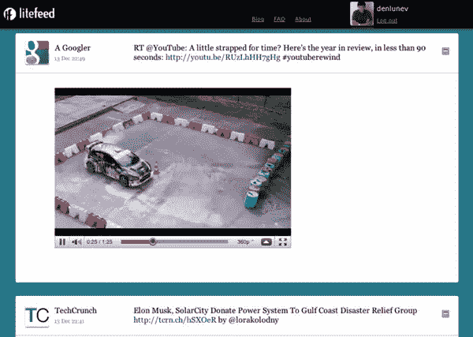
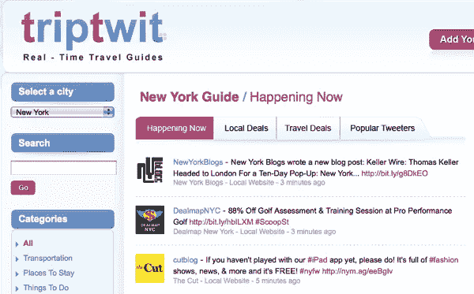
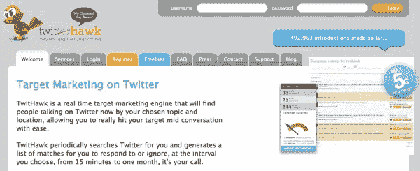
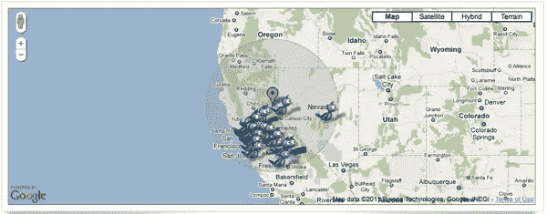

# 改变你使用 Twitter 方式的 7 款应用

> 原文：<https://www.sitepoint.com/7-apps-to-change-the-way-you-use-twitter/>

如果你使用 Twitter，你可能已经开发了非常具体的使用方法，以及适合你的检查、更新和搜索流程。然而，和任何交流工具一样，人们很容易陷入这样一种固定的套路，以至于你不容易找到使用这种工具的新方法。你甚至可能会变得厌烦，越来越少地使用它，即使它很有效。

我喜欢 Twitter 的一点是不断开发新的应用和工具。有些当然比其他的更好，但你会不时发现一个工具，它有可能改变你使用 Twitter 的方式，甚至可能给你一些如何更有效地使用它的见解。

这里是我最近遇到的七个 Twitter 应用程序，它们可以帮助你让 Twitter 变得更有用，与你的目标更相关……或者至少帮助你克服对 Twitter 的厌倦。

## [缓冲器](http://bufferapp.com)

Buffer 是一款 Twitter 应用，它只专注于让用户能够安排推文。有三个不同的账户级别，有不同的推文数量和指标；所有计划都包括一个 Chrome 扩展。

## [LiteFeed](http://www.litefeed.com/)

LiteFeed 获取你的 Twitter 流，并通过扩展所有缩短的 URL 让你感觉像一个 RSS 源，并让你能够立即看到完整的内容，而不必点击进入。

## [TripTwit](http://www.triptwit.com/)

TripTwit 聚合并提供来自成千上万个来源的实时 Twitter 旅行数据，包括航空公司、酒店、餐厅、公共交通等。你选择你感兴趣的城市，并可以查看当前的推文、当地交易和旅游交易。

## [TweetMemo](http://www.tmemo.me/)

TweetMemo 是 Twitter 的提醒服务。你只需发送一条推文或 DM 到@tmemo，并附上你的提醒以及你想被提醒的时间(2 天+2d，1 小时+1h，+30m 是 30 分钟，等等。).你也可以在你的推文中添加一些人来提醒他们。

## TwitHawk

TwitHawk 是一个实时 Twitter 营销引擎，它不仅仅做搜索。你通过你的账户设置你的搜索词，然后 TwitHawk 以你选择的时间间隔(从 15 分钟到一个月)搜索 Twitter，并生成一个匹配列表。它还集成了谷歌分析。

## [求推文](http://seekatweet.com/)

Seek a Tweet 让您可以看到世界任何地方的最新 Tweet、Twitter 用户和趋势。您可以使用过滤器在特定地区搜索特定主题的推文。

## 分享这篇文章