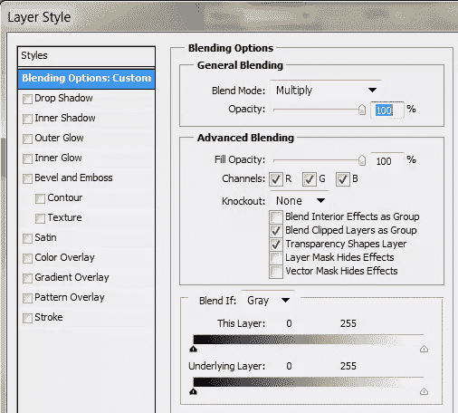
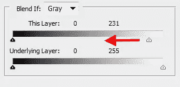
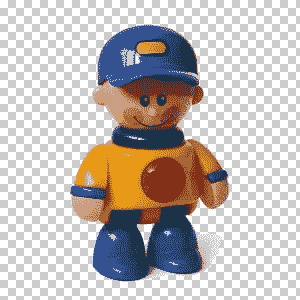

# Photoshop 混合滑块:移除纯色背景

> 原文：<https://www.sitepoint.com/easily-remove-white-or-black-backgrounds-with-blending-sliders-in-photoshop/>

今天我有一个相当快速的 Photoshop 技巧，教你如何在 Photoshop 中去除图像的白色或黑色背景，以创建透明区域。有几种方法可以做到这一点。你可以使用魔法橡皮擦，或者只是选择白色或黑色背景，然后删除它，但我想告诉你如何使用混合滑块来做到这一点。除了图层面板中可用的混合模式，您还可以在图层样式对话框中使用混合滑块。让我们开始吧。

对于更复杂的背景，这种方法不起作用——当图像中的背景已经是纯色时，这是一个简单的选择。你可以在我们的指南中找到如何使用 Photoshop 消除更复杂的图像，该指南涵盖了五种去除背景的技术。

## 1.在 Photoshop 中打开以白色或黑色为主要背景的图像。

levisz 拍摄的玩具照片

## 2.通过执行以下操作之一打开“图层样式”对话框:

*   单击图层面板底部的小 fx 按钮，然后选择混合选项。
*   在“图层”面板中双击其图层缩略图。
*   选择“图层”>“图层样式”>“混合选项”。

注意:混合滑块在锁定的背景层上不起作用；您必须先双击该层，使其可编辑。

在出现的对话框底部，您会看到两对滑块——一组用于此图层栏，另一组用于底层图层栏。每个滑块都可以让您根据像素的亮度值使图像的部分透明。左边的滑块代表图像中的阴影(黑色)，右边的滑块代表高光(白色)。如果你想改变当前活动层的背景，然后调整这个层滑块。

## 3.如果您想要隐藏白色背景，请将高亮滑块(右边的那个)向中间拖移，直到白色部分透明。

拖移时，您会看到图像的白色区域消失，棋盘图案(或底层)会出现。注意 ***任何*** 的白色区域都会消失，所以你需要小心拖动的距离。

同样，如果当前活跃层的背景是黑色的，而主体(或前景中的对象)要亮得多，您可以通过向中间拖动阴影滑块(左边的那个)来隐藏黑色部分，直到黑色部分透明。非常简单快捷。

如果你喜欢读这篇文章，你会爱上[可学的](https://learnable.com?utm_source=sitepoint&utm_medium=link&utm_campaign=learnablelink)；向大师们学习新技能和技术的地方。会员可以即时访问 SitePoint 的所有电子书和互动在线课程，如[Photoshop](https://learnable.com/courses/foundations-of-photoshop-2712?utm_source=sitepoint&utm_medium=link&utm_campaign=learnablelink)基础。

通过我们在 SitePoint Premium 上提供的 [Photoshop for Web Design](https://www.sitepoint.com/premium/courses/photoshop-for-web-design-2901) 课程，学习大量的 Photoshop 设计技能。

对本文的评论已经关闭。对 Photoshop 有疑问？为什么不在我们的[论坛](https://www.sitepoint.com/forums/forumdisplay.php?8-Graphics?utm_source=sitepoint&utm_medium=link&utm_campaign=forumlink)上问呢？

## 分享这篇文章