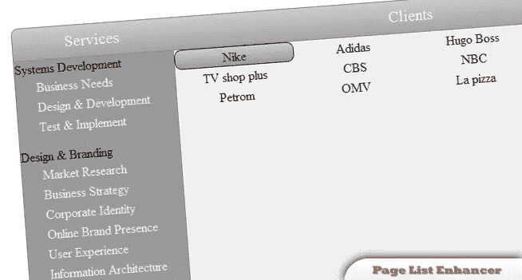

# jQuery 列表页面增强器

> 原文：<https://www.sitepoint.com/jquery-list-page-enhancer/>

## 介绍

基本的客户列表页面看起来有点单调。上面的设计将是本教程的最终结果，我们还将尝试添加一个服务列表，并将这两个列表映射在一起。指向服务将显示购买该服务的客户端，而指向客户端将显示该客户端购买的服务。在 jQuery 的帮助下，将这两者映射在一起是可能的。


## HTML

我们将使用专为现代浏览器定制的 HTML 5 标签。不过，需要修改一些标签和一个 doctype 才能使它在所有浏览器上工作。文件
的结构将由两个 HTML 5 标签组成:Header 和 section。

```
 # 服务

## 客户

*   系统开发

    *   [业务需求](#)

    *   [设计&放大器；开发](#)

    *   [测试&amp；实施](#)

*   设计&品牌

    *   [市场调查](#)

    *   [经营战略](#)

    *   [企业形象](#)

    *   [在线品牌形象](#)

    *   [用户体验](#)

    *   [信息架构](#)

    *   [应用开发](#)

*   [耐克](#)

*   [阿迪达斯](#)

*   [雨果博斯](#)

*   [运河+](#) 

*   电视店加

*   [哥伦比亚广播公司](#)

*   [美国全国广播公司](#)

*   [GOL 电视台](#)

*   [Petrom](#) 

*   [OMV](#) 

*   [拉比萨](#)

*   [商店](#) 
```

如您所见，每个列表项都有不同数量的类。这些用于识别服务，以及将服务映射到客户端，反之亦然。锚标记内的 class 属性用于
强调选择了哪些客户端或服务。CSS
在本教程中，我们将使用圆角。

```
/* reset basic styling and set rounded corners */
*
{ margin:0; padding:0; border:0; outline:0; font-weight:inherit; font-size:inherit; }
.all-rounded,
ul.services li a,
ul.clients li a
{ border-radius:9px; -moz-border-radius:9px; -webkit-border-radius: 9px; }
.btlft-rounded
{ border-bottom-left-radius:9px; -moz-border-radius-bottomleft:9px; -webkit-border-bottom-left-radius:9px; }
.btrght-rounded
{ border-bottom-right-radius:9px; -moz-border-radius-bottomright:9px; -webkit-border-bottom-right-radius:9px; }
.top-rounded
{ border-top-left-radius:9px; -moz-border-radius-topleft:9px; -webkit-border-top-left-radius:9px;
border-top-right-radius:9px; -moz-border-radius-topright:9px; -webkit-border-top-right-radius:9px; }

/* styling of the general structure: size, position and alike */
header
{ display:block; width:801px; height:40px; margin:0px auto; margin-top:100px; border:1px solid #888;  border-bottom:none; }
header h1, header h2
{ display:block; margin:0px; padding:0px; }
header h1
{ width:200px; float:left; }
section
{ display:block; width:803px; margin:0px auto; margin-bottom:50px; overflow:auto; }
ul
{ display:block; float:left; list-style:none; padding-bottom:15px; }
ul.services
{ width:200px; }
ul.clients
{ width:600px; }

/* visual styling: colors, font size etc */
header
{ background:#999 url('img/top.png') repeat-x; }
header h1, header h2
{ font-size:20px; color:#F6F6F6; line-height:40px; text-align:center; }
ul.services
{ background-color:#999; border:1px solid #888; border-right:none; }
ul.clients
{ background-color:#F0F0F0; border:1px solid #888; }

ul.services a, ul.clients a
{ text-decoration:none; }
ul.services li a
{ display:block; color:#F0F0F0; height:23px; line-height:25px; padding:0px 5px; border:1px solid #999; }
ul.services li a:hover
{ color:#222222; line-height:25px; padding:0px 5px; border:1px solid #222222; background:#999 url('img/hover_services.png'); }
ul.services li ul
{ margin-left:20px; }
ul.services li
{ overflow:hidden; }

ul.clients li a
{ display:block; float:left; width:138px; padding:0px 5px; line-height:25px; height:23px; text-align:center; border:1px solid #F0F0F0; }
ul.clients li a:hover
{ color:#222222; line-height:25px; padding:0px 5px; border:1px solid #222222; background:#999 url('img/hover_services.png'); }

ul.services li a.selected,
ul.clients li a.selected
{ color:#222222; line-height:25px; padding:0px 5px; border:1px solid #222222; background:#999 url('img/hover_services.png'); }
```

## jQuery

现在，我们将使两列具有相同的高度。

```
// resize column for same height
var servicesHeight = $('.services').height(); // get height of services ul
var clientsHeight = $('.clients').height(); // get height of clients ul
// check who's bigger and set height accordingly
if(servicesHeight>clientsHeight) $('.clients').height(servicesHeight);
   else $('.services').height(clientsHeight);
```

下一个代码块将创建单击服务时所需的行为。

 `//如果左边的服务被点击
$('。服务 a’)。单击(function(){
$('。选中的’)。attr('class '，")；//一个服务被点击，如果被选中，将任何一个设为未选中
//当我们点击一个服务时，我们需要强调它被选中
$(this)。attr('class '，' selected ')；//将当前链接设置为选中

//获取服务类
var classesString = $(this)。父级()。attr(' class ')；
var classes = classes string . split(')；//现在 classes 包含被点击服务的所有类属性
//循环通过所有类
for(var I = 0；我看现场试玩
来源` 

## `分享这篇文章`

 `*   系统开发
    *   [业务需求](#)
    *   [设计&放大器；开发](#)
    *   [测试&amp；实施](#)
*   设计&品牌
    *   [市场调查](#)
    *   [经营战略](#)
    *   [企业形象](#)
    *   [在线品牌形象](#)
    *   [用户体验](#)
    *   [信息架构](#)
    *   [应用开发](#)

*   [耐克](#)
*   [阿迪达斯](#)
*   [雨果博斯](#)
*   [运河+](#)
*   电视店加
*   [哥伦比亚广播公司](#)
*   [美国全国广播公司](#)
*   [GOL 电视台](#)
*   [Petrom](#)
*   [OMV](#)
*   [拉比萨](#)
*   [商店](#)`