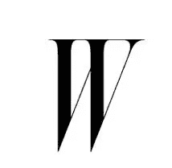
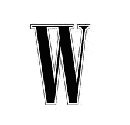
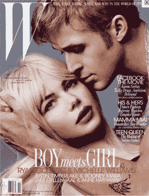
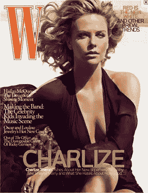
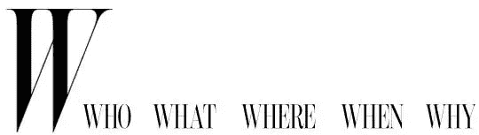

# w 杂志标志:近距离观察

> 原文：<https://www.sitepoint.com/w-magazine-logo-a-closer-look/>

2010 年 9 月版的美国时尚和生活方式杂志 *W* 展示了一个全新的 W 标志和一个全新的标语。新的品牌是整个杂志改革的一部分。

|  |  |
| *新的斜体 W 标志* | *老 W logo* |

在接受 *W 杂志*主编 [WWD](http://www.wwd.com/media-news/fashion-memopad/memo-pad-on-the-w-watch-alexander-wang-goes-multimedia-3206422) 的采访时，Stefano Tonchi 谈到重新设计时说:

> 然后是一个新的标志，看起来和旧的一样，用的是新的字体。有点瘦，很垂直。它非常优雅，是斜体的，有一种运动和进化的感觉。然后是一句标语——从来不是 W 的一部分——我认为这句标语定义了 W 的含义。这不仅仅是女性时尚，而是时尚的世界，更确切地说，是我们的五个 w:时尚世界中的谁、什么、哪里、何时和为什么。

|  |  |
| *带有新标志和标语的杂志封面* | 旧封面 |

如上所述，新的字体伴随着出现在杂志网站上的五个 w 的标语。这是一种在网站和杂志上划分内容的方式。这当然不是一个新的想法，但它工作得很好。

我个人喜欢新的 w。它非常优雅，几乎有点像字体界的奥黛丽·赫本。感人的衬线几乎创造了另一个形状，具有良好的运动感。只有当我比较新旧时，我才意识到我从来没有真正注意到旧的，但新的 W 有一个美丽，精致的外观，很容易看。

你认为这个新标志怎么样？进步还是退步？

## 分享这篇文章