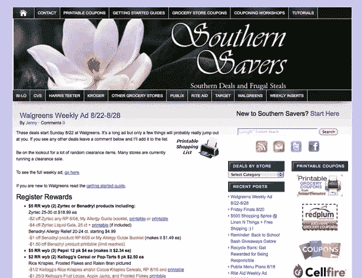
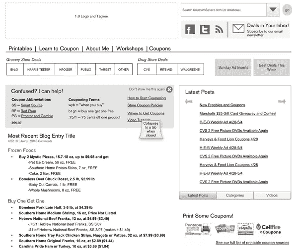
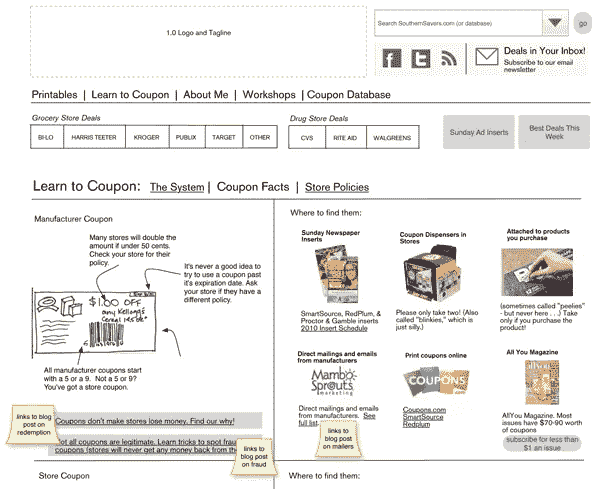

# 布局和组成作为网页设计过程的一部分

> 原文：<https://www.sitepoint.com/layout-and-composition-as-part-of-the-web-design-process/>

通常，我们作为设计师做的很多事情都是潜意识的。我们通常可以在一个选择一个选择的基础上告诉你为什么我们做了特定的决定，但是它不自然地用语言描述我们遵循的程序。有时候，解释如何应用图形设计原则的最好方法是通过一个实际的客户网站的设计过程。

进入:[南方储蓄者](http://www.southernsavers.com/)，一个真实客户的真实网页设计项目。2008 年 6 月，珍妮·马丁在 Blogger.com 创办了 Southern Savers，与朋友分享她发现的最佳杂货交易。短短几个月后，该网站对 Blogger 来说变得太大了，她的丈夫 James 将其迁移到一个自托管的 WordPress 安装程序上。珍妮和詹姆斯都没有任何设计经验，所以他们购买了一个 WordPress 主题，创建了一个标题图形，珍妮继续写博客。自成立两年多以来，该网站现在每月的点击量超过 300 万次，在脸书拥有超过 60，000 名粉丝——所有这些都采用了您在这里看到的基本设计模板:

**古老的南方储蓄者设计**

珍妮知道早就应该重新设计了，于是雇佣了摇滚明星设计公司 Squared Eye 来完成这项工作。作为 Jenny 和 Squared Eye 的马修·史密斯的朋友，从客户和代理的角度来看设计过程是很有趣的。我知道在本书的每一章中遵循这个过程对你来说也是很有见地的，我非常感激 Jenny 和 Matthew 同意让我用这个项目作为例子。

## 入门指南

通常，客户对他们的网站应该是什么样子以及如何工作有具体的想法。根据客户的不同，这些先入之见可能有助于设计过程，也可能阻碍设计过程——通常是后者。然而，在这个项目中，Squared Eye 被赋予了完全重新设计和重塑网站的自由。马修知道，重要的是，他和他的团队不仅要了解网站如何运作，还要了解谁是南方储蓄者的访问者，以及他们为什么会在那里。自由网络战略家艾米丽·史密斯是该项目的信息架构师，他解释道:“在设计开始之前，我们经历了一个发现阶段，以找出目标是什么。我们还去了珍妮的优惠券 101 研讨会之一，并与与会者交谈。我们评估了经常性访问者如何使用该网站——在他们身后观察，谈论他们依赖的特性和功能，以及观察他们如何导航。”

**Note:** User Testing

这是艾米丽描述的“在他们的肩膀上看着”的活动的术语。监测重新设计前后的实际用户行为是衡量其成功的一个好方法。Silverback 是一个很棒的用户测试 DIY 工具。

带着他们从与 Jenny 和她的网站用户相处中学到的东西，Emily 和 Squared Eye 团队的其他成员回到了他们共享的工作空间。“我们绘制了目前使用该网站的人物，并将其分解为实际的人物角色，”马修说。从那里，他们开始探索如何组织网站上的信息，以便新用户和老用户都能找到他们想要的东西。

我前面提到过，便笺和白板是信息架构的好工具。艾米丽在南方储蓄者重新设计的探索阶段很好地利用了这两者。正如你在下面看到的，有很多内容需要整理，而办公室的墙壁是整理它们的最好地方。

**便签信息架构**

一旦 Emily 将所有页面分组到适当的导航部分，就该开始设计布局了。她知道网站的布局将是 960 像素宽，并且对于大多数页面来说，两列布局是必要的。因为有太多的导航元素需要处理，她在一个名为 Omnigraffle 的 Mac 应用程序中将布局结构设计为线框。下图显示了她建议的主页线框。

**拟为南方储户提供首页线框**

注意，在这个例子中没有颜色，没有真实的图像，也没有实际的 HTML 元素。线框的目标只是建立布局结构和元素的定位。在这一章的前面，我说过在一个好的设计中，用户“识别出每个页面都属于这个网站。”这并不意味着每个页面的布局都必须完全相同。事实上，在网站的主页和其他页面之间进行一些对比是有好处的。当 Emily 为网站的其余部分创建线框时，她为一些部分规划了替代布局，如下面显示的“学习优惠券”部分。

**南方储户“学券”栏目线框**

好吧，当谈到无色的线框时，也许“加香料的东西”有点言过其实，但设计球肯定在这里滚动。

这个过程类似于你为你工作的网站创建布局和排版的方式吗？我们希望在下面的评论中听到你的建议和忠告！

## 分享这篇文章